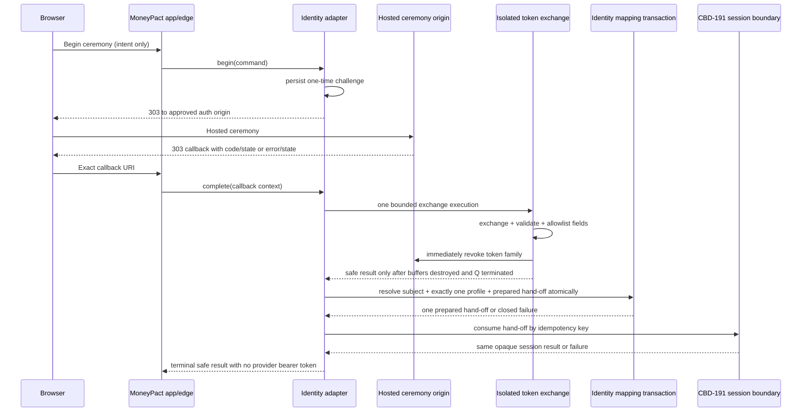

# CBD-190 — Identity ceremony and account-subject mapping contract

| Field | Value |
| --- | --- |
| Status | **Proposed — architecture contract for implementation and independent Security review; provider observations remain open** |
| Document version | 0.3 |
| Jira subtask | [CBD-190](https://cobudget.atlassian.net/browse/CBD-190) |
| Parent | [CBD-21](https://cobudget.atlassian.net/browse/CBD-21) |
| Repository baseline | `8ac588f` |
| Last updated | September 12, 2026 |

## 1. Purpose, authority, and status

This document fixes the contract between an identity ceremony, immutable
provider identity, one MoneyPact account subject, and the future application
session boundary owned by CBD-191. It also defines a local Cognito-shaped
adapter that can implement the contract without a provider account.

The local path is required by Executive decision `PROVIDERS-LOCAL-001`: no
provider account is activated and no provider spend is authorized for the
prototype. Amazon Cognito remains the CBD-108 selection at
`ELIGIBLE-PENDING-EVIDENCE`; this contract does not upgrade that disposition.
Activating Cognito is a separate decision with credentials, limits, and live
observation evidence.

The binding upstream rules are:

| Source | Constraint consumed here |
| --- | --- |
| CBD-104 `ID-104-001` | Every credential ceremony is provider-served; MoneyPact receives no raw password, passkey assertion/private key, MFA seed/code, or recovery secret. |
| CBD-104 `ID-104-002` | One provider identity maps to one account subject; no budget-space role or relationship data enters the identity directory. |
| CBD-104 `ID-104-004`–`006` | The provider result is exchanged for an opaque, revocable MoneyPact session; invalidation propagates in both directions. CBD-191 owns that session. |
| CBD-104 `ID-104-014` | Production, staging, and development use isolated provider tenants, clients, signing keys, domains, and identities. |
| CBD-104 `ID-104-016` | Provider client credentials and signing material are S4 and remain inside the secret boundary. |
| CBD-104 `ID-104-019` | The provider seam is OIDC authorization code with PKCE on a MoneyPact-controlled custom domain; provider SDKs do not enter domain code. |
| CBD-92 `TB-92-003`, `EP-92-001`, `RL-92-*` | Identity results are minimal, bound, fresh, revocable, non-replayable, origin-checked, uniformly rate-limited, and fail closed. Concrete rate values remain a downstream gate. |
| CBD-92 `AN-92-003`–`004`, `SA-92-006`–`007` | Reliability telemetry is content-free; authentication evidence is restricted, purpose-specific security evidence. |
| CBD-92 `EM-92-*` | Authentication and recovery mail contains only the permitted lifecycle/security action class and deadline; links locate and never authorize. |
| CBD-94 `SR-94-001`–`006` | Results bind subject/client/assurance/time/evidence; sessions rotate and revoke; browser state changes enforce origin and replay controls; support cannot impersonate. |
| CBD-94 `SR-94-039`–`043` | Credential material requires a complete custody inventory, separated encryption/KMS custody, least-privilege access, dependency-aware rotation/revocation, and negative scanning across runtime and build surfaces. |
| CBD-82 `CA-92-012`; `CBD190-PROFILE-ATOMIC-001` | Each account subject has exactly one active financial profile. A new subject and its one active profile are created in the same transaction; no zero-profile branch exists. |
| `CBD190-AC02-CUSTODY-001` | No provider token is stored, logged, cached, forwarded, or reusable after the exchange. Transient in-memory possession is permitted only inside the bounded exchange defined in section 10, including immediate issuer-side revocation. |
| `PROTOTYPE-SLICE-001` | The prototype demonstrates sign-in and one account subject with one financial profile without narrowing the Private-MVP scope. |

This is a design contract, not executed acceptance evidence. It does not
create a Cognito tenant, set concrete rate limits, implement CBD-191, or mark
any observation-bound provider gate passed.

## 2. Scope and boundaries

### 2.1 In scope

The contract covers registration, verification, sign-in, factor enrollment,
provider return processing, immutable identity mapping, deterministic failure
outcomes, and a typed successful hand-off to CBD-191. It covers the production
Cognito adapter and the local Cognito-shaped adapter through one port.

### 2.2 Out of scope

MoneyPact-authored credential, passkey, MFA, or recovery forms are prohibited.
Application-session issuance, cookie attributes, rotation, expiry, revocation,
and logout are CBD-191. Budget roles, invitations, financial-profile fields,
and budget authorization are outside this adapter. Provider account creation,
DNS changes, certificates, secrets, spend, and Confluence/Jira changes are not
authorized by this record.

### 2.3 Trust boundary

The browser navigates from a MoneyPact application origin to an environment's
approved `auth` origin. Only the identity adapter serves the latter. The
callback terminates at the MoneyPact edge, where the adapter validates the
provider response and emits either a canonical result or a closed failure.
Domain and session modules never receive raw OAuth/OIDC tokens.

## 3. Environment and custom-domain contract

Configuration is a closed, versioned record. It is valid only when every
value belongs to the same environment row. Values below are logical names,
not authorization to allocate them.

| Environment | Provider isolation unit | Application origins | Ceremony origin | Callback origin | Identity data |
| --- | --- | --- | --- | --- | --- |
| production | Dedicated Cognito user pool, app client, signing-key set, secret set | Production allowlist only | Dedicated MoneyPact-controlled production custom domain | Dedicated production edge origin | Real identities only |
| staging | Dedicated Cognito user pool, app client, signing-key set, secret set | Staging allowlist only | Dedicated MoneyPact-controlled staging custom domain | Dedicated staging edge origin | Synthetic identities only |
| development | Dedicated Cognito user pool, app client, signing-key set, secret set, or the local adapter | Development allowlist only | Dedicated development custom domain or its local equivalent | Dedicated development edge origin | Synthetic identities only |

The configuration schema contains `environment_id`, `adapter_kind`, `issuer`,
`authorization_endpoint`, `token_endpoint`, `revocation_endpoint`, `jwks_uri`,
`client_id`, `oauth_grant`, exact OAuth scopes, token-revocation enablement,
refresh-token lifetime, maximum exchange lifetime, `ceremony_origin`, exact
`callback_uri`, allowed initiating application origins, allowed post-result destinations, expected
signing algorithms, accepted clock-skew policy, and a secret reference when
required. It never contains secret values.

Validation fails startup and readiness when:

1. any URL is not HTTPS, except an explicit loopback-only local-development
   profile;
2. issuer, endpoint, client, callback, ceremony origin, key set, or secret
   reference is absent or belongs to another environment;
3. a non-production configuration permits a production identity, origin,
   user pool, client, key, domain, or secret reference;
4. a wildcard origin, callback, post-result destination, signing algorithm,
   or issuer is configured;
5. production selects the local adapter; or
6. a callback URI differs from the exact provider-registered value after
   normalization. Prefix, suffix, subdomain, query, and fragment matching are
   forbidden; or
7. the real adapter is not authorization-code with PKCE S256 only, requests
   scopes beyond `openid`, has token revocation disabled, or uses a refresh
   lifetime longer than the shortest value supported by the provider for the
   selected client; or
8. maximum exchange lifetime is absent, non-positive, or unbounded.

The WebAuthn relying-party ID is the stable MoneyPact-controlled custom-domain
boundary from `ID-104-019`. Changing it is a passkey migration, not routine
configuration. The local adapter may use a development-only equivalent, but
must expose the same origin transition and may never claim that this proves
production RP-ID behavior.

## 4. Canonical adapter interface

Both adapters implement one versioned port. Domain consumers depend only on
these commands and results.

### 4.1 Begin command

`BeginIdentityCeremonyV1` contains:

| Field | Rule |
| --- | --- |
| `environment_id` | Server-selected; never accepted from a query parameter. |
| `ceremony` | Closed vocabulary: `register`, `verify`, `sign_in`, `enroll_factor`, `account_switch`. Account recovery remains provider-hosted under `ID-104-009`, but is not a CBD-190 deliverable or part of this prototype command. `RECOVERY-DEFER-001` defers the separate second-operator recovery principal and does not relax the customer recovery boundary. |
| `initiating_origin` | Exact member of the environment allowlist. |
| `post_result_destination_id` | Opaque server-side allowlist key, never an arbitrary URL. |
| `current_account_subject_id` | Present only for an authenticated account switch; never sent to the provider. |
| `request_correlation_id` | Short-lived opaque reliability correlation; not a stable identity. |

`begin` generates at least 256 bits of random challenge material, a PKCE
S256 verifier/challenge, an OIDC nonce, and an opaque state handle. The server
stores only the minimum challenge record: one-way state verifier, protected
PKCE verifier, protected nonce verifier, environment, exact origins, ceremony,
destination key, creation/expiry, single-use status, and optional current
subject for account switch. State and nonce are distinct values. No client
value can override a stored field.

The response is a `303` navigation to the configured authorization endpoint
with exact `client_id`, exact `redirect_uri`, `response_type=code`,
`code_challenge`, `code_challenge_method=S256`, `state`, `nonce`, and exactly
the minimum `openid` scope. Custom-resource, user-administration, and other
additional scopes are forbidden. Ceremony-specific provider parameters come
from a closed adapter map; arbitrary authorization parameters are forbidden.

### 4.2 Callback envelope

The only accepted query shapes are:

* success: exactly one non-empty `code` and one non-empty `state`; or
* provider-declared failure: one `error`, optional `error_description` and
  `error_uri`, and one non-empty `state`.

Duplicate keys, both success and error fields, fragments, unexpected security-
meaningful fields, oversized values, invalid encoding, or malformed Unicode
are `malformed_result`. Provider error descriptions and URIs are diagnostic
input only: they are never reflected to the browser, stored in ordinary logs,
or used to select a customer-visible outcome.

The edge supplies non-user-controlled context alongside the query:
`request_environment_id`, observed callback origin, exact callback path,
HTTP method, and receipt time. Only `GET` at the exact configured callback is
accepted. The adapter consumes the challenge exactly once before any subject
or session effect. A retry after a committed success may retrieve the stored
safe terminal result for that challenge; it does not repeat token exchange or
mapping.

### 4.3 Verified provider result

The real adapter gives the authorization code to the dedicated isolated
execution defined in section 10. That execution exchanges the code, validates
the ID token, extracts only canonical allowlisted fields, revokes the returned
token family at the issuer, destroys token buffers, and terminates before the
parent adapter may release `VerifiedIdentityResultV1` to mapping. The local
adapter constructs the same type only after applying the fidelity rules in
section 8; local evidence does not prove the live revocation behavior.

Required validated token form:

| Element | Required rule |
| --- | --- |
| Serialization | Compact signed JWT with three segments; unsecured or encrypted tokens are rejected. |
| Header | `alg` is on the environment allowlist; `kid` selects exactly one current issuer key; `typ`, when present, is `JWT`. Algorithm/key confusion and unknown/stale keys fail closed after one bounded JWKS refresh. |
| `iss` | Exact configured issuer. |
| `sub` | Non-empty immutable opaque provider subject; maximum length is bounded; never normalized, case-folded, or replaced by email/phone/username. |
| `aud` | Contains the exact environment client ID and no ambiguous client selection; `azp`, when present or required by a multi-audience shape, equals that client. |
| `exp`, `iat` | Numeric dates; token is unexpired, not issued in the future outside the approved skew, and within the challenge lifetime. |
| `auth_time` | Numeric date no later than receipt time; retained only as minimum assurance evidence and never treated as an application role. |
| `nonce` | Constant-time match to the challenge nonce and required for every interactive result. |
| `token_use` | Cognito production path requires `id`. A token marked `access` is never accepted as identity evidence. |
| `jti`, `origin_jti` | Validated for type/size when present and reduced to a keyed digest only if required for restricted replay/revocation evidence. Raw values do not leave the adapter. |

Email, phone, username, groups, roles, custom attributes, profile fields, and
budget metadata are not identity keys and are excluded from the canonical
result. The provider may return them, but the adapter discards them before the
mapping boundary. Access and refresh tokens are never returned by the adapter,
never placed in a browser response, and never written to a log, database,
cache, queue, trace, crash report, or metric.

`VerifiedIdentityResultV1` contains only:

* `contract_version = 1`;
* `environment_id`;
* `issuer` and immutable `provider_subject`;
* `ceremony` and `provider_event_time`;
* minimum `assurance` evidence supported by validated standard claims;
* `challenge_id`, `identity_event_id`, and safe outcome class; and
* optional `previous_account_subject_id` for a validated account switch,
  taken from server state rather than the provider.

## 5. Identity mapping and concurrency contract

### 5.1 Logical schema

| Record | Required fields and constraints |
| --- | --- |
| `identity_binding` | Opaque `identity_binding_id`; `environment_id`; exact `issuer`; immutable `provider_subject`; opaque `account_subject_id`; lifecycle state; created/updated timestamps; binding version. Unique on `(environment_id, issuer, provider_subject)` and separately unique on `(environment_id, account_subject_id)`. |
| `identity_callback` | Opaque `challenge_id`; keyed digest of replay material; processing state (`processing`, `handoff_ready`, or terminal); terminal safe outcome when present; optional `identity_binding_id`, `account_subject_id`, and `session_handoff_id`; receipt/commit timestamps; expiry; no raw token, code, state, nonce, contact attribute, or provider error text. Unique on `challenge_id`; replay digest unique within the environment. |
| `identity_session_handoff` | Opaque `session_handoff_id`; unique `challenge_id`; `account_subject_id`; `identity_binding_id`; `identity_event_id`; minimum session inputs from section 6; state (`prepared`, `consumed`, or `terminal_failed`); attempt metadata; expiry; and optional opaque issued-session reference. It is a purpose-specific transactional record, not a general queue or event bus. Unique on `challenge_id`; the CBD-191 consumer uses `session_handoff_id` as its idempotency key. |
| `account_subject` | Opaque identifier and lifecycle/version state only as needed here. A newly inserted subject is never committed without the `financial_profile` row below. |
| `financial_profile` | Opaque profile identifier; `account_subject_id`; active lifecycle state; created/updated timestamps; and version. Exactly one active row per subject is enforced by the CBD-82/CBD-212 boundary and a deferred commit-time database invariant compatible with the shared mapping transaction. |

An issuer is part of identity. The same `sub` under a different issuer or
environment is a different provider identity. Contact attributes never join,
merge, switch, or recover a subject.

### 5.2 PostgreSQL atomic resolution and conflict protocol

The verified result enters a PostgreSQL `SERIALIZABLE` transaction that
prepares, but does not itself consume, the CBD-191 hand-off:

1. insert or lock the callback row by `challenge_id` and replay digest; return
   an already committed terminal result without repeating any effect, or reuse
   its existing hand-off when the row is already `handoff_ready`;
2. resolve `(environment_id, issuer, provider_subject)` under the transaction's
   snapshot;
3. when absent, insert one candidate account subject, exactly one active
   financial profile through the CBD-82/CBD-212 boundary, and then its binding,
   all inside this same transaction and using the applicable uniqueness
   constraints;
4. require the resolved subject to have exactly one active financial profile
   as specified in section 5.3;
5. insert exactly one `identity_session_handoff` in `prepared` state, keyed by
   the challenge and containing the resolved binding and subject; and
6. set the callback to `handoff_ready` and commit all mapping and hand-off
   preparation state together.

PostgreSQL SQLSTATE `23505` (unique violation), `40001` (serialization failure),
or `40P01` (deadlock detected) aborts the entire attempt. The implementation
must issue `ROLLBACK`; it must not query, recover, or commit that failed
transaction. It then starts the whole algorithm again from step 1 in a new
`SERIALIZABLE` transaction and fresh snapshot. The maximum attempt count is a
required positive value in versioned configuration; startup/readiness fails
when it is absent or unbounded. Backoff is bounded and jittered within the
challenge lifetime.

Because the candidate subject, profile, binding, callback changes, and prepared
hand-off share each attempt, a losing insert leaves none of them behind. On a
fresh attempt the winner's committed callback or binding is re-read. If the
attempt bound or challenge lifetime is exhausted, a separate short transaction
first locks and re-reads the callback. It returns a concurrently committed terminal
result when one exists and resumes an existing `handoff_ready` record instead
of overwriting it. Only an absent/uncommitted mapping attempt may become
terminal `callback_failure`, without creating a subject, binding, hand-off, or
session. Concurrent callbacks for one provider identity therefore converge on
exactly one binding, subject, and active profile, and duplicate delivery of one
challenge converges on exactly one prepared hand-off.

### 5.3 Profile atomicity and eligibility boundary

Executive decision `CBD190-PROFILE-ATOMIC-001` resolves the former profile
branch: an account subject never exists without exactly one active financial
profile. For a first identity use, subject, active profile, binding, callback,
and prepared hand-off are committed by the same transaction. For an existing
binding, the same transaction locks or otherwise proves the deferred
commit-time exactly-one-active-profile database invariant before preparing the
hand-off. A zero- or multiple-active-profile observation fails closed, raises
restricted integrity evidence, and creates no new hand-off or session; it is not repaired by the
identity adapter.

Disabled, deletion-pending, deleted, or security-blocked subjects resolve to
the same binding but produce `account_unavailable` and no session hand-off.
They are never remapped to a fresh subject. Reuse of a contact address or a
different provider subject never resurrects the former subject.

### 5.4 Account switch

Account switch begins from an authenticated server-side subject, forces a new
hosted sign-in ceremony, and binds that former subject into the challenge.
After validation, the mapping may resolve the same or a different subject. It
never edits either binding. A success hand-off tells CBD-191 to rotate from
the former session to the resolved subject atomically; a failure leaves no new
session and grants no authority from either subject.

## 6. Session hand-off to CBD-191

CBD-190 does not issue an application cookie. On successful mapping it emits
one `SessionIssueCommandV1` over an in-process typed boundary:

| Field | Rule |
| --- | --- |
| `account_subject_id` | Exactly the mapping result. |
| `identity_binding_id` | Opaque reference for revocation propagation, not a provider token. |
| `identity_event_id` | Opaque evidence reference. |
| `authenticated_at` | Derived from validated provider time subject to local receipt checks. |
| `assurance` | Minimum supported canonical assurance result; absence never implies a stronger level. |
| `ceremony` | The completed intent. |
| `previous_session_id` | Optional opaque reference for account-switch rotation, supplied by CBD-191 context. |

The command is materialized only in the purpose-specific
`identity_session_handoff` record. It is single-use, short-lived,
audience-bound to the CBD-191 session issuer, and never serialized to the
browser, cache, telemetry, or a general queue/event bus.

CBD-191 consumes it in one transaction keyed by `session_handoff_id`: lock the
`prepared` row, return the prior result if already consumed, create or rotate
exactly one opaque application session, mark the hand-off `consumed` with the
opaque session reference, and commit. CBD-190 then marks the callback terminal
success in a short idempotent finalization transaction. If finalization fails
after the session commit, replay observes `consumed` and finalizes the same
success; it never issues another session.

Failure before the CBD-191 transaction commits leaves a committed subject,
active profile, binding, `handoff_ready` callback, and `prepared` hand-off, but
no application session. This is legitimate recoverable workflow state, not an
atomicity claim violation. An authorized bounded retry may consume that same unexpired hand-off.
When the attempt or expiry policy is exhausted, a transaction changes the
prepared hand-off to `terminal_failed` and the callback to terminal
`callback_failure`; the subject, active profile, and immutable binding remain,
and no session exists. They are never deleted as compensation because a later
ceremony must converge on the same binding. Account-switch failure also leaves the previous
session unchanged. Thus the atomic guarantee is exactly one subject/profile/
binding mapping plus one prepared hand-off, and exactly-once session effect per
hand-off—not a false claim that mapping and an independently owned session
commit together.

No budget role, profile, membership, or resource authority is present. Every
protected request still needs current server-side authorization.

## 7. Deterministic safe outcomes

Failures before the mapping transaction commits create no subject, binding,
profile, hand-off, or application session. A CBD-191 failure after mapping
commit may leave only the recoverable or terminal workflow state specified in
section 6: the immutable subject, active profile, binding, callback, and purpose-
specific hand-off remain, while no new session or authority exists. Failures invalidate
or terminate the challenge as shown and render one accessible application-owned
result page. HTTP status, body shape, headings, focus order, landmarks,
available actions, headers, and coarse timing do not disclose whether an
account or binding exists.

| Internal condition | Public outcome | Challenge effect | Retry action |
| --- | --- | --- | --- |
| Verification is still required | `verification_pending` | Remains pending only for a bounded provider continuation | Return to hosted verification |
| Subject cancels | `cancelled` | Terminal | Start a new ceremony |
| Provider denies | `not_completed` | Terminal | Start a new ceremony |
| Provider unavailable or token/JWKS exchange cannot complete within bounded retry | `temporarily_unavailable` | Terminal or safely resumable under a new code; never reuse an uncertain code | Start a new ceremony later |
| Missing/unknown/expired/consumed state | `invalid_or_expired` | No state change for unknown input; terminal for known expired input | Start a new ceremony |
| Wrong environment, origin, callback URI, or method | `invalid_or_expired` | Known challenge terminates and raises restricted security evidence | Start from the correct application origin |
| PKCE, nonce, issuer, audience, signature, algorithm, time, or token-use mismatch | `invalid_or_expired` | Terminal and restricted security evidence | Start a new ceremony |
| Duplicate callback after committed success | The previously committed safe success destination, with no identity details | No new effect | Continue using the existing application result |
| Concurrent callback still in progress | `still_processing` for a bounded interval, then the stored terminal safe result | No parallel effect | Poll a one-time application status handle |
| Malformed or oversized response | `invalid_or_expired` | Known challenge terminates | Start a new ceremony |
| Bound account disabled/deletion-pending/deleted/security-blocked | `account_unavailable` | Terminal; binding remains unchanged | Generic support/recovery route only where authorized |
| Mapping transaction failure before commit | `callback_failure` | Terminal callback after bounded whole-transaction retries; no new mapping, hand-off, or session | Start a new ceremony |
| CBD-191 failure after mapping commit | `callback_failure` only after retry/expiry exhaustion; otherwise `still_processing` | Subject and binding remain; the same prepared hand-off is retryable until it becomes consumed or `terminal_failed`; no new session exists | Consume the same bounded hand-off where authorized, or start a new ceremony after terminal failure |

Each page meets WCAG 2.2 AA expectations applicable to the component: keyboard
operation, visible focus, programmatic heading/status, focus placed on the
result heading, no color-only meaning, reduced-motion support, and concise
next-action text. Screen-reader live announcements use only the public outcome.
Provider-rendered page accessibility requires separate live evidence.

## 8. Local Cognito-shaped adapter fidelity boundary

The local adapter is a replaceable infrastructure adapter, not a second
identity contract. It accepts synthetic identities only and exposes no real
password, passkey, MFA, or recovery credential entry. A synthetic chooser may
select fixture scenarios; it must be served on the configured development
ceremony origin, outside the application origin.

### 8.1 Must emulate exactly

The local adapter must match the production adapter at every observable port:

1. OIDC discovery metadata field names used by the adapter, authorization,
   token, and revocation endpoint paths, and JWKS retrieval behavior;
2. authorization-code callback parameter names, duplicate/omission handling,
   percent decoding, maximum lengths, `state`, and provider `error` shapes;
3. one-time codes, PKCE S256 verification, nonce binding, expiry, bounded clock
   skew, and replay/concurrency behavior;
4. asymmetric signed compact JWTs, rotating `kid` values, the allowed
   production algorithm family, and every required claim/type rule in section
   4.3, including Cognito's `token_use=id` shape;
5. immutable, opaque `sub` behavior across first use and repeat use, including
   distinct subjects with the same synthetic display/contact data;
6. deterministic scenarios for pending verification, cancellation, denial,
   malformed results, disabled account, provider outage, key rotation,
   signature failure, wrong issuer/audience/environment/origin, expiry, replay,
   duplicate callback, concurrent callback, account switch, and session
   hand-off failure; and
7. the same canonical success/failure values, identity-mapping transaction,
   bounded exchange/revocation state machine, secret exclusion, redaction,
   accessible result routing, and CBD-191 port.

Fixtures contain only synthetic data and are redacted by construction. JWT
examples use repository-owned test keys that are clearly marked non-production
and accepted only by the local environment profile.

### 8.2 May stub, with an explicit fidelity label

The local adapter may stub provider branding, email delivery, DNS/certificate
issuance, device biometrics, WebAuthn authenticator interaction, actual MFA
factor verification, recovery, fraud/risk decisions, provider SSO-cookie
behavior, provider console/IAM, service quotas, regional behavior, retention,
support access, billing, SLA, and provider-side event delivery. Latency and
outage patterns may be injected, not claimed as provider behavior.

Every stubbed scenario reports `fidelity=simulated` in restricted test evidence
and cannot satisfy an observation-bound provider gate. No fidelity flag reaches
customer-visible output or authorization logic.

### 8.3 Forbidden shortcuts

The local adapter may not bypass callback validation, accept unsigned tokens,
call the mapping layer with a caller-supplied subject, use email as `sub`,
directly issue a CBD-191 session, share production key material, run on a
production configuration, or expose a special success path unavailable to the
real adapter.

## 9. Dual-adapter conformance and divergence guard

One black-box `IdentityAdapterContractV1` suite is run unchanged against:

* the local adapter with synthetic signing keys;
* the Cognito adapter using redacted recorded token/JWKS/error fixtures; and,
* after separately authorized provider activation, a dedicated synthetic live
  Cognito tenant in each non-production environment.

The fixture-mode Cognito adapter is required before provider activation, but it
counts only when the test runner loads the exact packaged adapter artifact
proposed for release through the production dependency-composition root. A
build-provenance record must bind source commit, dependency-lock digest,
reproducible build invocation, artifact digest, composition-root identifier,
fidelity-manifest digest, and fixture-set digest. CI rejects a fixture result
whose artifact digest differs from the candidate release artifact, and an
authorized live run must report that same artifact digest.

Fixture selection may replace only the provider HTTP transport at the declared
network seam. Fixture-only parsing, claim validation, callback validation,
mapping, or result branches are prohibited. Build inspection must prove that
fixture and provider transports compose the same production parser and
validator module digests and entry points; the later authorized live run must
confirm those entry points executed. Fixture evidence proves only how the
pinned release artifact handles the pinned shapes. It does not prove Cognito
behaves like a fixture; authorized live conformance supplies that missing
observation.

Every negative or concurrency case is paired with a valid positive control run
against the same artifact and environment configuration; a suite that rejects
all inputs or produces zero successful hand-offs fails. Each case starts from
an isolated named database state, records before/after counts for subjects,
bindings, callbacks, prepared/consumed/failed hand-offs, profiles, and sessions,
and correlates every observation to the tested `challenge_id`,
`session_handoff_id`, and artifact digest. Unrelated rows cannot satisfy a
count assertion. Secret-canary network assertions are destination- and
phase-scoped: state, nonce, and the PKCE challenge may traverse the browser only
in the redirect to the exact authorization endpoint; code and state may return
only in the exact callback; the code and PKCE verifier may reach only the exact
token endpoint during exchange; token material may arrive only in the inbound
TLS token response; and the refresh token may leave only in the immediate
issuer-bound revocation request. Section 10.1 defines the sole additional
destination/phase allowances for authorized synthetic negative probes. Every
value must be absent from all other destinations and phases and from logs,
metrics, traces, browser durable storage, response bodies outside those
protocol-required redirects, persistence, queues, support, and diagnostics.

Concurrency cases use a barrier so all workers begin the conflicting database
operation before any is released; they require the stated exact winner count,
not merely an upper bound. Fault cases inject a failure immediately before and
after token receipt, validation, revocation, canonical-result transfer,
isolated-execution termination, mapping/hand-off preparation commit, CBD-191
session/consumption commit, and callback finalization commit. The test then
retries from a fresh request context and proves the precise custody and durable
state described in sections 5, 6, and 10.

Required dated cases are:

| Test ID | Scenario | Required invariant |
| --- | --- | --- |
| `CT-190-001` | First valid use | From zero isolated counts, exactly one subject, exactly one active profile, one binding, one callback, one consumed hand-off, and one session exist; the subject and profile share the mapping commit and positive-control success is correlated to the challenge. |
| `CT-190-002` | Existing immutable subject | Exactly one successful new challenge uses the same subject and binding, consumes its one hand-off, and creates/rotates one session; subject and binding counts do not increase. |
| `CT-190-003` | Duplicate and synchronized concurrent callback | After a barrier release, exactly one terminal-success callback row, one prepared-and-consumed hand-off, and one session effect exist for the challenge; all workers return the correlated stored result and deltas exclude unrelated rows. |
| `CT-190-004` | Account switch | A valid positive control rotates exactly one session; old bindings remain unchanged. Injected failure leaves the previous session unchanged and follows section 6 hand-off state. |
| `CT-190-005` | Disabled/deletion-pending account | Safe unavailable outcome; no session and no remapping. |
| `CT-190-006` | Missing, expired, and replayed state/code/token | No subject or session; deterministic safe outcome. |
| `CT-190-007` | Wrong origin, callback, environment, issuer, audience, or key | Fail closed before mapping. |
| `CT-190-008` | PKCE/nonce/signature/algorithm/time/token-use mismatch | Fail closed before mapping. |
| `CT-190-009` | Malformed/duplicate/oversized callback parameters | Fail closed with bounded work and uniform output. |
| `CT-190-010` | Verification pending, cancelled, and denied | Accessible, non-enumerating safe outcomes. |
| `CT-190-011` | Token endpoint, JWKS, revocation endpoint, or provider outage | Bounded fail-closed result; revocation failure or uncertainty permits no canonical-result release, mapping, profile, hand-off, or session. |
| `CT-190-012` | Mapping, CBD-191, and finalization commit-boundary fault injection | Before mapping commit, all subject/profile/binding/hand-off/session deltas are zero. After mapping commit but before CBD-191 commit, one subject, one active profile, one binding, and one prepared hand-off remain with zero new sessions. After CBD-191 commit but before callback finalization, replay observes one consumed hand-off and the same one session, then finalizes without duplication. Exhaustion produces `terminal_failed` while retaining the immutable subject/profile/binding mapping and zero new sessions. |
| `CT-190-013` | Credential/token canary inspection | Required material appears only at the destination and phase allowed above and is absent from every other egress destination and from application/browser durable storage, response bodies outside required redirects, logs, database, cache, queue, telemetry, support, diagnostics, or crash output. |
| `CT-190-014` | Configuration cross-wire matrix with positive controls | A known-good complete configuration for each environment passes readiness and one valid callback through the common parser. Each single-field and required multi-field cross-environment substitution is then rejected before ceremony or mapping; a reject-all implementation fails the positive controls. |
| `CT-190-015` | Keyboard and screen-reader outcome traversal | Focus, names, roles, status, and next actions are operable without disclosure. |
| `CT-190-016` | Bounded exchange, revocation, and rejection probes | The digest-identical artifact proves the section 10 state order and maximum lifetime. After verified issuer revocation, refresh, UserInfo, and applicable Cognito API probes fail; every MoneyPact endpoint rejects provider JWTs as application authority even when signature-and-expiry validation alone would succeed. |

A versioned fidelity manifest pins the expected discovery fields, endpoints,
headers, claims, callback/error vocabulary, algorithms, maximum sizes, fixture
digests, candidate artifact digest, production composition-root identifier,
source commit, dependency-lock digest, build invocation, and the bounded-
exchange configuration digest. A provider documentation change, observed live-
shape change, artifact/provenance mismatch,
fixture-only validation branch, new signing algorithm, new required claim, or
contract version change fails the guard until both adapters and the manifest
are reviewed together. Recorded fixtures never contain a real bearer token,
code, subject, contact value, or secret.

Promotion rules are asymmetric:

* local conformance may prove application-owned behavior and the adapter seam;
* fixture conformance may prove only that the digest-identical release artifact
  follows the production composition path and handles the pinned shape;
* only authorized live observation may prove Cognito-served ceremonies,
  provider accessibility, physical tenant/key/domain separation, provider
  error behavior, or real token/cookie custody; and
* no provider-only row becomes passed by substituting local or fixture evidence.

## 10. Credential custody and bounded provider-token exchange

Executive decision `CBD190-AC02-CUSTODY-001` makes this the binding criterion:
no provider token is stored, logged, cached, forwarded, or reusable after the
exchange. Transient in-memory possession during the exchange is permitted only
inside the bounded execution below and must be proven. The application contract
continues to exclude passwords, passkey private keys/assertions, MFA seeds/codes,
recovery secrets, authorization codes, PKCE verifiers, raw state/nonce, provider
cookies, provider access/refresh tokens, raw ID tokens, and reusable provider
bearer tokens from domain interfaces and durable or observable application
sinks. Structured allowlist logging is mandatory; arbitrary provider exceptions
and payloads are never logged. Ordinary telemetry carries only component and
version, coarse operation, safe outcome, duration/capacity bucket, and aggregate
counts under `AN-92-003`.

### 10.1 Bounded exchange state machine

The production composition root creates one dedicated, isolated execution for
one callback. It has no shared token heap or concurrent-request reuse. Request
or response capture, APM body capture, core and heap dumps, crash upload,
arbitrary exception serialization, and inheritance of unrelated environment
secrets are disabled. The exchange begins when the authorization code enters
this execution and ends only when the execution terminates; issuer revocation
and an authorized negative-probe phase therefore occur inside the exchange and
are not forwarding after it. The execution follows exactly this order:

1. receive the token response over the pinned issuer TLS connection;
2. validate the ID token under section 4.3;
3. extract only the allowlisted canonical fields into a bounded, token-free
   result buffer;
4. send the refresh token to the exact issuer revocation endpoint immediately,
   thereby revoking the returned token family;
5. verify successful issuer revocation, including the required negative probes
   when running a separately authorized live conformance case;
6. destroy the authorization-code, PKCE, client-authentication, ID, access, and
   refresh-token buffers, close the one-way canonical-result channel, and
   terminate the isolated execution; and
7. only after the parent observes successful termination may it accept the
   token-free canonical result and permit mapping or session hand-off.

A missing refresh token, revocation error, timeout, ambiguous response, failed
negative probe in a live conformance case, abnormal termination, or canonical
result before confirmed termination fails closed. It produces no mapping,
profile, hand-off, or session and emits only restricted token-free security
evidence. Discard without verified issuer revocation does not satisfy AC02.
Every MoneyPact endpoint rejects a Cognito JWT as application authority even
when its signature and expiry alone remain valid after revocation.

Normal runtime egress permits credential material only at its required exact TLS
destination during its required phase. Ceremony parameters go through the browser
redirect only to the configured ceremony endpoint. Code and PKCE proof go only
to the token endpoint. Client authentication follows that same route. A refresh
token goes only to issuer revocation. In a separately authorized synthetic live conformance run only, revoked material may
also reach the exact issuer token, UserInfo, and applicable Cognito API
endpoints during the post-revocation negative-probe phase. No other destination
or phase is permitted. These probe exceptions never authorize customer-token
testing or provider activation.

### 10.2 `SR-94-039`–`043` credential-material inventory

Every reader is a workload identity unless a designated operator is named.
Human access is strongly authenticated, purpose-bound, time-bounded, and
independently audited. “No backup” also means exclusion from snapshots, crash
artifacts, heap/core dumps, and support bundles.

| Material | Owner and purpose | Store or memory boundary | Readers / writers | Rotation or revocation | Backup / dump status | Prohibited destinations |
| --- | --- | --- | --- | --- | --- | --- |
| Authorization code | Issuer owns; isolated exchange redeems it once. | Callback ingress passes it directly to one isolated-execution buffer; never durable. | Readers: callback ingress and that execution. Writer: issuer. | Single-use redemption, challenge expiry, and terminal consumption; never retried after uncertain exchange. | No backup. | Domain rows, browser output/history beyond the inbound callback, cache, queue, log, trace, metric, audit, support, analytics, export, client bundle, or non-token-endpoint egress. |
| State handle | Identity adapter owns; binds callback to the one-time challenge. | Browser round trip plus one-way verifier in the short-lived challenge store; raw value is not persisted. | Readers: callback ingress and challenge verifier. Writer: begin operation. | Fresh per ceremony; consumed once or expired and invalidated. | Raw value: no backup. One-way verifier follows challenge-record retention only. | Domain/session interfaces, ordinary evidence, support, analytics, export, or unrelated egress. |
| PKCE verifier | Identity adapter owns; binds code redemption to the initiating challenge. | Protected short-lived challenge store, then only the isolated-execution buffer. | Readers: challenge service and isolated exchange. Writer: begin operation. | Fresh per ceremony; erased on consumption or expiry; dependent callback is invalidated on compromise. | Excluded from backup and all dumps. | Browser, domain/session interfaces, persistence outside the challenge record, cache, queue, logs, telemetry, support, analytics, export, client bundle, or non-token-endpoint egress. |
| OIDC nonce | Identity adapter owns; binds the ID token to the ceremony. | Raw nonce traverses only authorization; a protected one-way verifier occupies the short-lived challenge store and the isolated execution compares it. | Readers: challenge verifier and isolated exchange. Writer: begin operation. | Fresh per ceremony; verifier erased on consumption or expiry. | Raw value: no backup. Verifier follows challenge-record retention only; no dumps. | Domain/session interfaces, ordinary logs/evidence, support, analytics, export, or unrelated egress. |
| Provider client secret, when the selected app client requires one | Security/Infrastructure owns; authenticates only the configured client. | S4 secret manager under separated KMS custody; injected only into the isolated execution for token and revocation calls. Configuration contains a reference only. | Reader: isolated-exchange workload identity. Writers: separately authorized provisioning/rotation operators. | Provider-side rotation/revocation replaces the reference and invalidates dependent client/callback paths; old value is revoked before retirement. | Only separated secret-manager/KMS recovery custody; no application backup or dump. | Repository, environment inventory value, browser, domain row, queue, log, audit payload, trace, metric, support, analytics, export, client bundle, or arbitrary operator workstation. |
| ID token | Issuer owns; isolated exchange validates identity claims. | Isolated-execution memory only. | Reader: isolated exchange. Writer: issuer token endpoint. | Token family is immediately issuer-revoked; buffer is destroyed before execution termination; MoneyPact never accepts it as session authority. | No backup. | Parent adapter, mapping/session interfaces, browser output, persistence, cache, queue, logging, telemetry, diagnostics, support, analytics, export, client bundle, or egress except an authorized negative probe. |
| Access token | Issuer owns; MoneyPact has no runtime use for it. | Isolated-execution memory only. | Reader: isolated exchange solely for bounded custody and an authorized negative probe. Writer: issuer token endpoint. | Token family is immediately issuer-revoked and buffer destroyed before termination. | No backup. | Every application/domain/session interface and every persistence, observability, support, export, client, or non-probe egress surface. |
| Refresh token | Issuer owns; isolated exchange uses it only to revoke the returned token family. | Isolated-execution memory only between receipt and the issuer-bound revocation request. | Reader: isolated exchange. Writer: issuer token endpoint. | Immediate issuer revocation is mandatory; shortest supported configured lifetime limits residual exposure; buffer is then destroyed. | No backup. | Parent adapter, browser, domain/session interfaces, persistence, cache, queue, logs, telemetry, diagnostics, support, analytics, export, client bundle, or egress except revocation and an authorized negative probe. |
| Issuer JWKS and signing value | Issuer owns signing keys; MoneyPact consumes only public JWKS to validate issuer signatures. Provider private signing material never enters MoneyPact custody. | Public JWKS in a bounded environment-scoped verification cache; provider private key stays issuer-side. | Reader: isolated validator. Writers: issuer for keys; bounded JWKS loader for cache. | Unknown/current `kid` permits one bounded refresh; retired keys expire from cache. Issuer compromise invalidates affected challenges, bindings, sessions, and recovery paths under a separately authorized response. | Public JWKS may follow configuration recovery policy; private signing material has no MoneyPact backup or dump. | Provider private key is prohibited everywhere in MoneyPact. Public JWKS is prohibited from domain/session data and cannot select another environment. |
| Synthetic test signing key | Test/Identity maintainers own; signs local and recorded-fixture cases only. | Explicitly non-production test fixture, isolated by environment and absent from the production release artifact and runtime secret mounts. | Readers: isolated test runner. Writers: designated test maintainers through reviewed changes. | Versioned rotation updates fixture and fidelity-manifest digests together; any production acceptance revokes the test configuration and fails readiness. | Repository history may retain the explicitly synthetic key; runtime backups and dumps may not. | Production/staging configuration, provider tenant, production artifact, customer-data test, browser output, logs, telemetry, support bundle, or operator secret store. |

Rotation or revocation of any material must enumerate and invalidate every
dependent challenge, callback, session, connection, package, queue, replica,
and backup recovery path without reactivating prior authority. Build and
runtime scanning plus negative tests must cover logs, errors, traces, queues,
audit, support, analytics, exports, client bundles, persistence, browser
surfaces, and the destination/phase egress matrix.

### 10.3 Required custody evidence

Evidence binds the digest-identical release artifact, source/lock/build and
composition-root digests, bounded-exchange configuration digest, issuer/client
configuration, and synthetic test case. It records monotonic receipt,
revocation-confirmation, buffer-destruction, and termination times and proves
the configured maximum lifetime. Destination- and phase-scoped captures, sink
scans, fault-injection results at every section 9 boundary, and post-revocation
refresh, UserInfo, applicable Cognito API, and MoneyPact-authority rejection
results are mandatory. Evidence contains keyed correlations and safe outcomes,
never credential or token values. Local and recorded-fixture runs exercise the
state machine but do not satisfy live issuer revocation or post-revocation
observations.

## 11. Alternatives and tradeoffs

| Alternative | Disposition | Tradeoff |
| --- | --- | --- |
| Direct Cognito integration in web/API/domain modules | Rejected | Spreads provider claims and token custody across packages, prevents local replacement, and makes provider exit a contract change. |
| Local-only custom authentication | Rejected | Violates the provider-hosted credential boundary and cannot be swapped for Cognito without changing the ceremony contract. |
| Use email/phone/username as the account key | Rejected | Mutable and potentially recycled; creates enumeration, merge, and resurrection risk. Only issuer plus immutable `sub` is authoritative. |
| Pass provider JWT through as the application session | Rejected | Conflicts with `ID-104-004`, exposes reusable provider authority, and prevents prompt local revocation. |
| Adapter returns only a canonical verified result | Selected | Quarantines provider syntax and tokens, supports the local adapter, and preserves CBD-191 independence. It requires a strict conformance suite and live activation evidence. |
| Local adapter copies provider UI and accepts synthetic passwords | Rejected | Needlessly creates credential-handling code and supplies false evidence about hosted ceremonies. A fixture chooser is enough. |

## 12. Migration, compatibility, and dependencies

Activation from local to Cognito changes `adapter_kind`, environment
configuration, secret references, DNS/certificate bindings, and live fixture
evidence. It does not change callback envelopes, canonical results, mapping
keys, session hand-off, safe outcomes, or application routes. Existing local
synthetic subjects are development-only and are never copied into staging or
production.

An issuer or user-pool change is an identity migration. Because issuer is part
of the binding key, a new issuer cannot silently match old subjects. Migration
requires a separately approved, auditable subject-link proof; contact equality
is insufficient. A custom-domain/RP-ID change additionally requires passkey
re-enrollment or an approved portability plan.

Implementation dependencies are:

1. local PostgreSQL and a typed transactional data seam for mapping;
2. CBD-191's transactional, idempotent opaque-session issue/rotation consumer,
   with the session and hand-off state inside one shared transaction boundary;
3. a CBD-82/CBD-212 profile operation and database constraint that participate
   in the same transaction as new-subject mapping and enforce exactly one
   active profile;
4. an isolated token-exchange execution, issuer revocation integration, and
   destination/phase-restricted network policy satisfying section 10;
5. approved concrete challenge lifetimes, skew, rate windows, thresholds,
   counting keys, and retention values (`PR-94-001/002`, `RF-92-005/012`);
6. a Security review of bounded token custody, browser storage, logging, error
   uniformity, credential inventory, revocation, and test canaries;
7. accessible application result components; and
8. separate Executive authorization before any Cognito account, credentials,
   domain, spend, or live test is created.

## 13. Acceptance-criteria traceability

The evidence labels distinguish what the local adapter can eventually prove
from what remains provider-only. This document itself supplies design coverage,
not executed evidence.

| Acceptance criterion | Contract sections | Local adapter can evidence | Provider-only evidence that remains open |
| --- | --- | --- | --- |
| `CBD-190-AC01` | 2.3, 3, 4.1, 8 | Separate ceremony/application origins, redirects, and absence of credential inputs on MoneyPact pages using synthetic ceremonies. | Cognito actually serves registration, sign-in, verification, and factor enrollment on the approved production custom domain; actual RP-ID behavior. **Open.** |
| `CBD-190-AC02` | 3, 4.1, 4.3, 9 `CT-190-011`, `013`, `016`, 10 | Local and fixture evidence can prove sink exclusion, state order, fault closure, MoneyPact-JWT rejection, maximum lifetime, and the destination/phase policy without real credentials. | Digest-identical live synthetic evidence for issuer revocation, post-revocation refresh/UserInfo/applicable-API failure, network custody, managed-login cookies, provider support/retention, and isolated-execution termination. **Open until authorized activation evidence.** |
| `CBD-190-AC03` | 5–6, 9 `CT-190-001`–`004`, `012` | Positive-controlled first use creates subject and exactly one active profile atomically; existing-subject, bounded whole-transaction retry, synchronized concurrency, exact hand-off/session winner counts, and commit-boundary recovery run against local PostgreSQL. | Same artifact-correlated black-box cases against the activated Cognito adapter and live synthetic tenant. **Open until activation.** |
| `CBD-190-AC04` | 3, 4.2–4.3, 5–7, 9 `CT-190-006`–`009`, `011`–`012` | All synthetic negative shapes, isolated before/after effects, uniform outcomes, bounded retries, and commit-boundary fault injection. | Cognito's actual expired/error/JWKS/token/callback/outage shapes and bounded retry behavior. **Open until activation.** |
| `CBD-190-AC05` | 3, 9 `CT-190-014` | Positive-controlled configuration schema and exhaustive cross-wire rejection, including prohibition of local mode in production; reject-all behavior fails. | Three physically separate Cognito user pools/clients/keys/domains/origins and provider-console/configuration evidence. **Open.** |
| `CBD-190-AC06` | 7, 9 `CT-190-010`, `015` | Accessible application-owned outcome pages and local synthetic ceremony scaffold; non-enumerating public copy. | Keyboard/screen-reader observation of Cognito-managed pages and actual provider failures. **Open.** |
| `CBD-190-AC07` | 9–10 | Dated local runs for every named case with positive controls, isolated correlated deltas, exact concurrency winners, exchange and commit-boundary injection, custody scans, and release-artifact provenance. | Dated live Cognito run of the digest-identical release artifact, post-revocation probes, destination/phase captures, redacted fixture refresh, and provider observation record. **Open until activation.** |

No criterion is waived. AC01, AC02, AC05, AC06, and AC07 contain irreducible
provider observations. AC03 and AC04 can gain strong local implementation
evidence, but their real-adapter equivalence remains open until live
conformance.

## 14. Architectural findings and open decisions

| ID | Finding or decision needed | Consequence |
| --- | --- | --- |
| `OI-190-002` | Concrete expiry, clock skew, rate, counter, and retention values remain unset under `PR-94-001/002` and `RF-92-005/012`. | Blocks release of authentication surfaces; implementations must accept versioned configuration and fail closed when absent. |
| `OI-190-003` | Cognito remains `ELIGIBLE-PENDING-EVIDENCE` with no account authorized. | Blocks every provider-only traceability row and live fixture capture. |
| `OI-190-004` | CBD-191 is not implemented in this package. | The hand-off is a contract only; a complete sign-in cannot be claimed until the session consumer passes its own gates. |

## 15. Revision history

| Version | Date | Author | Change | Disposition |
| --- | --- | --- | --- | --- |
| 0.1 | September 12, 2026 | Architecture specialist, dispatched under `CBD190-ARCH-001 v1` | Initial callback, mapping, CBD-191 hand-off, local-adapter fidelity, dual-adapter conformance, negative-test, environment, and AC traceability contract under `PROVIDERS-LOCAL-001`. | Proposed; independent Review and Security review required. |
| 0.2 | September 12, 2026 | Architecture specialist, dispatched under `CBD190-ARCH-002 v1` | Review correction round: finding-to-line map follows below. | Proposed; independent Review required; the custody and zero-profile decisions then remained open. |
| 0.3 | September 12, 2026 | Architecture specialist, dispatched under `CBD190-ARCH-003 v1` | Executive-decision and Security correction round: finding-to-line map follows below. | Proposed; independent Review and Security review required; provider observations remain open. |

### 15.1 v0.2 review correction map

Line references below identify this v0.2 candidate after the final consistency
pass.

| Review finding | v0.2 lines | Correction |
| --- | --- | --- |
| 1 — mapping/session atomicity | 89–95, 239–286, 322–392, 519 | Adds the transactional `identity_session_handoff`, the CBD-191 idempotency boundary, explicit recoverable/terminal post-mapping states, and commit-boundary assertions. |
| 2 — zero-profile authority | 40–41, 242, 287–306, 508, 603–604, 623, 642 | Separates approved `CA-92-012` from draft `CD-82-01`, defines the two then-pending branches, and prevents session issuance without profile eligibility. |
| 3 — PostgreSQL conflict protocol | 248–286, 496–501, 519 | Requires full rollback and bounded whole-transaction retry from a fresh `SERIALIZABLE` snapshot for SQLSTATE `23505`, `40001`, and `40P01`, including callback re-read behavior and exhaustion handling. |
| 4 — artifact provenance | 465–482, 524–537, 627 | Binds fixture evidence to the digest-identical release artifact, production composition root, source/lock/build provenance, common parser/validator modules, and the later live run. |
| 5 — non-vacuous tests | 484–521, 623–627 | Requires valid positive controls, isolated correlated deltas, synchronized starts, exact winners, and fault injection around every relevant commit boundary; strengthens `CT-190-003`, `CT-190-012`, and `CT-190-014`. |
| 6 — literal AC02 custody | 555–570, 622, 638 | Preserves the then-unresolved literal custody conflict for Product Owner and Security decision; transient quarantine is not claimed as AC02 compliance. |

### 15.2 v0.3 Executive and Security correction map

Line references below identify this v0.3 candidate after the final consistency
pass.

| Binding item | v0.3 lines | Correction |
| --- | --- | --- |
| `CBD190-PROFILE-ATOMIC-001`; Security finding 2 | 41, 97, 250–321, 360–383, 528, 539, 693–697, 719, 730–736 | Removes the two former profile branches and their open-decision row; makes subject and exactly one active profile share the first-use mapping transaction; requires exactly one active profile in `CT-190-001`. |
| `CBD190-AC02-CUSTODY-001`; Security finding 1 | 42, 116–142, 176–213, 516–543, 566–663, 698–704, 718 | Defines the PKCE-only, minimum-scope isolated exchange, immediate issuer revocation, fail-closed ordering, destruction/termination boundary, provider-JWT rejection, post-revocation probes, and custody evidence. |
| Security finding 3 | 503–513, 540, 614–622 | Replaces the impossible blanket egress assertion with destination- and phase-scoped normal-runtime and authorized synthetic-probe rules. |
| Security finding 4; `SR-94-039`–`043` | 40, 624–649 | Adds the complete credential-material inventory with owner, purpose, store/memory boundary, readers, writers, rotation/revocation, backup/dump status, and prohibited destinations. |
| Secret-scanner false positives and publication metadata | 6, 9; publication manifest 1617–1621 | Updates the version/baseline and publication-manifest rationale; rewords any generic-scanner match while preserving the contract. |
