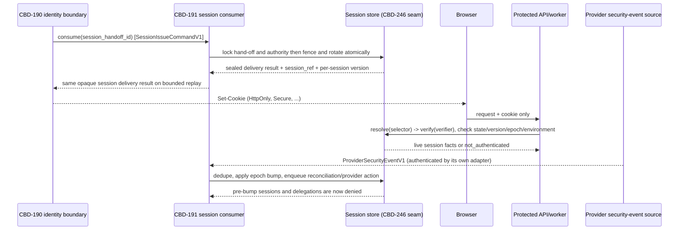

# CBD-191 — Opaque application session and two-way revocation contract

| Field | Value |
| --- | --- |
| Status | **Approved — Product Owner, September 13, 2026 (PO-CONTRACT-APPROVALS-001); open questions and residuals stay recorded and open** |
| Document version | 0.2.2 |
| Jira subtask | [CBD-191](https://cobudget.atlassian.net/browse/CBD-191) |
| Parent | [CBD-21](https://cobudget.atlassian.net/browse/CBD-21) |
| Repository baseline | `a6c13d2` |
| Last updated | September 12, 2026 |

## 1. Purpose, authority, and status

This document fixes the contract for the one client authority every CoBudget
protected surface accepts: an opaque, server-resolved CoBudget session. It
consumes the CBD-190 v0.3 identity hand-off where that version is sufficient,
fails closed where it is not, and produces the
`subject.sessionRef`, `subject.sessionVersion`, and `assurance.*` facts that
the CBD-236 v0.4 policy input schema requires. `sessionRef` and
`sessionVersion` have `session_store` provenance. CBD-236 v0.4 instead assigns
API `assurance.*` to `idp_evidence`; this document stores the validated
CBD-190 evidence with the session but does not relabel that provenance. The
cross-contract representation remains `OQ-191-005`. This document does not
redefine either pinned contract; it names the identifiers they already fix and
states additive integration requirements where v0.3/v0.4 do not yet carry a
safe input.

The binding upstream rules are:

| Source | Constraint consumed here |
| --- | --- |
| CBD-104 `ID-104-004`–`006` | The provider result is exchanged for an opaque, revocable session; invalidation propagates in both directions. This document is that exchange's receiving side. |
| CBD-94 `SR-94-001`–`002` | Sessions rotate after authentication, recovery, assurance elevation, and account switch; logout, recovery, credential/factor change, account deletion, and security revocation invalidate affected sessions within `PR-94-001`. |
| CBD-94 `SR-94-039`–`043` | Session material requires a complete custody inventory, no backup/dump exposure, and negative scanning. |
| CBD-190 §6 | `SessionIssueCommandV1`, delivered once per `identity_session_handoff` row, consumed exactly once keyed by `session_handoff_id`. This document is the consumer named there. |
| CBD-190 §5.1, §5.4 | `identity_binding_id`, `account_subject_id`, and the account-switch `previous_account_subject_id`/`previous_session_id` shape are immutable references this document receives, never recomputes. |
| CBD-236 `PC-236-002`, §4.1–4.2 | `subject.accountSubjectId`, `subject.sessionRef`, `subject.sessionVersion`, and `assurance.*` are session-store/idp-evidence facts the policy assembler may only read, never accept from a request. This document writes the session record; `OQ-191-005` preserves the assurance-provenance conflict for upstream resolution. |
| CBD-236 §7.1 step 1 | Session resolution is the first hook in the API chain; its failure is `not_authenticated`, indistinguishable from every later denial. |
| CBD-236 `PC-236-014` | Commit-time re-evaluation reloads the live session and requires exact `sessionVersion` equality; a session revoked after precheck but before commit denies the write. This document supplies the field that check depends on. |
| CBD-232 `BCP-03`, §8.1–8.2 | A budget-creation proposal is bound to "the session generation" and is invalidated when that generation ends; §4 below is the record CBD-232 already assumes exists. |
| `PROVIDERS-LOCAL-001` | No provider account is activated; the local Cognito-shaped adapter must emit the same provider-security-event shapes this document defines, so revocation logic is provable without a live tenant. |
| `PR-94-001` (CBD-94 verification inventory, status **Open**) | The exact session-invalidation propagation SLO is not yet set. This document treats it as required versioned configuration and fails closed, exactly as CBD-190 treats `PR-94-002`; it does not invent a number. |

This is a design contract, not executed acceptance evidence. It creates no
code, no Cognito tenant, and no concrete timing value.

## 2. Scope and boundaries

### 2.1 In scope

Session schema, opaque identifier and cookie, server-side resolution,
per-session version and subject revocation epoch, lifetime and idle rules, rotation on the four
named triggers, application-initiated revocation, provider-initiated
revocation (including the local adapter's emulation obligation), rejection of
non-session client authority, and customer-state clearing on session end.

### 2.2 Out of scope

Credential ceremonies, the identity mapping transaction, and changes to the
CBD-190 hand-off itself. This document consumes v0.3 where safe and records an
additive upstream requirement rather than amending that pinned contract.
Protected-action assurance semantics beyond carrying the assurance facts CBD-72
already defines. Budget authorization decisions — CBD-236 owns `decide`; this
document supplies its session-shaped inputs and nothing else. The concrete
`packages/contracts`/`apps/api`/`apps/worker` module layout for the
implementation packet, beyond the one interface named in §3.4. Cognito account
creation, event-delivery infrastructure provisioning, and any spend.

### 2.3 Trust boundary



## 3. Session schema, opaque identifier, and server-side store

### 3.1 Logical schema

| Record | Required fields and constraints |
| --- | --- |
| `account_session` | Opaque `session_selector` (indexed lookup key); keyed digest `verifier_digest` of the verifier half, compared in constant time; opaque `session_ref` (safe correlation identifier, distinct from the cookie value, the one CBD-236 reads as `subject.sessionRef`); `account_subject_id`; `environment_id`; `identity_binding_id` (from CBD-190, for revocation correlation); immutable `session_version` (a subject-monotonic integer allocated uniquely for this session and returned as CBD-236 `subject.sessionVersion` and CBD-232's session generation); `issued_revocation_epoch` (copied from the subject authority row); `state` (`active`, `rotated`, `revoked`, `expired`); `superseded_by_session_ref` (present only when `state = rotated`); `assurance_level` (`session` / `fresh`); `fresh_assurance` (`{ boundAction, boundSpaceId, expiresAt }`, present only when a fresh grant has not yet expired); `csrf_digest`; `issued_at`, `idle_expires_at`, `absolute_expires_at`; `rotation_cause` (closed vocabulary, §5.2); `revocation_cause` (closed vocabulary, §6.1, present only when revoked). Unique on `session_selector`, `session_ref`, and `(account_subject_id, session_version)`. |
| `account_subject_authority` | `account_subject_id` (primary key); `next_session_version` (integer, monotonically allocated under row lock); `revocation_epoch` (integer, monotonic, starts at 1); `epoch_bumped_at`; `epoch_bump_cause` (closed vocabulary, §6.1). One row per subject. Session resolution compares `issued_revocation_epoch` with the current epoch; proposal/session-lineage comparison uses the distinct per-session `session_version`. Issuance separately re-reads the authoritative subject lifecycle/version in its transaction; a cached lifecycle copy here is forbidden. |
| `session_delivery_result` | `session_handoff_id` (primary key); `session_ref`; authenticated-encryption envelope containing the exact selector/verifier and CSRF delivery values; key-version reference; `deliver_until`; `acknowledged_at` or absent. The envelope is audience-bound to this hand-off and session, excluded from backups/dumps/logs, and erased on acknowledgement or bounded expiry. This is the recoverable prior result CBD-190 v0.3 §6 requires after a commit/result-loss fault (§5.3). |
| `provider_security_event` | Opaque `provider_event_id` (the provider's own event identifier, used as the dedupe key); `environment_id`; `issuer`; `provider_subject`; `event_class` (closed vocabulary, §6.2); `provider_event_time`; optional provider-authenticated `ordering_cursor`; `received_at`; `identity_binding_id` (resolved, or absent when the binding is unknown); `processing_state` (`applied`, `applied_pending_reconciliation`, `superseded`, `rejected`); `rejection_reason` (present only when `rejected`); no raw provider token, credential, or contact attribute. Unique on `(environment_id, issuer, provider_event_id)`. A duplicate delivery does not create a second row or a fictional `duplicate` state; it returns the existing canonical outcome. |
| `revocation_outbox` | Opaque action ID; subject/binding/environment; cause; target (`provider_global_invalidation`, `provider_current_browser_bound`, or `delegation_retirement`); revocation epoch; occurrence/commit/deadline timestamps; attempt state and next retry; provider/reconciliation cursor when applicable. Inserted in the same transaction as the application epoch bump or row revoke. It contains no cookie, token, contact attribute, or provider credential. |

`session_selector` and `verifier_digest` are never logged, cached outside this
store, or placed in an audit event. `session_ref` is the only session-shaped
value CBD-236 or an audit event may carry; it cannot be replayed as a cookie
because it resolves nothing by itself.

The sealed delivery envelope is the sole temporary exception to the rule that
raw cookie material is not durable. Its plaintext exists only in the isolated
issuer during authenticated encryption/decryption, its key is held outside the
database under separated custody, and the record is categorically excluded
from replicas used for analytics, backups, dumps, support, logs, telemetry,
queues, and exports. Expiry erasure is mandatory even if the browser never
acknowledges delivery; no recovery path may restore an expired envelope.

### 3.2 The opaque identifier

The cookie value is `<session_selector>.<session_verifier>`, each half at
least 256 bits of cryptographically random material, matching the CBD-190
challenge-material floor. The store indexes on `session_selector` for O(1)
lookup and compares `verifier_digest` (a keyed hash of `session_verifier`
using a server-side pepper outside the database) in constant time — the same
selector/verifier split CBD-190 §4.1 uses for its one-time challenge state, so
the two documents share one custody idiom. Splitting the identifier this way
means a database read (selector lookup) never by itself discloses whether a
guessed value would have verified, and a compromised read-only database
export does not hand over usable session authority without also having
recorded the pepper.

**`SC-191-001` (Binding).** No code path may resolve a session by scanning or
comparing raw verifier values; only the selector-indexed, peppered-digest
comparison in §3.2 is a valid resolution path. A resolution helper that
accepts a raw verifier from anywhere other than the incoming cookie is
forbidden.

### 3.3 Server-side resolution

Resolution takes the cookie value only. It is:

1. malformed shape (missing separator, wrong length, invalid encoding) →
   `not_authenticated`; it uses a synthetic selector/verifier and performs the
   same fixed-shape store and keyed-digest work as a well-formed miss, without
   using attacker-controlled bytes as a lookup key;
2. `session_selector` not found → `not_authenticated` (`unknown identifier`);
3. found but `verifier_digest` mismatch → `not_authenticated`, and the event is
   restricted security evidence (possible guessing/theft signal), never a
   customer-visible hint (CBD-236 `PC-236-016`'s uniform-denial rule applies
   identically here);
4. found and verified but `environment_id` does not match the serving
   environment → `not_authenticated` (`other-environment session`); the
   session row is never treated as valid evidence for any environment but the
   one it was issued in, mirroring CBD-190 §3's environment-isolation rule;
5. found, verified, correct environment, but `state != active`, or
   `idle_expires_at`/`absolute_expires_at` has passed → `not_authenticated`
   (`expired identifier`); an `active` row past either expiry is resolved as
   expired, not silently extended;
6. found, verified, active, unexpired, but `issued_revocation_epoch !=
   account_subject_authority.revocation_epoch` for the subject →
   `not_authenticated` (`revoked identifier`) — this is how a bulk subject
   revocation (§6.1) invalidates every outstanding session without a
   per-row write; and
7. otherwise resolved: the caller receives `{ accountSubjectId, sessionRef,
   sessionVersion, assurance }` and nothing else. The raw
   cookie value never crosses into domain, policy, or audit code past this
   point.

No rejection branch above returns a distinct status or body. Timing is
normalized by `SC-191-001A`: every miss/rejection executes one selector-shaped
store operation (real or synthetic), one keyed digest, one authority-row read,
and releases only through a configured minimum response bucket with
cryptographically random bounded jitter. The bucket floor must exceed the
measured p99 of the slowest ordinary rejection path for the deployed store;
readiness fails if the timing profile, sample window, or maximum permitted
differential is absent. A store timeout still fails closed and uses the timeout
bucket. `CT-191-002A` compares every rejection pair statistically across a
minimum configured sample count; exceeding the approved differential fails the
gate. This is a mechanism and testable bound, not a claim of physically
identical execution.

**`SC-191-001A` (Binding).** Implementations may strengthen the timing profile
without changing the public outcome, but may not omit synthetic work, the
release bucket, jitter, or the differential test merely because all branches
already return `not_authenticated`.

**An IdP ID or access token is not a session and is never accepted here.**
Resolution reads only the configured session cookie name; an `Authorization`
header, a bearer token, or any other credential shape presented to a
protected route is ignored for authentication purposes and produces the same
`not_authenticated` outcome as a missing cookie (CBD-191-AC01). This is a
consequence of §3.3 reading one specific cookie and no other input, not a
separate check to bypass.

### 3.4 Persistence port: `SessionStorePort`

The ticket names the CBD-246 seam as this document's persistence port. CBD-191
does not redefine CBD-246's data-access primitives; it names the interface it
needs from that seam so the concurrent CBD-246 implementation has an exact
target:

```
interface SessionStorePort {
  consumeAndIssue(command: SessionIssueCommandV1, context: ServerSessionContext): Promise<SealedSessionDelivery>;
  resolveBySelector(selector: SessionSelector): Promise<SessionRecord | "not_found">;
  markRevoked(sessionRef: SessionRef, cause: RevocationCause): Promise<void>;
  bumpSubjectEpoch(accountSubjectId: AccountSubjectId, cause: EpochBumpCause): Promise<RevocationEpoch>;
  currentSubjectAuthority(accountSubjectId: AccountSubjectId): Promise<SubjectAuthority>;
  recordProviderEvent(event: ProviderSecurityEventV1, outcome: ProcessingOutcome): Promise<"inserted" | "duplicate">;
  claimRevocationActions(now: Instant, limit: number): Promise<RevocationAction[]>;
}
```

Every method is environment-scoped by construction (the caller's
`environment_id` is bound before any row is touched, the same isolation rule
CBD-232 §8.1 states for its own store), and `bumpSubjectEpoch` is the one
operation that must be a single atomic row update reachable in O(1) regardless
of how many session rows exist for the subject — that atomicity is what lets
`PR-94-001` be met for a subject with many concurrent sessions (AC08's bulk
case) without an unbounded fan-out write.

**Open coordination point.** CBD-246's own contract is not yet a merged
document; it is being implemented concurrently as `packages/data-access`
under CBD246-IMPL-001 in a separate worktree. This document assumes CBD-246
exposes both budget-space-tenant-scoped statements (for CBD-232/CBD-236
consumers) and environment-scoped statements (for the two subject-keyed
tables above, which have no budget space). If CBD-246 turns out to support
only budget-space scoping, `SessionStorePort` needs either a CBD-246 seam
extension or a narrowly separate session-store module — a Manager-level
sequencing question, not one this document can resolve unilaterally. Flagged
as `OQ-191-006`.

## 4. Per-session version and subject-wide revocation epoch

**`SC-191-002` (Binding).** Two monotonic values serve different scopes and
must never be substituted for each other:

1. **Per-session version.** Every issuance, including reauthentication and
   rotation, allocates a new subject-monotonic `session_version`. CBD-236 reads
   it as `subject.sessionVersion`; CBD-232 v0.4's `sessionGeneration` binding is
   this value for the resolved session. A proposal therefore binds both the
   authenticated subject and one session lineage without requiring a new
   CBD-232 field. After that session is revoked or rotated, it cannot resolve;
   after reauthentication the new row has a different version, so the old
   proposal fails CBD-232's lazy generation comparison. Sibling device rows
   have their own versions and remain unaffected by a single-row revoke.
2. **Subject revocation epoch.** A bulk-invalidating event (§6.1) increments
   `revocation_epoch` exactly once under the subject-authority row lock. Every
   pre-bump row has a mismatched `issued_revocation_epoch` and is dead at the
   next resolution or commit-time recheck. New sessions may be issued at the
   new epoch only through the fenced transaction in §5.3.

Allocation and epoch reads occur under the same subject-authority row lock as
session insertion. This keeps subject-wide revocation O(1), permits many live
devices, and closes the single-session gap without invalidating a sibling
device's proposals. CBD-236 `PC-236-014` rechecks both the live row and exact
`sessionVersion`; consumers that compare only an unscoped subject epoch are
non-conforming.

## 5. Lifetime, idle rules, and rotation

### 5.1 Lifetime configuration

The implementation profile is reviewed as follows. Cookie security attributes
are fixed by this contract; timing values remain required versioned
configuration because `PR-94-001` and the adjoining lifetime values are still
**Open** in the CBD-94 verification inventory.

| Cookie setting | Required value and rule |
| --- | --- |
| Name | `__Host-cobudget_session`; no fallback or unprefixed alias is read |
| `Secure` / `HttpOnly` | Both present on issuance, rotation, and deletion |
| `SameSite` | `Lax`, to admit the provider's top-level safe-method return while withholding the cookie on cross-site subrequests and unsafe methods |
| `Path` / `Domain` | `Path=/`; the `Domain` attribute is omitted, as required by the `__Host-` prefix |
| Expiry | `Max-Age = floor(absolute_expires_at - now)` and matching `Expires`; never beyond server absolute expiry and never refreshed by idle activity. Server idle expiry remains authoritative if earlier. |
| Deletion | Same name, `Secure`, `HttpOnly`, `SameSite=Lax`, `Path=/`, no `Domain`, `Max-Age=0`, and an `Expires` value in the past on logout, rotation failure, expired/revoked resolution, access-loss/reconnect detection, account switch, and every other path that ends or fails the current browser session |

Cookie-authenticated mutations use safe `GET` only for reads and require all
of: an exact allowlisted `Origin`; `Sec-Fetch-Site: same-origin`; and an
unpredictable session-bound CSRF value in `X-CoBudget-CSRF` whose keyed digest
is stored on the session row and compared in constant time. Missing or
mismatched signals deny before mutation with the uniform response contract.
The raw CSRF value is delivered only in the same-origin bootstrap response and
held in browser memory; it is not a cookie, URL, log field, or durable client
value. The provider callback is a CBD-190 state/nonce/PKCE ceremony, not a
cookie-authenticated mutation, and receives no exemption that can mutate
customer data.

Startup and readiness fail when any of the following is absent, non-positive,
unbounded, or outside the approved configuration registry:

* `idle_timeout` — maximum gap between resolved requests before
  `idle_expires_at` is reached;
* `absolute_lifetime` — maximum session age regardless of activity;
* `fresh_assurance_window` — maximum lifetime of a `fresh` assurance grant
  (CBD-72 §6.1; distinct from the session's own lifetime — a session can
  outlive a fresh-assurance window, which then simply reverts the effective
  assurance to `session` on the next read, with no rotation required for that
  reversion alone); and
* `revocation_propagation_target` — the value this document treats as
   `PR-94-001` once Security fixes it; every AC04/AC06 measured test in §8
   is written against this configured value, not a hardcoded number;
* `provider_max_future_skew` and provider-reconciliation cadence — bounds for
  §6.2 ordering and quarantine; and
* `rejection_timing_floor`, jitter range, sample count, timeout bucket, and
  maximum permitted pairwise timing differential — the §3.3 uniform-timing
  profile.

A session's `idle_expires_at` slides forward on every successfully resolved
request (bounded by `absolute_expires_at`, which never moves). Both are
re-checked at resolution (§3.3 case 5); neither is extended past
`absolute_expires_at`.

### 5.2 Rotation triggers

**`SC-191-003` (Binding).** Four semantic causes rotate a session. Each
representable cause consumes one CBD-190 v0.3 `SessionIssueCommandV1` and
produces a full new session row rather than an in-place attribute update, so
that CBD-191-AC03's
"previous identifier unusable for a later request" is a row-state fact, not a
policy inference:

| `rotation_cause` | Trigger | Effect on the prior row |
| --- | --- | --- |
| `authentication` | CBD-190 `register` or `sign_in`. A server-owned current-browser session context, if present, must accompany consumption. Like `recovery`, the bound-context branch cannot be invoked from a CBD-190 v0.3 command (see the closing paragraph of this section); under v0.3 only the no-context branch ships. | Current row → `rotated` **only when its `account_subject_id` equals the subject this ceremony resolved**; a live current row for a different subject is never folded into the new subject's lineage — consumption is rejected and the caller must use the explicit `account_switch` cause, which ends the prior subject's row by name. Absent current row starts a lineage. Ordinary authentication never assumes “no prior row.” |
| `recovery` | Future CBD-190 recovery completion input. CBD-190 v0.3 deliberately has no recovery ceremony, so this branch cannot be invoked from a v0.3 command. | In one transaction: bump the subject epoch, rotate any current row, then issue the replacement at the new epoch. No replacement is issued if the bump fails. |
| `assurance_elevation` | CBD-190 `verify` with a validated `fresh` assurance result. | Current row → `rotated`; new row carries the fresh-assurance fields. `verify` without the required fresh result cannot select this cause. |
| `account_switch` | CBD-190 §5.4 `account_switch` with `previous_session_id`. | Prior row under the former subject → `rotated`; new row is allocated under the resolved subject at that subject's current epoch. |

Every represented rotation locks the hand-off, subject-authority row, and
server-resolved prior row in a stable order; validates the fence in §5.3;
allocates a new `session_version`; inserts the new row; marks the prior row
(when one exists) `rotated` with `superseded_by_session_ref`; seals the exact
delivery result; and commits as one transaction. A `rotated`
row fails resolution the same way a `revoked` one does (§3.3 case 5 treats any
non-`active` state as expired); the distinction between `rotated` and
`revoked` exists only for audit legibility, not for a different resolution
outcome.

CBD-190 v0.3 supplies `previous_session_id` only for account switch and does
not carry current-session context for ordinary sign-in/verify. CBD-191 must
capture that context server-side before starting the ceremony and bind it to
the opaque challenge/handoff; accepting a browser-supplied prior reference is
forbidden. This additive integration field and recovery ceremony require an
upstream CBD-190 revision before those paths can ship; they are not silently
added to or redefined as part of v0.3.

### 5.3 Transactional issuance fence and replayable result

**`SC-191-003A` (Binding).** Handoff preparation must read and bind the
subject's current `revocation_epoch` under the same subject-authority lock used
by epoch bumps, producing `prepared_revocation_epoch`. Consumption locks the
handoff and authority row, rechecks subject lifecycle, and rejects a prepared
handoff when its bound epoch differs from the current epoch. A disabled,
deletion-pending, deleted, or security-blocked subject is always rejected in
this transaction. When server-bound current-session context is present, the
prior row must still be active, unexpired, at the current epoch, and owned by
the same `account_subject_id` the ceremony resolved; logout or rotation during
the ceremony, or a prior row belonging to another subject, therefore rejects
consumption (the latter must go through `account_switch`). Thus preparation
→ revocation bump or prior-session end → consumption cannot mint
post-revocation authority.

Recovery is the only combined operation: a future typed recovery handoff names
the recovery completion, proves the epoch at which it began, first requires
that epoch still equal the current epoch, and atomically bumps and issues the
replacement at the resulting epoch. A later security/deletion/global bump
therefore fences out an older recovery attempt. An ordinary
pre-bump `register`, `sign_in`, `verify`, or `account_switch` handoff can never
use that exception. Because CBD-190 v0.3 has neither
`prepared_revocation_epoch` nor a recovery command variant, implementation of
this fence requires an additive CBD-190 contract revision; until then the
consumer must fail closed rather than infer either value from timestamps.

Consumption is keyed by `session_handoff_id`. The same transaction stores the
sealed `session_delivery_result` and marks the handoff consumed. A replay while
`deliver_until` remains live decrypts and returns the exact same cookie and
CSRF delivery values, not merely `session_ref`; it never rotates twice. A
positive browser acknowledgement erases the envelope. If the envelope expires
before acknowledgement, one transaction revokes the orphan session and erases
the envelope; replay then fails terminally and requires a new ceremony. It
never creates another session from the consumed handoff.

## 6. Two-way revocation

### 6.1 Application-initiated

| `revocation_cause` / epoch-bump cause | Trigger | Application scope | Provider/delegation action (§6.3/§7) |
| --- | --- | --- | --- |
| `logout` | Explicit sign-out of the current browser | Single row → `revoked`; cookie deletion in the initiating response | Top-level provider sign-out for this participating browser; provider lifetime remains the fallback bound if navigation is abandoned |
| `logout_everywhere` | Explicit “sign out all devices” | Subject epoch bump | Durable server-side provider global invalidation for the binding; every known binding if the subject can have more than one |
| `recovery_completed` | Future typed recovery completion (§5.3) | Atomic subject epoch bump then replacement issuance at the new epoch | Durable global provider invalidation; delegation retirement where recovery policy requires it |
| `credential_or_factor_change` | Password/passkey/MFA change confirmed by authenticated provider event | Subject epoch bump | Durable global provider invalidation |
| `account_deletion` | Deletion confirmed | Subject epoch bump and lifecycle block on all later issuance | Durable global provider invalidation and delegation retirement |
| `security_action` | Confirmed compromise/security block | Subject epoch bump | Durable global provider invalidation and delegation retirement |
| `permission_loss` | Subject disablement, always; zero-membership standing only under Product branch A below | Subject epoch bump | Delegation retirement; no provider action unless the subject is also provider-disabled |

Application invalidation is measured from the causing application event to
the row write/epoch bump becoming visible to every resolver and commit-time
recheck, including queueing and replica visibility. Provider-originated
invalidation is measured from provider event occurrence—not adapter receipt—
to that same visibility point, including provider transport, queueing, retries,
reconciliation, and outage. Provider-artifact invalidation is separately
measured from the application cause to confirmed global provider action, or to
the configured hard provider-session lifetime bound. Every interval must be no
greater than `revocation_propagation_target`; ordinary CoBudget session expiry
is not a substitute.

The application write and required `revocation_outbox` actions commit together.
Revocation workers retry with durable exponential backoff capped so the next
attempt precedes the deadline, reconcile ambiguous provider results before
retry, and page/fail readiness when the remaining deadline cannot be met. A
periodic authoritative reconciliation starts from a durable cursor, discovers
events missed during transport outage, and is itself configured frequently
enough to remain inside the same end-to-end target. No cause is marked globally
complete merely because the application epoch bump committed.

**`OQ-191-001` (Product decision: zero memberships) — DECIDED, branch B.**
The Executive selected branch B on September 13, 2026 (records/decisions
`CBD191-ZERO-MEMBERSHIP-001`): losing the last membership does not end
authenticated standing. Ordinary role/scope narrowing does not revoke the
session because CBD-236 re-evaluates it live. Both branches stay recorded so
the rejected one is not rediscovered:

* **A — zero memberships ends authenticated standing:** the transaction that
  revokes the last membership also enqueues `permission_loss`, bumps the
  subject epoch, deletes the current-browser cookie when observable, and
  retires delegations.
* **B — profile-level standing remains:** no session bump occurs solely because
  the membership count reaches zero; CBD-236 denies space operations while
  profile-level authenticated surfaces remain available. Subject disablement,
  deletion, or security blocking still bumps unconditionally.

Implementation must select A or B from an approved Product decision; this
document does not select it.

### 6.2 Provider-initiated: `ProviderSecurityEventV1`

**`SC-191-004` (Binding).** One canonical event envelope, authenticated by its
adapter before this document ever sees it — the same quarantine pattern CBD-190
§4.3 uses for the identity result:

| Field | Rule |
| --- | --- |
| `contract_version` | `1` |
| `environment_id` | Set by the adapter from its own trusted configuration, never from event content |
| `issuer`, `provider_subject` | Resolved through the immutable CBD-190 `identity_binding` table to `account_subject_id`; an unresolvable binding discards the event with restricted evidence and creates no subject, binding, or session effect |
| `event_class` | Closed union: `credential_changed`, `factor_changed`, `account_disabled`, `account_deleted`, `global_sign_out`, `compromised_credentials_action` |
| `provider_event_id` | The provider's own event identifier; the dedupe key |
| `provider_event_time` | Provider-asserted event time |
| `ordering_cursor` | Optional provider-authenticated monotonic sequence/cursor. Only this field, when the adapter proves its semantics for the selected event source, may suppress an older event. |
| `received_at` | Adapter receipt time |

The real adapter's authenticity mechanism (signature verification, a private
event-bus resource policy, or workload identity — Cognito's exact security-event
delivery shape is not fixed by this document) is a downstream implementation
and Security decision, not fixed here; this document only fixes the envelope
the adapter must hand over and the guarantee that nothing before that hand-off
is trusted. **`OQ-191-002` (Security/Executive).** Which delivery mechanism
Cognito activation will use for security events, and its authenticity proof,
remain open until provider activation is separately authorized —
`PROVIDERS-LOCAL-001` does not resolve this because no live tenant exists to
observe.

**Local adapter emulation obligation.** Per `PROVIDERS-LOCAL-001`, the local
Cognito-shaped adapter must emit the identical `ProviderSecurityEventV1` shape
for deterministic fixture scenarios covering every `event_class`, plus
deliberately malformed, forged (wrong signature/authenticity proof), replayed
(duplicate `provider_event_id`), stale (old `provider_event_time` arriving
after a newer one already applied), and cross-environment events, so §8's
tests can run without a live tenant. A fidelity label of `simulated` applies
to the local adapter's authenticity proof exactly as CBD-190 §8.2 requires;
it cannot satisfy a provider-only observation of the real delivery mechanism
once `OQ-191-002` is resolved.

**Processing (CBD-191-AC05).** `recordProviderEvent` inserts by the unique
`(environment_id, issuer, provider_event_id)` key first, inside the same
transaction as any resulting epoch bump or row revocation:

1. duplicate `provider_event_id` → return the existing canonical row and its
   existing state, record a restricted duplicate-delivery observation, and
   perform no second effect; there is deliberately no `duplicate` row state;
2. authenticity failed (caught by the adapter, never reaches this table) →
   no row, restricted evidence only;
3. `environment_id` mismatch against the serving environment → inserted as
   `rejected` with `rejection_reason = cross_environment`, no session effect;
4. unresolvable binding → inserted as `rejected` with
   `rejection_reason = unknown_binding`, no session effect;
5. resolved and current → apply the §6.1-shaped effect for that
   `event_class` (every provider-initiated class is an epoch bump; none
   is a single-row revocation, since the provider has no visibility into
   which of a subject's CoBudget sessions correspond to which device) and
   mark `processing_state = applied`;
6. a resolved event with a valid `ordering_cursor` lower than or equal to the
   binding's already-applied cursor → `superseded`, no new effect. Equal event
   times never break a tie and provider time alone never suppresses an event;
7. an authenticated event with `provider_event_time` farther in the future
   than `provider_max_future_skew` → conservatively apply the epoch bump now,
   quarantine its ordering metadata as `applied_pending_reconciliation`,
   exclude its time from the ordering watermark, and enqueue cursor-based
   reconciliation. Successful reconciliation transitions the canonical row to
   `applied`; correction of metadata can never undo the bump; and
8. when no authenticated cursor exists, every unique authenticated resolved
   event applies monotonically regardless of event-time order. Extra epoch
   bumps may terminate a newer session but can never preserve stale authority.

Forged, replayed, malformed, cross-environment, or cursor-proven superseded
events change no session. Timestamp-stale or future-skewed events are never
allowed to create a suppression watermark. This favors a conservative extra
revocation over allowing a later legitimate event to be ignored.

### 6.3 Provider-held artifacts capable of minting new authority

CBD-190 §10 already revokes the provider's issued token family at the moment
of exchange; no reusable Cognito bearer token survives past that boundary. The
one artifact CBD-190 explicitly leaves unresolved (§8.2, "provider SSO-cookie
behavior... may be stubbed") is the hosted ceremony origin's own browser
session — a Cognito-hosted-UI session cookie scoped to the ceremony origin,
which could let a signed-out browser silently re-authenticate without
re-entering credentials.

**`SC-191-005` (Binding).** Current-browser and global actions are different
operations and must not share a success label:

| Cause/device | Required provider-artifact mechanism | Completion evidence |
| --- | --- | --- |
| Current-browser `logout` | A top-level server-driven navigation through the configured provider sign-out endpoint, followed by the final allowlisted destination. Background fetch is insufficient. | Correlated navigation completion when it occurs; otherwise the configured provider hosted-session absolute lifetime is the hard bound. |
| `logout_everywhere`, `recovery_completed`, `credential_or_factor_change`, `account_deletion`, `security_action` | A durable server-to-provider global invalidation operation covering all hosted sessions for every affected binding, invoked from the outbox even when no browser response exists. | Provider-correlated confirmed result plus negative reauthentication probe in authorized live synthetic evidence. |
| Provider-originated global event | Application epoch bump via §6.2; no browser redirect is assumed. If the event itself does not prove provider global invalidation, reconciliation invokes/validates the same server-side global operation. | End-to-end event and provider-action evidence within the configured target. |

The local adapter exposes separate observable current-browser and global
operations, outage/ambiguous-result injection, durable retry evidence, and a
controllable hosted-session clock. Merely asserting that an endpoint was
called is insufficient: `CT-191-012` proves every affected device can no
longer mint a session, or that each remaining artifact expires inside the hard
bound.

**`OQ-191-003` (Executive risk decision: global provider invalidation) —
CONDITIONALLY DECIDED.** Recorded on September 13, 2026 as
`CBD191-PROVIDER-BOUND-001`: if activation evidence shows branch A is
unavailable, the Executive accepts branch B's hard provider-session lifetime
bound — the shortest the provider supports and inside `CBD-191-AC06`'s limit —
as the residual risk for non-participating devices, revisited at activation.
Two activation branches are defined:

* **A — provider operation available:** configure and authenticate the
  server-side global invalidation API, prove binding/environment scope and
  retry/reconciliation, and keep its end-to-end worst case within
  `revocation_propagation_target`.
* **B — operation unavailable:** configure the provider hosted-session
  absolute lifetime no greater than `revocation_propagation_target` and prove
  the provider enforces that bound on every device. If the provider cannot
  satisfy either A or B, Cognito activation is blocked unless the Executive
  explicitly accepts the residual reauthentication risk for an exact provider
  configuration and duration. A current-browser redirect is never evidence
  for global coverage.

## 7. Customer-state clearing (CBD-191-AC07)

Logout, access loss, account switch, and reconnect all re-establish trusted
session context before any customer state renders. The guarantee is:

* **New requests stop immediately.** §3.3's resolution re-reads epoch,
  version, and row state on every request; there is no session-attribute cache a
  handler could read instead.
* **In-flight work cannot commit.** CBD-236 `PC-236-014`'s commit-time
  recheck re-reads the live session and requires exact `sessionVersion`
  equality before any mutation's transaction commits. A request that
  resolved successfully before the revoking write, then reached its own
  commit after it, fails there — this is the mechanism, not a new one this
  document invents, and it is why CBD-191 only needs to supply a correct,
  live-readable `sessionVersion`, not a request-cancellation channel.
* **Derived and cached surfaces.** Any cache, index, or report keyed under
  CBD-236's `bind_cache_key` obligation includes `sessionVersion`/subject
  scope among its dimensions (`SR-94-017`); an ended session therefore
  cannot serve a stale derived read either.
* **Browser-held state.** Logout, recovery completion, account switch, an API
  session-ending access-loss response, and every reconnect/bootstrap handshake clear the
  session cookie plus locally cached identifiers, drafts, previews, bindings,
  and session-keyed data before rendering. Reconnect first resolves the cookie
  and compares the returned `sessionRef`/`sessionVersion` with the client
  context; missing, denied, or changed context clears before subscriptions or
  queued client mutations resume. This explicitly includes CBD-232 §8.2 draft
  state and access loss, not only voluntary logout.
* **Worker-side delegation.** `account_deletion`, `security_action`, and the
  selected `permission_loss` branch write `delegation_retirement` to the same
  revocation transaction. The owning delegation store must expose
  `retireSubjectDelegations(environmentId, accountSubjectId, revocationEpoch,
  cause)` idempotently and make both worker start and commit rechecks deny any
  delegation issued before that epoch. If it is a separate store, delivery is
  bounded by `revocation_propagation_target`; while an action is pending or
  its current epoch cannot be read, affected workers fail closed. `CT-191-017`
  proves a queued job cannot commit across this boundary.

**`OQ-191-004` (Manager routing).** The package that implements the delegation
retirement port is not assigned in the pinned sources. The interface and
fail-closed/bounded behavior are fixed here; implementation integration remains
blocked until Manager assigns its single writer. This is no longer an
undefined invalidation path.

## 8. Test and evidence obligations (deliverable: provider-event authenticity, replay, ordering, and outage tests)

Required dated cases, in the shape CBD-190 §9 uses:

| Test ID | Scenario | Required invariant |
| --- | --- | --- |
| `CT-191-001` | Cookie and CSRF profile | Assert exact `__Host-cobudget_session` issuance, rotation, expiry, and deletion attributes from §5.1; mutation accepts only exact-origin + same-origin fetch metadata + valid session-bound CSRF header. Cross-site, missing-origin, missing/mismatched token, unsafe-GET mutation, and stale-token controls deny (CBD-191-AC02) |
| `CT-191-002` | Rejection matrix | IdP ID token, IdP access token, unknown selector, expired row, other-environment row, revoked row, and revoked-epoch row each independently produce the identical `not_authenticated` outcome (CBD-191-AC01) |
| `CT-191-002A` | Differential rejection timing | Across the configured sample count, every rejection pair—including malformed vs store-backed and timeout paths—executes the §3.3 normalization profile and remains within the approved statistical differential; a deliberately omitted synthetic read or bucket makes the test fail |
| `CT-191-003` | Rotation causes and upstream mapping | `register`/`sign_in` with a bound current session, `verify` with fresh assurance, and `account_switch` each issue a new pair and kill the prior pair. A v0.3 attempt to select recovery or an unbound current session fails closed. Once the additive CBD-190 input exists, recovery proves bump-before-replacement atomically (CBD-191-AC03) |
| `CT-191-004` | Concurrent login/logout | A device logs in while another device logs the same subject out mid-request; the logging-in device's new row is unaffected by a single-row revoke, but is affected by a subject-wide bump issued after its own issuance (CBD-191-AC08) |
| `CT-191-005` | Single-session revocation and proposal binding | Revoke one row; sibling rows and their proposals remain live. The ended row, its in-flight commit, and its proposal after reauthentication all fail because the replacement has a different `sessionVersion` (CBD-191-AC04, AC07) |
| `CT-191-006` | Provider event delay, duplication, and reordering | Measure provider occurrence through visible epoch bump; a duplicate returns the canonical state and has one effect; authenticated cursor order alone can supersede; no-cursor stale events apply conservatively; equal times do not suppress (CBD-191-AC05, AC06, AC08) |
| `CT-191-007` | Forged/malformed/cross-environment/future-skew events | Forged/malformed/cross-environment events change no session. A future-skewed authentic event bumps immediately, enters `applied_pending_reconciliation`, does not poison the watermark, reconciles, and a later legitimate event still applies. A session issued after the reconciled event uses the current epoch (CBD-191-AC05) |
| `CT-191-008` | Provider transport outage and reconciliation | Events occurring during outage are discovered from the durable cursor, retried/reconciled, and become visible within the occurrence-to-visibility target. Ambiguous results are queried before retry. A case exceeding the deadline fails; ordinary session expiry cannot pass it (CBD-191-AC06, AC08) |
| `CT-191-009` | Session-store outage | Resolution and commit-time recheck both fail closed to `not_authenticated`/deny, never to an implicit allow, when the store is unavailable (CBD-191-AC08) |
| `CT-191-010` | Clock boundary | A request arriving exactly at `idle_expires_at` or `absolute_expires_at`, under configured skew tolerance, resolves deterministically to expired, not to a race-dependent result (CBD-191-AC08) |
| `CT-191-011` | Bulk subject revocation | A subject with many concurrent sessions across devices is revoked by exactly one epoch bump; every row is dead at the next resolution without a per-row write, measured from cause through replica visibility (CBD-191-AC04, AC08) |
| `CT-191-012` | Provider-held artifact bound by cause/device | Current-browser logout proves top-level sign-out or hard expiry. Every global cause is initiated without a browser, retries through outage, and proves all device artifacts cannot mint or expire within the approved bound; endpoint invocation alone cannot pass (CBD-191-AC06) |
| `CT-191-013` | Commit-boundary interaction with CBD-236 | A mutation's precheck succeeds, the session is then revoked, and the commit-time recheck denies the write with no customer-data effect (CBD-191-AC07) |
| `CT-191-014` | Prepared-handoff revocation barrier | Prepare a handoff, bump for recovery/security/deletion/global revocation, then attempt consumption: it rejects with no session. Lifecycle disablement raced after preparation also rejects. Recovery's future typed path proves bump and replacement are one transaction. |
| `CT-191-015` | Lost issuance result | Commit issuance, drop the response before `Set-Cookie`, replay, and receive the byte-identical cookie/CSRF result with one session row. After acknowledgement/expiry the envelope is erased and cannot be replayed. |
| `CT-191-016` | Access-loss and reconnect clearing | Seed cookie, CBD-232 draft, cached identifiers, and queued client mutation; simulate access loss and reconnect to denied/changed context; all state clears before render/subscription/mutation resume. |
| `CT-191-017` | Delegated worker revocation barrier | Queue a user-delegated job, bump for deletion/security/selected permission loss, and pause retirement delivery. Worker start/commit fail closed while pending and after retirement; no customer mutation occurs. |

Every negative case above is paired with a valid positive control, following
the CBD-190 §9 non-vacuous-test rule, so a suite that rejects everything
cannot pass.

## 9. Alternatives and tradeoffs

| Alternative | Disposition | Tradeoff |
| --- | --- | --- |
| Signed, self-contained session token (e.g., a JWT the client holds) | Rejected | Cannot be revoked before its own expiry without a server-side denylist, which is the same store this document already needs — it would add the complexity of signature verification for none of the revocation benefit. |
| One raw random token compared by direct hash lookup, no selector/verifier split | Rejected | Requires either a full-table scan by hash prefix or storing a value whose leak from a read-only export is immediately usable; the selector/verifier split costs one extra indexed column. |
| One shared value for both session lineage and subject-wide revocation | Rejected | Carry-forward lets a proposal from an ended session survive reauthentication; bump-on-every-logout incorrectly kills sibling devices. Separate per-session version and subject epoch preserve both invariants. |
| Per-row revocation only, no subject-wide epoch | Rejected | A bulk revocation would require enumerating every live row and could not provide the O(1) bound. |
| Push-based revocation notification to every consumer package | Rejected for this contract | CBD-236 and CBD-232 already re-read live session/generation facts on every decision and every proposal confirmation; a push channel would duplicate that guarantee with new infrastructure and a new failure mode (a missed push reintroducing a stale-allow window) for no additional correctness. |
| Treat any CBD-72 role/scope change as a session-revoking event | Rejected | Contradicts CBD-236's live per-request re-evaluation of membership/role, which already makes a role change effective on the next request without session termination; conflating the two would revoke sessions far more often than `SR-94-002` requires. |

## 10. Migration, compatibility, and dependencies

Activation from the local adapter to Cognito changes only the
`ProviderSecurityEventV1` authenticity mechanism (`OQ-191-002`) and the
provider global-invalidation/lifetime branch (`OQ-191-003`). Activation must
not change the per-session version, subject epoch, cookie, or cause semantics.
A cookie-attribute
change (domain, `SameSite`) is a session-format migration requiring every
outstanding session to either be re-validated under the new attributes or
revoked; this document does not fix a migration procedure because no attribute
change is yet proposed.

Implementation dependencies are:

1. `SessionStorePort` implemented behind the CBD-246 seam, resolving
   `OQ-191-006`;
2. an additive successor to CBD-190 v0.3 carrying the server-bound current
   session context and `prepared_revocation_epoch`, plus a typed recovery input;
   v0.3 remains the cited source and is not redefined here;
3. CBD-236's live per-request read of `subject.sessionRef`/`sessionVersion`
   and its commit-time recheck, which this document depends on rather than
   duplicates;
4. approved concrete values for `PR-94-001`, lifetimes, timing normalization,
   future skew, and reconciliation cadence (§5.1);
5. a Security decision on the provider security-event delivery and
   authenticity mechanism before Cognito activation (`OQ-191-002`);
6. an Executive decision only if neither provider-artifact branch in
   `OQ-191-003` is supportable, and a Product decision selecting the
   zero-membership branch in `OQ-191-001`; and
7. Manager assignment of the delegation-retirement port owner (`OQ-191-004`)
   and resolution of assurance provenance (`OQ-191-005`).

## 11. Acceptance-criteria traceability

| Acceptance criterion | Contract sections | Local adapter can evidence | Provider-only evidence that remains open |
| --- | --- | --- | --- |
| `CBD-191-AC01` | §3.3, §5.3, §8 `CT-191-002`, `014` | Full rejection matrix plus the pre-revocation handoff barrier against local PostgreSQL. | Live Cognito ID/access tokens presented against an activated deployment. **Open until activation.** |
| `CBD-191-AC02` | §5.1, §8 `CT-191-001` | Exact cookie profile, deletion paths, Origin/fetch-metadata/CSRF matrix. | None — application-owned. |
| `CBD-191-AC03` | §5.2–§5.3, §8 `CT-191-003`, `015` | Representable v0.3 mappings, current-session rotation, exact lost-result replay, and fail-closed recovery gap. Full four-cause evidence requires the additive CBD-190 input. | Real recovery/elevation ceremonies and provider behavior. **Open until upstream revision and activation.** |
| `CBD-191-AC04` | §4, §6.1, §8 `CT-191-004`, `005`, `011`, `014` | Single-row and O(1) epoch cases measured through replica visibility; prepared handoff cannot cross a bump. | Concrete `PR-94-001` approval remains open. |
| `CBD-191-AC05` | §6.2, §8 `CT-191-006`, `007` | Closed state vocabulary; authenticity/dedupe/cursor/equal-time/future-skew/reconciliation matrix with local events. | Real delivery authenticity/cursor semantics (`OQ-191-002`). **Open until chosen and activated.** |
| `CBD-191-AC06` | §6.1–§6.3, §8 `CT-191-006`, `008`, `012` | Occurrence-to-visibility outage/reconciliation and separate current/global artifact tests, including no-browser causes and hard lifetime branch. | Live global operation or enforced hosted-session lifetime (`OQ-191-003`). **Open until activation; risk acceptance required only if neither branch is supportable.** |
| `CBD-191-AC07` | §4, §7, §8 `CT-191-005`, `013`, `016`, `017` | Per-session proposal invalidation, commit denial, access-loss/reconnect clearing, and fail-closed delegation retirement. | None provider-only; delegation owner remains an integration dependency. |
| `CBD-191-AC08` | §8 (all rows) | Concurrency, lost result, barrier, event/order/skew, outages, store failure, boundary, bulk, clearing, and delegation cases against local fixtures. | Provider fidelity for delivery/global invalidation once `OQ-191-002/003` resolve. |

This document closes the design gaps but is not executed evidence. AC02 and
the application-owned portion of AC07 can be evidenced locally. AC03 remains
blocked on the explicitly additive CBD-190 input; AC01 and AC04–AC06/AC08
retain configuration or provider evidence named above.

## 12. Architectural findings and open questions

| ID | Question or finding | Consequence |
| --- | --- | --- |
| `OQ-191-001` (Product decision — decided: branch B, `CBD191-ZERO-MEMBERSHIP-001`) | Does zero memberships end authenticated standing (branch A), or does profile-level standing remain while CBD-236 denies space access (branch B)? Ordinary role/scope narrowing is non-revoking in either branch. | Selects whether the last-membership transaction bumps the subject epoch and retires delegations. |
| `OQ-191-002` (Security/Executive) | Cognito's real security-event delivery mechanism and authenticity proof are undecided; no live tenant exists to observe one under `PROVIDERS-LOCAL-001`. | Blocks the provider-only half of AC05/AC06 traceability and the real adapter's §6.2 authenticity check. |
| `OQ-191-003` (Executive risk decision — conditionally accepted, `CBD191-PROVIDER-BOUND-001`) | Can Cognito supply branch A server-side global invalidation, or branch B a proven hosted-session lifetime no greater than `PR-94-001`? | If neither is supportable, activation is blocked absent explicit Executive acceptance of the exact residual risk; current-browser logout cannot substitute. |
| `OQ-191-004` (Manager routing) | Which package owns the fixed delegation-retirement port in §7? | Design behavior is fixed, but implementation integration cannot close until a single writer is assigned. |
| `OQ-191-005` (cross-contract finding) | CBD-236 v0.4 §4.1/§4.2 assigns API `assurance.*` provenance to `idp_evidence`, while CBD-191 persists the validated evidence on the session row. | CBD-236 must either define persisted server-attested IdP evidence as `idp_evidence` or amend provenance to `session_store`; CBD-191 does not silently choose. |
| `OQ-191-006` (finding, coordination) | `SessionStorePort` (§3.4) assumes CBD-246 supports environment-scoped statements alongside its budget-space-tenant-scoped ones; CBD-246 is not yet a merged contract. | May require a CBD-246 seam extension or a separate session-store module once CBD246-IMPL-001's actual shape is known. |
| `OQ-191-007` (cross-contract dependency) | CBD-190 v0.3 lacks server-bound current-session context, `prepared_revocation_epoch`, and a recovery ceremony/input. | An additive upstream revision is required before complete AC03/fenced issuance implementation; v0.3 inputs fail closed where information is absent. |

## 13. Revision history

| Version | Date | Author | Change | Disposition |
| --- | --- | --- | --- | --- |
| 0.2.2 (approval) | September 13, 2026 | Manager, in the merge lane | Product Owner approval recorded (PO-CONTRACT-APPROVALS-001). Status Proposed → Approved at the same version; no decision, identifier or contract text changed. | Approved. |
| 0.2.2 | September 13, 2026 | Manager, in the merge lane | Executive decisions applied: `OQ-191-001` decided as branch B (`CBD191-ZERO-MEMBERSHIP-001`); `OQ-191-003` conditionally accepted (`CBD191-PROVIDER-BOUND-001`). Question text and both branches retained; no mechanism changed. | Proposed. |
| 0.2.1 | September 13, 2026 | Manager, in the merge lane | Review closures on v0.2: the `authentication` rotation cause requires the current row's subject to equal the resolved subject, a mismatch forcing `account_switch` (Security `MQ-191-SEC-006`, answered: force the explicit switch, never silently end a foreign row); the same rule added to §5.3's fence; the bound-context branch marked v0.3-blocked exactly like `recovery` so §11 AC03 reads consistently (Reviewer clarity finding). No other text changed. | Proposed; Reviewer approve and Security remediate-closed at this revision. |
| 0.2 | September 12, 2026 | Architecture specialist, dispatched under `CBD191-ARCH-002 v1` | Correction round for Review `CBD191-REVIEW-001` and Security `CBD191-SECURITY-001`: finding-to-line map follows this table. | Proposed; fresh independent Review and Security review required. |
| 0.1 | September 12, 2026 | Architecture specialist, dispatched under `CBD191-ARCH-001 v1` | Initial session schema, opaque identifier/store, cookie/lifetime configuration, session-generation counter, two-way revocation (application- and provider-initiated), provider-held-artifact bounding, customer-state clearing, test obligations, and AC traceability, consuming CBD-190 v0.3 and CBD-236 v0.4. | Proposed; independent Review and Security review required. |

The v0.2 finding map uses final repository line numbers and is part of the
revision entry:

| Source finding | Corrected lines |
| --- | --- |
| Review High 1 (single-session generation) | Lines 99–100, 233–258, 602 |
| Review High 2 / Security High 5 (rotation and recovery representation/order) | Lines 314–381, 600 |
| Review High 3 / Security High 3–4 (provider artifacts, device/cause coverage, outage/SLO) | Lines 384–429, 507–546, 603–609 |
| Review High 4 / Security High 2 (cookie and CSRF profile) | Lines 262–312, 597 |
| Review Medium 5 (lost issuance result) | Lines 101–116, 348–381, 612 |
| Review Medium 6 (provider event state vocabulary) | Lines 102, 432–505, 603 |
| Review Medium 7 (uniform timing mechanism) | Lines 165–183, 599 |
| Security High 1 (pre-revocation handoff fence) | Lines 348–381, 611 |
| Security High 6 (access-loss/reconnect and delegation invalidation) | Lines 548–589, 613–614 |
| Security Medium 7 (provider clock skew/order) | Lines 432–505, 604 |
