# CBD-236 — Consent facts for the ordinary authorization variant: the Primary Owner's self-disclosure, the consent record, and the prototype interim

| Field | Value |
| --- | --- |
| Status | **Proposed — architecture proposal for an Executive decision; nothing in this document is approved, and no consent semantics change until the decision in §14 is recorded** |
| Document version | 0.1 |
| Proposal identifiers | `CF-236-001` through `CF-236-012`; open questions `OQ-CF-001` through `OQ-CF-005` |
| Owner | Alexander Wohlford |
| Jira subtask | [CBD-236](https://cobudget.atlassian.net/browse/CBD-236), under [CBD-24](https://cobudget.atlassian.net/browse/CBD-24) and epic [CBD-4](https://cobudget.atlassian.net/browse/CBD-4); consent lifecycle source [CBD-73](https://cobudget.atlassian.net/browse/CBD-73) |
| Governing authorization contract | `docs/cbd-236-authorization-policy-contract.md` v0.7 — §4.1 `consent` row (`DI-91-007`), §4.2 `PC-236-002`, §5.2 `consent_not_current`, §6.1 `consentDisclosureVersion`, §6 `PC-236-012`, `PC-236-014`, `PC-236-015`, §7.1 step 4, §12 |
| Governing consent lifecycle | `docs/cbd-73-invitation-consent-lifecycle-specification.md` — §2 vocabulary, §6 rules 1–6, §7.2, §13 `DR-73-04`, §14 `AE-73-13`, `AE-73-18`, `AE-73-19`, §15 `OI-73-004` |
| Governing data inventory | `docs/cbd-91-private-mvp-data-inventory.md` — `DI-91-005`, `DI-91-007` |
| Consumed creation contracts | `docs/cbd-231-budget-space-lifecycle-contract.md` §3.2, §5, §7; `docs/cbd-233-budget-creation-confirmation-contract.md` §3.1, §3.3, §4 steps 4–8; `docs/cbd-232-budget-creation-proposal-contract.md` §8.1 |
| Findings answered | `PROTO-ACTIVATION-REVIEW-001` finding `R06`; `PROTO-ACTIVATION-SEC-001` finding `SEC-ACT-F01` (both September 14, 2026, against candidate `245a6ec` of PR #328) |
| Milestone | `PROTOTYPE-SLICE-001` and `PROVIDERS-LOCAL-001` (Executive, September 12, 2026) |
| Repository baseline | `4daf24b` on `main` |
| Written by | Architecture, assignment `PROTO-CONSENT-ARCH-001`, September 14, 2026 |
| Last updated | September 14, 2026 |

> **Authority.** CBD-73 decides what consent is and CBD-236 decides how a consent fact reaches `decide`. This document changes neither. It proposes how the one consent fact the prototype needs — the Primary Owner's consent to their own space — comes into existence as a datastore record, how the fact assembler reads it, and what the prototype may do until that record exists. Where this document appears to widen CBD-73 §6 or CBD-236 §4, the approved source wins and this document is wrong.

## 1. Purpose, the problem, and limits

CBD-236 §4.1 requires `consent.{consentId, disclosureVersion, state}` on every `ApiOrdinaryUserPolicyInput`, sourced from the application datastore (`DI-91-007`), with the rule that consent evidence never authorizes but a membership whose consent is not `current` cannot be allowed (CBD-73 §6 rule 6; reason class `consent_not_current`, §5.2). `PC-236-002` forbids the assembler from substituting a default for any authority fact, and the contracts package enforces the shape: `decide` rejects an ordinary input whose `consent` section is absent, whose `disclosureVersion` is not a positive integer, or whose `state` is not one of `current`, `superseded`, `ended` (`packages/contracts/src/authorization/evaluate.ts`).

No migration creates a consent record. The CBD-73 consent evidence (`DR-73-04`) is defined by the invitation ceremony, which `PROTOTYPE-SLICE-001` does not exercise; the milestone has exactly one Primary Owner who creates their own space through CBD-233 and is never invited. The activation candidate (PR #328, `apps/api/src/sessions/budget-facts.ts:95-98`) closed the gap by deriving consent from the membership row: `consentId` from `membership_id`, `disclosureVersion` from `authorization_version`, `state` `current` while the membership is `active`, for every active membership returned. Review finding `R06` and security finding `SEC-ACT-F01` rejected this: it is not restricted to the owner, it relabels an authorization version as a disclosure version, a membership row does not establish the contract's separate consent fact, and a controlled no-consent probe admitted a protected read. Both findings end the same way: obtain the applicable ruling, or implement verified consent and fail closed; never redefine consent silently.

This document is that ruling's proposal. It supplies:

* what consent means for a Primary Owner in their own space, and why the creation confirmation is a consent event only when a disclosure precedes it (§3);
* the consent record `budget_space_consent`, shaped from `DR-73-04` so that the owner's creation-time row is the first row and invitation acceptance later adds rows of the same shape (§4);
* the source of the disclosure version: an append-only disclosure registry, not `authorization_version` (§5);
* the migration outline under the repository's forward-only rules (§6);
* the confirmation-time write inside the CBD-233 transaction (§7) and the assembler read at precheck and commit (§8);
* the interim rule for the prototype until that record lands, with its risk and its ending trigger (§9);
* how invitations, membership changes, and Primary transfer extend the record rather than replace it (§10);
* affected interfaces (§11), rejected alternatives (§12), open questions (§13), the decision text ready for the Executive (§14), and traceability (§15).

It does not supply code, does not change a CBD-236 cell or the policy release history, does not design invitations, other roles, or sharing scopes (CBD-8), and does not amend CBD-73 or CBD-233; where it needs a clause of either to change, it says so in §11 and leaves the amendment to the owning package.

Rules marked **Proposed-binding** become binding on the implementation packet only when the §14 decision is recorded.

## 2. Decision summary

The Executive is asked to decide four things, stated in full in §14:

1. **Self-disclosure is a consent event.** The Primary Owner's explicit "Confirm and create budget" action, taken after the complete current-version Primary Owner self-disclosure, is consent in the CBD-73 §6 rule 1 sense, recorded as consent evidence with source `self_disclosure`. Without the disclosure it is not consent, and the prototype today shows no disclosure.
2. **One consent record for every source.** A `budget_space_consent` table shaped from `DR-73-04` holds the owner's row first and every later invitation, change, and transfer row under the same shape; consent is read from it and never derived.
3. **The disclosure version comes from an approved registry**, `config/consent-disclosure-registry.json`, append-only and digest-pinned like the policy release history; the first entry is `primary_owner_self` version 1.
4. **The interim rule.** Until the record lands, the prototype may emit consent facts only through an explicitly labelled owner-only derivation that fails closed for every other row and every non-local environment, and that is deleted — not toggled off — by the change that lands the record.

## 3. What consent means for the Primary Owner of their own space

**`CF-236-001` (Proposed-binding). The creator's confirmation is consent only if a disclosure precedes it.** CBD-73 §6 rule 1 admits exactly one consent event: "the explicit affirmative acceptance action, taken after the complete current-version disclosure". The CBD-233 confirmation is an explicit affirmative action (a deliberate, idempotent, server-authorized commit, §4 step 8), and it is taken by the person who will hold the membership, about that membership, in that space (rule 4). What it lacks today is the disclosure. Therefore:

* A Primary Owner self-disclosure is defined (`CF-236-002`), presented on the creation surface before the confirmation control, and bound to the confirmation request by version (§7).
* The confirmation records consent evidence for the creator in the same transaction as the membership (`CF-236-006`), so that "membership/consent/authorization activate atomically" holds for the creator exactly as `TR-73-13` requires it for an invitee.
* The record is evidence of the ceremony, not authorization (rule 6): the membership row, `authorization_version`, space lifecycle, and policy version authorize; the consent row can only deny by its absence or by a state other than `current`.

**`CF-236-002` (Proposed-binding). The Primary Owner self-disclosure, kind `primary_owner_self`, version 1.** Its content is the subset of CBD-73 §7.2 that has meaning for a person granting a role to themself, restated for that person. It is a semantic definition; exact copy, accessibility, comprehension, and localization evidence remain under `OI-73-004` for Private-MVP release, and §14 asks the Executive to approve this semantic content, with the exact prototype copy derived from it, for the prototype phase only.

| Item | Content, in the current consent-copy version | CBD-73 §7.2 source |
| --- | --- | --- |
| 1 | The person is creating a personal budget space and becomes its sole Primary Owner, the role CBD-72 §2.2 defines | item 2 |
| 2 | What the Primary Owner can and cannot do, in approved role terminology and inherited from CBD-72: full administration of the space, and no payment, financial, legal, or bank-account authority created by this action (CBD-72 §1) | items 2, 7 |
| 3 | Nobody else sees the space. Sharing it with another person is a separate invitation and consent ceremony that the other person accepts or declines; nothing in this action shares anything | items 3, 4 |
| 4 | The owner's supported exits: transfer of primary ownership and archival, each a separate protected action; nothing else removes or demotes the Primary Owner | item 6 |
| 5 | Confirming is the consent action; it activates the role immediately; the choice is presented without a default | items 7, 8 |

Items 1, 5 (alert behavior) and 9 (notification-only destination) of §7.2 are omitted because an invitation identity, an inviter, alerts, and destinations do not exist in the prototype; they are added to a later version of this disclosure kind when the corresponding capability lands, and a later version supersedes an earlier one exactly as §5 states.

**`CF-236-003` (Proposed-binding). What the self-disclosure is not.** It is not account-level consent: rule 4 makes consent membership- and space-specific, so a second space created by the same person is a second consent row against the then-current disclosure version. It is not sign-in consent: CBD-190 records no disclosure and this document does not add one. It is not a substitute for the invitation disclosure: an invitee's consent comes only from `TR-73-13` against `MSG-73-016`, and the owner's row never speaks for anyone else.

## 4. The consent record

**`CF-236-004` (Proposed-binding). `budget_space_consent` is the `DR-73-04` consent evidence record, one row per consent event, immutable once written except for its state transition.** The table is budget-space scoped (`-- scope: budget-space`), so every statement that reads it is tenant-scoped through CBD-246 and a row from another space cannot satisfy a reference (CBD-231 `BSL-231-010` pattern).

| Column | Type and constraint | Meaning | Traced to |
| --- | --- | --- | --- |
| `consent_id` | `uuid` PK, server-generated | The opaque `consent.consentId` fact | CBD-236 §4.1; CBD-82 §3 opaque identifiers |
| `budget_space_id` | `uuid` NOT NULL, FK `budget_space` DEFERRABLE INITIALLY DEFERRED | The space the consent is specific to | CBD-73 §6 rule 4; `DR-73-04` "budget space" |
| `membership_id` | `uuid` NOT NULL; composite FK `(budget_space_id, membership_id)` → `budget_space_membership`, DEFERRABLE INITIALLY DEFERRED | The membership the consent activates or governs | `DR-73-04` "membership"; `DI-91-007` link to `DI-91-005` |
| `account_subject_id` | `uuid` NOT NULL, FK `account_subject` | The person; must equal the membership's subject (trigger) | `DR-73-04` "person/account" |
| `role` | `text` NOT NULL, CHECK in the CBD-236 §4.1 role enum | The role consented to at this event | `DR-73-04` "role"; CBD-73 §6 rule 2 |
| `resource_scope` | `text` NOT NULL, CHECK `'full'` in this migration; the Viewer profile and scope groups widen it later | The permitted scope consented to | `DR-73-04` "resource scope"; CBD-73 §7.2 item 3 |
| `source` | `text` NOT NULL, CHECK `'self_disclosure'` in this migration; later `'invitation_acceptance'`, `'membership_change'`, `'primary_transfer'` | The acceptance surface class | `DR-73-04` "invitation/change/transfer source"; `CF-236-001` |
| `source_record_id` | `uuid` NOT NULL | For `self_disclosure`, the CBD-233 `proposal_id` that keys the `budget_creation_operation` row; for later sources, the invitation, change-proposal, or transfer-workflow record | `DR-73-04` "source and version"; CBD-73 §6 rule 2 |
| `source_record_version` | `integer` NOT NULL CHECK ≥ 1 | The version of that record the person acted on; for `self_disclosure`, the proposal `lifecycle_revision` that was confirmed | `DR-73-04`; `TR-73-13` version match |
| `disclosure_kind` | `text` NOT NULL, CHECK `'primary_owner_self'` in this migration | Which disclosure the person saw | `CF-236-002`; CBD-73 §6 rule 3 |
| `disclosure_version` | `integer` NOT NULL CHECK ≥ 1 | The `consent.disclosureVersion` fact; the registry version that was current at the event | CBD-236 §4.1, §6.1 `consentDisclosureVersion`; `DR-73-04` "copy/disclosure version"; §5 |
| `disclosure_digest` | `text` NOT NULL | The registry content digest of that version, so the row proves which text was shown even if the registry file is later edited | `DR-73-04`; `PC-236-012` pattern |
| `policy_version`, `policy_digest` | `text` NOT NULL each | The policy tuple of the decision that authorized the write | `PC-236-012`: every persisted authorization-bearing record carries them; `DR-73-04` "policy version" |
| `state` | `text` NOT NULL CHECK in (`'current'`, `'superseded'`, `'ended'`) | The `consent.state` fact | CBD-236 §4.1, §5.2 |
| `assurance_ref` | `text` NULL | Opaque reference to the assurance evidence where the source required `fresh`; NULL for `self_disclosure`, which is not a protected action | `DR-73-04` "assurance reference where required" |
| `recorded_at` | `timestamptz` NOT NULL DEFAULT `now()` | The event timestamp | `DR-73-04` "timestamp" |
| `recorded_by_subject_id` | `uuid` NOT NULL, FK `account_subject` | The acting subject; equals `account_subject_id` for every source except a system-committed transfer | CBD-231 `created_by_subject_id` pattern |
| `supersedes_consent_id` | `uuid` NULL, FK self | The row this one replaced, set only at insert | `DR-73-04` `supersedes_consent_id`; CBD-73 §6 rule 6 |
| `ended_by_event_id` | `uuid` NULL | The revocation, removal, reduction, or transfer event that ended it | `DR-73-04` `ended_by_event_id` |
| `ended_at`, `ended_reason_class` | `timestamptz` NULL; `text` NULL | Set exactly when `state` leaves `current`; CHECK `(state = 'current') = (ended_at IS NULL)` | `DR-73-04` `ended_by_… time/reason_class` |

Constraints and behavior:

* **One current consent per membership.** Partial unique index on `(budget_space_id, membership_id) WHERE state = 'current'`. A superseding row is inserted, and the prior row transitions to `superseded` with `supersedes_consent_id` pointing forward, in one transaction (CBD-73 §6 rule 6; `TR-73-21`, `TR-73-43`).
* **Write-once evidence.** A `BEFORE UPDATE` trigger, in the shape of `forbid_budget_space_membership_identity_mutation`, rejects any change to a column other than `state`, `ended_by_event_id`, `ended_at`, `ended_reason_class`, and admits only the transitions `current → superseded` and `current → ended`. `REVOKE DELETE` from `cobudget_api` and `cobudget_worker` (`IC-73-018`: evidence is immutable for historical explanation; CBD-231 `DB-231-009` pattern).
* **Subject coherence.** A `BEFORE INSERT` trigger rejects a row whose `account_subject_id` differs from the referenced membership's `account_subject_id`; the tenant-scoped composite foreign key already rejects a membership from another space.
* **Activation atomicity for new memberships.** A deferred constraint trigger on `INSERT` into `budget_space_membership` verifies at commit that the new active membership has exactly one `current` consent row. It fires for rows inserted after the migration only; it never inspects or repairs pre-existing rows (§6).
* **Historical, non-authorizing marker.** The table comment states the CBD-73 §2 "historical consent evidence" rule: the row is never an authorization input; `budget_space_membership` and its `authorization_version` are.

```mermaid
stateDiagram-v2
    [*] --> current : insert at the consent event (self_disclosure, invitation_acceptance, membership_change, primary_transfer)
    current --> superseded : a later consent for the same membership is inserted; supersedes_consent_id links forward
    current --> ended : revocation, removal, reduction, or transfer ends it; ended_by_event_id links the event
    superseded --> [*]
    ended --> [*]
```

`superseded` and `ended` are terminal. A membership whose only rows are terminal denies `consent_not_current`; a membership with no row denies `input_invalid`. Both are the same external class (CBD-236 §5.2).

## 5. The disclosure version source

**`CF-236-005` (Proposed-binding). `disclosure_version` is the version of an approved disclosure text, read from `config/consent-disclosure-registry.json`; it is never `authorization_version` and never a value from the request.** The registry is append-only and digest-pinned in the same manner as `config/authorization-policy-release-history.json`:

| Field | Meaning |
| --- | --- |
| `kind` | `primary_owner_self` in the first entry; later `invitation`, `membership_change`, `primary_transfer` |
| `version` | Positive integer, dense per kind, starting at 1 |
| `contentPath` | The disclosure content, a semantic item list with its copy, under a new `packages/contracts/src/consent/disclosures/` subpath (additive, CBD-236 §12 pattern) |
| `contentDigest` | SHA-256 of the normalized content file; the row copied into `budget_space_consent.disclosure_digest` |
| `status` | `current` or `superseded`; exactly one `current` row per kind |
| `approvals` | The decision and review record identifiers that approved this version; for version 1 of `primary_owner_self`, the §14 decision and the prototype-phase scope it states |
| `releasedAt` | UTC timestamp |

Behavior:

* **Startup guard.** `apps/api` verifies at startup that every kind the running routes need has exactly one `current` row whose digest equals the content file; a mismatch is a startup failure, as `policy_version_unsupported` is for the policy registry (CBD-236 §6).
* **Version propagation.** A material change to the content is a new version (CBD-73 §6 rule 3, `TR-73-05` for invitations). A new `current` version changes nothing retroactively: existing rows keep their version and digest and remain `current` consent for their memberships. Whether a later self-disclosure version requires the owner to re-consent is `OQ-CF-002`; CBD-73 requires replacement only for an unaccepted invitation, and nothing in CBD-72 or CBD-73 ends an active membership because the disclosure copy changed.
* **The version is bound to the confirmation.** The creation surface receives the current disclosure with its kind and version; the confirmation request carries `acknowledgedDisclosure: { kind, version }` as a claim; the server compares the claim with the registry's current row and denies inequality (§7). The claim is never the recorded value; the registry's current row is, in the `claimedEffectClass` pattern of CBD-236 §5.1: a client may claim, the server records what it verified.

## 6. Migration outline

One forward-only migration file under `packages/migrations/migrations/`, ordinal after `20260913T130003Z`, named in the pattern `config/migrations.json` enforces (`create_budget_space_consent`), plus its closed-catalog row:

1. `-- scope: budget-space` header, the CBD-231 and CBD-73 clauses this document cites, and the explicit statement that the migration writes, alters, or synthesizes no row.
2. `CREATE TABLE budget_space_consent` as §4, with `timestamptz`, no monetary or floating columns, no transaction control, no psql meta-command.
3. Foreign keys to `budget_space`, the composite key of `budget_space_membership`, and `account_subject` (both subject columns), each `DEFERRABLE INITIALLY DEFERRED` so the creation transaction may insert in either order (CBD-231 §3.2 pattern; the identity foreign keys exist since `20260913T100100Z`).
4. The partial unique index, the write-once trigger, the subject-coherence trigger, the deferred activation-atomicity constraint trigger on `budget_space_membership` inserts, the table comment, and the `REVOKE DELETE`.
5. `packages/data-access/src/catalog.ts` gains `budget_space_consent: "budget-space"` in the same change; the catalog test forces agreement with the `-- scope:` annotation.
6. **No backfill.** Existing memberships in a local database gain no consent row; the migration never synthesizes evidence (CBD-231 §7; CBD-73 §6 rule 1). After the landing, an existing local space denies `input_invalid` on every ordinary cell until the database is reset and the space is recreated through the confirmation that now records consent. `db:reset` and re-migrate is the sanctioned local recovery (`config/migrations.json` `reset`). No hosted database exists under `PROVIDERS-LOCAL-001`, so nothing is orphaned.
7. `npm run check:migrations`, then the live proof `db:reset / db:migrate / db:verify` against the compose Postgres 17, in the implementation packet's gate.

The widening of `role`, `resource_scope`, `source`, and `disclosure_kind` CHECK constraints for invitations is a later migration in the CBD-73 implementation packet, in the same way CBD-231 defers widening the membership `role`/`status` CHECK.

## 7. The confirmation-time write

**`CF-236-006` (Proposed-binding). The creator's consent row is written inside the CBD-233 §4 transaction, immediately after the creator membership, from server-side facts only.** Restated against CBD-233 §4 with the additions in bold:

* Step 2 additionally locks nothing new; the disclosure is not a row.
* Step 4 additionally **allocates the candidate `consent_id`** server-side and **reads the current `primary_owner_self` registry row**. `BootstrapCapturedVersions` and the bootstrap `PolicyInput` are unchanged: CBD-236 §6.1 states the bootstrap variant carries no consent, and `space.create` needs none. The consent identifier is application state of the transaction, not a policy input.
* Step 5, before `decide` is recalled, **compares `acknowledgedDisclosure` from the request with the registry's current row**; inequality returns the stable failure outcome `stale_disclosure` (a CBD-233 §3.3 addition, §11) and writes nothing. This mirrors `TR-73-13`: an acceptance against a stale disclosure version is denied at commit.
* Step 6, after `insert the creator membership`, **inserts the `budget_space_consent` row**: `consent_id` the candidate; `membership_id` `candidatePrimaryMembershipId`; `account_subject_id` and `recorded_by_subject_id` `subject.accountSubjectId`; `role` `primary_owner`; `resource_scope` `full`; `source` `self_disclosure`; `source_record_id` the `proposal_id`; `source_record_version` the confirmed proposal `lifecycle_revision`; `disclosure_kind`, `disclosure_version`, `disclosure_digest` from the registry row read in step 4; `policy_version`, `policy_digest` from the allow decision; `state` `current`; `assurance_ref` NULL.
* Step 7 additionally **carries the `consent_id` on the single `budget.created` creation audit** so the audit chain links the evidence (CBD-73 §14 pattern; whether a dedicated `consent_recorded` event class is allocated is `OQ-CF-003`).
* Step 8 is unchanged; the deferred activation-atomicity trigger and the deferred foreign keys validate the pair at commit.

In the activation candidate's shape, this is the `discharge` of `create_primary_owner_membership` in `apps/api/src/budget-creation/transaction-store.ts` gaining the consent insert after the membership insert, and `verify` gaining the check that exactly one `current` consent row exists for the candidate membership with `source = 'self_disclosure'` and the registry's current version. The obligation itself, its name, and its policy definition do not change; the discharge is what the enforcement adapter does with it, and the adapter is not the policy package.

The creation surface (`apps/web`, `creation-form.tsx`) presents the disclosure content received with the CBD-232 preview above the `Confirm and create budget` control and sends `acknowledgedDisclosure` with the confirmation. The preview response gains the disclosure (`OQ-CF-004` records the CBD-232 amendment).

## 8. The assembler read

**`CF-236-007` (Proposed-binding). The ordinary variant's consent facts are read from `budget_space_consent` by a tenant-scoped statement keyed on the acting membership and subject, at precheck and again at commit; nothing is derived.** In `apps/api/src/sessions/budget-facts.ts` `spaceFacts`, after the membership row is loaded:

1. `tenantSelect` on `budget_space_consent` with `budgetSpaceId` the acting space and conditions `membership_id = actingMembershipId`, `account_subject_id = subjectId`, `state = 'current'`, columns `consent_id`, `disclosure_version`, `state`.
2. Exactly one row: emit `consent.consentId`, `consent.disclosureVersion`, `consent.state` with `datastore` provenance.
3. No current row: repeat the statement without the state condition, ordered by `recorded_at` descending, limit 1; if a row exists, emit its facts with its stored state, so `decide` denies `consent_not_current`; if none, emit nothing, so `decide` denies `input_invalid`. Both are the single external class.
4. The reader never emits a consent fact for a membership it did not load in the same read set, never substitutes a membership value for a consent value, and never emits `current` from any source but the row's `state` column (`PC-236-002`; `SR-94-013`).

The commit-time recheck (`PC-236-014` step 3) reloads the same statement on the transaction client; `consentDisclosureVersion` is in `ApiUserCapturedVersions` (§6.1), so a superseding row between precheck and commit denies `stale_version`, and a row that has left `current` denies `consent_not_current`. `apps/worker` has no ordinary cell in the prototype; when it gains one, its reader carries the same statement, and the existing byte-parity test on `apps/api/src/authorization` is unaffected because `budget-facts.ts` lives under `sessions`.

The audit allowlist (CBD-236 §11) is unchanged: `consentId` and `disclosureVersion` are already captured-version and identifier fields.

## 9. The interim rule

**`CF-236-008` (Proposed-binding). Until the change described in §6–§8 is merged, the prototype's ordinary variant may emit consent facts only through the interim owner-only derivation below, which is a stated absence of consent evidence tolerated for a local, synthetic-identity prototype, not a definition of consent.** This restates, with exact conditions, what the PR #328 correction round is implementing, and it is the only derivation this document proposes to permit.

The reader emits `consent.*` if and only if every condition holds, each from rows loaded in the same read set:

| # | Condition | Why |
| --- | --- | --- |
| a | The membership row was loaded by `(budget_space_id, membership_id, account_subject_id = acting subject)` and exists | the acting subject's own membership, never another's |
| b | `membership.role = 'primary_owner'` and `membership.status = 'active'` | owner-only, active-only (`R06`, `SEC-ACT-F01`) |
| c | `membership.membership_id = budget_space.primary_owner_membership_id` | the space's sole Primary, not merely a row labelled owner (`PM-72-008`) |
| d | `membership.created_by_subject_id = membership.account_subject_id` | self-created through CBD-233, the only path that today produces a membership row |
| e | The process runs under an explicitly local runtime configuration (`PROVIDERS-LOCAL-001`) | the derivation fails closed in any environment that is not the local prototype, like the `CBD236-SIGNING-KEY-001` key rule |

Emitted values, fixed constants named for what they are:

* `consent.consentId`: the literal prefix `interim-owner-self:` followed by `membership_id`, so every audit line that carries the identifier shows its origin;
* `consent.disclosureVersion`: the constant `INTERIM_DISCLOSURE_VERSION = 1`, with the comment that no disclosure was shown and this is not a registry version (`decide` requires a positive integer, so `0` cannot label it);
* `consent.state`: `current`.

If any condition fails, the reader emits no `consent` fact at all; `decide` then denies `input_invalid`. The reader never emits `superseded` or `ended` under the interim; those states describe evidence, and there is none.

**Labelling.** The derivation lives in one exported function whose name contains `interim`, in a file header that cites this document and the §14 decision, with a unit test that feeds the reader a membership row for each non-owner role, a non-self `created_by_subject_id`, a mismatched `primary_owner_membership_id`, and a non-local configuration, and asserts that no consent fact is emitted for any of them. A second test pins the CBD-231 membership migration's `CHECK (role = 'primary_owner')` and `CHECK (status = 'active')` literals: a migration that widens them fails that test, which is the mechanical signal that the interim's safety assumption is gone.

**Risk statement.** The interim carries these risks, accepted only for the local prototype:

1. Every policy audit line for an ordinary cell asserts `consent current` with no evidence behind it; `DI-91-007` is empty for the prototype's owner. A reader of the audit trail must know the `interim-owner-self:` prefix means "no consent was recorded".
2. The owner has seen no disclosure, so no informed agreement exists even for the owner. This is tolerable only because `PROVIDERS-LOCAL-001` admits synthetic identities alone (CBD-190 local adapter) and no real person's data or space exists.
3. The derivation's owner-only guarantee rests on the CBD-231 database constraints that admit no other role or status. Widening those constraints, adding an invitation route, or adding any path that creates a membership other than CBD-233, while the interim exists, recreates `R06` in full.
4. The `SEC-ACT-F01` probe — an active membership with no consent admitted to a protected read — still passes for the owner. That is the accepted condition, and it is the reason the interim ends at the first opportunity rather than at the milestone.

**Ending trigger.** The interim ends at the merge of the change that lands §6 (migration and catalog row), §7 (confirmation write and surface) and §8 (assembler read) together — the consent landing. That change deletes the interim function, its tests and its label; it does not add a flag. The same change resets no database itself; the landing note instructs every local environment to `db:reset` and recreate its space, because a membership without a consent row denies from that commit on (§6 item 6). Landing the assembler read before the write, or the write before the migration, is not permitted: the three land in one change or in the order migration, write, read, each merged before the next opens.

Before the landing, each of the following is a blocker for the change that would introduce it, not a permission to keep the interim: any hosted or non-local environment; activation of a real identity provider; any migration widening `budget_space_membership.role` or `.status`; any route that creates or changes a membership other than CBD-233 confirmation; any worker ordinary cell.

## 10. How invitations, changes, and transfers extend the record

**`CF-236-009` (Proposed-binding). Every later CBD-73 consent event is a row of the same table, distinguished by `source`, never a second consent store.**

| CBD-73 event | Row written | Prior row | Links |
| --- | --- | --- | --- |
| `TR-73-13` acceptance commit | `source = 'invitation_acceptance'`, `source_record_id` the invitation, `source_record_version` its version, `disclosure_kind = 'invitation'`, the invitation's disclosure version, `assurance_ref` where the ceremony required it, `state = 'current'`; in the same transaction as the membership (AE-73-13 "one correlated transition receipt for membership/authorization/code/consent") | none | the deferred activation-atomicity trigger applies unchanged |
| `TR-73-21` expansion commit | `source = 'membership_change'`, `disclosure_kind = 'membership_change'`, new `role`/`resource_scope`, `supersedes_consent_id` the prior current row | `current → superseded` | `AE-73-18`, `AE-73-19` superseded-consent link |
| `TR-73-26` pure reduction | no new row (a reduction is not consent) | `current → ended`, `ended_by_event_id` the reduction event, or a new row where CBD-73 decides the reduced scope needs its own evidence (`OQ-CF-005`) | `AE-73-19` |
| `TR-73-30` self-revoke, `TR-73-31`–`TR-73-33` removal | no new row | `current → ended`, `ended_by_event_id` the `DR-73-09` record | "ended consent references linked" |
| `TR-73-43` transfer commit | recipient: `source = 'primary_transfer'`, `role = 'primary_owner'`, `supersedes_consent_id` their prior row; former Primary: a `co_owner` row superseding their `self_disclosure` or `invitation_acceptance` row | both `current → superseded` | "ended/superseded consent linked"; `PC-236-015` bumps both `authorization_version`s |

The `self_disclosure` row is therefore the first row of the space's consent history and is superseded, never deleted, when the owner's role changes. `DR-73-04`'s "invitation/change/transfer source and version" is `source`, `source_record_id`, `source_record_version`; its "ceremony correlation" for an invitation is the `DR-73-03` ceremony binding, which `OQ-CF-005` places either in `source_record_id` for that source or in an added nullable column when the CBD-73 packet needs it.

## 11. Affected interfaces, migration, and compatibility

| Interface | Change | Compatibility rule | Who amends |
| --- | --- | --- | --- |
| `packages/migrations` | New table `budget_space_consent` and its constraints (§6) | Forward-only; additive; no backfill | Implementation packet under this decision |
| `packages/data-access` catalog | New row `budget_space_consent: "budget-space"` | Required by the catalog test in the same change | Same |
| `config/consent-disclosure-registry.json` and `packages/contracts/src/consent/` | New append-only registry and content subpath (§5) | Additive; `packages/contracts/src/authorization` is untouched | Same; `guard` role for the append-only check |
| `apps/api` startup | Registry digest guard (§5) | Fails closed like the policy registry guard | Same |
| CBD-233 §3.1, §3.3, §4 | Request field `acknowledgedDisclosure`; failure outcome `stale_disclosure`; steps 4–7 as §7 | Additive to the request; a new stable failure outcome is a contract amendment | CBD-233 owner, Product Owner approval of the amendment (`PO-CONTRACT-APPROVALS-001` scope) |
| CBD-232 preview response | Carries the current disclosure `{ kind, version, content }` | Additive | CBD-232 owner (`OQ-CF-004`) |
| `apps/api/src/sessions/budget-facts.ts` | Consent read (§8) replaces the derivation; interim (§9) until then | The p1 cells, `PolicyInput`, `decide`, and the policy release history are unchanged | Implementation packet |
| `apps/web` creation form | Disclosure presented before the confirm control; acknowledgement sent | Additive | Same |
| CBD-73 §13 `DR-73-04` mapping | `DI-91-007` gains its physical record; `source` gains `self_disclosure` | This document proposes; the CBD-73 owner records the mapping under `OI-73-003` | CBD-73 owner |
| CBD-236 §4.1 consent row | No change; the source rule already says datastore (`DI-91-007`) | — | — |
| CBD-236 §14 | `OQ-236-006` remains: `space.create` stays the sole membership-free cell; this document adds no cell | — | — |

Nothing here changes `packages/contracts/src/authorization`, `config/authorization-policy-release-history.json`, or a CBD-236 cell.

## 12. Alternatives and why they lost

**Consent derived from the membership row for every active membership (the PR #328 candidate).** Rejected by `R06` and `SEC-ACT-F01`: it fabricates a fact the contract requires from evidence, it is not owner-bound, and it relabels `authorization_version`. Retained only in the owner-only, labelled, local-only interim of §9, with an ending trigger.

**Declare the Primary Owner exempt from consent, so the ordinary variant carries no consent for the owner.** Rejected. It changes CBD-236 §4.1 and the `ApiOrdinaryUserPolicyInput` shape in `packages/contracts`, both outside this packet and both approved, and it contradicts CBD-73 §6 rule 6 (absence denies). It also loses the one thing the prototype's owner should have: a record that they were told what a Primary Owner is before they became one.

**Store the owner's consent on the membership row (columns on `budget_space_membership`).** Rejected. `DR-73-04` is its own evidence class (`DI-91-007`) with a lifecycle (`current`, `superseded`, `ended`, `supersedes_consent_id`) that a single membership row cannot carry across an invitation, an expansion, and a transfer without overwriting history, which `IC-73-018` forbids. A separate table with the owner's row first lets invitations extend it; columns on the membership would have to be migrated away when invitations arrive.

**A generic `consent_evidence` table across connections, alerts, and memberships.** Deferred, not rejected. `DI-91-007` spans roles, ownership, connections, sharing, and alerts, but connection consent is `AU-82-01` authorizer evidence with a provider receipt and alert consent has no source contract yet. A budget-space-scoped table with a closed `source` enum is the smallest record that satisfies CBD-73 today; a later class may reference it.

**Deny every ordinary cell until the real record lands (no interim).** Rejected for the milestone only. `PROTOTYPE-SLICE-001` requires reload and see the same plan, which is `1.view_space`; a deny-all interim ends the milestone. The §9 interim is the narrowest alternative, and it ends at the landing rather than at the milestone.

**Take the disclosure version from the policy version.** Rejected. A policy version is the table `decide` ran against (`PC-236-012`), not a text a person read; CBD-73 §6 rule 3 versions the disclosure content itself.

## 13. Open questions

| ID | Question | Why pending | Authority |
| --- | --- | --- | --- |
| `OQ-CF-001` | Is the `CF-236-002` semantic content sufficient as the Primary Owner self-disclosure for Private-MVP, and which items of CBD-73 §7.2 must a later version add? | `OI-73-004` gates exact copy, accessibility, and comprehension evidence; the prototype approval in §14 is phase-limited | Product Owner; Security/Privacy for `RI-93-016` voluntariness copy |
| `OQ-CF-002` | Does a new `primary_owner_self` version require the existing owner to re-consent, or does the existing row stay `current`? | CBD-73 requires replacement only for an unaccepted invitation; nothing ends an active membership on a copy change | Product Owner; CBD-73 owner |
| `OQ-CF-003` | Is a dedicated `consent_recorded` audit event class allocated in CBD-73 §14, or does the `budget.created` audit's `consent_id` reference suffice for the self-disclosure source? | CBD-73 §14 allocates `AE-73-*` codes; this document adds none | CBD-73 owner |
| `OQ-CF-004` | The CBD-232 preview response carries the disclosure; is that a v0.2.x additive amendment or a separate endpoint? | CBD-232 is approved; an additive field is the smallest change | CBD-232 owner; Product Owner |
| `OQ-CF-005` | For a pure reduction (`TR-73-26`), does the reduced scope get its own evidence row, and where does the `DR-73-03` ceremony correlation live for the invitation source? | Outside this packet's scope (invitations and other roles); the shape admits either answer | CBD-73 owner, under `OI-73-003` |

## 14. Decision text ready to record

The following is drafted for the Executive to approve in one pass, as `CBD236-CONSENT-SEMANTICS-001`. It records nothing until the Executive records it.

> **CBD236-CONSENT-SEMANTICS-001**
>
> Decided [date] by the Executive on the Manager's Decision Request, from `docs/cbd-236-consent-facts-proposal.md` v0.1 (assignment `PROTO-CONSENT-ARCH-001`), answering `PROTO-ACTIVATION-REVIEW-001` finding `R06` and `PROTO-ACTIVATION-SEC-001` finding `SEC-ACT-F01`.
>
> 1. **Self-disclosure is a consent event.** A Primary Owner's explicit confirmation of budget creation (CBD-233), taken after the complete current-version Primary Owner self-disclosure, is consent under CBD-73 §6 rule 1 and is recorded as consent evidence with source `self_disclosure`. A confirmation without the disclosure is not consent. Consent evidence never authorizes (CBD-73 §6 rule 6); it can only deny by absence or by a state other than `current`.
> 2. **One consent record.** `budget_space_consent`, budget-space scoped and shaped from `DR-73-04` as `docs/cbd-236-consent-facts-proposal.md` §4 specifies, is the physical `DI-91-007` record for memberships. The Primary Owner's creation-time row is its first row; invitation acceptance, membership change, and Primary transfer add rows of the same shape and never a second store. Rows are write-once except the state transition, are never deleted by an application role, and are never synthesized by a migration.
> 3. **Disclosure version.** `disclosure_version` is the version of an approved disclosure text in the append-only, digest-pinned `config/consent-disclosure-registry.json`, read server-side; it is never `authorization_version`, never a policy version, and never a request value. The `primary_owner_self` version 1 semantic content in §3 `CF-236-002` is approved for the prototype phase only, with its exact prototype copy derived from it; Private-MVP copy remains under `OI-73-004`.
> 4. **The write and the read.** The creator's consent row is written inside the CBD-233 confirmation transaction immediately after the creator membership, from server-side facts, with the request's acknowledged disclosure version compared to the registry and inequality denied at commit. The fact assembler reads `consent.{consentId, disclosureVersion, state}` from `budget_space_consent` by a tenant-scoped statement at precheck and at commit and derives nothing. The migration, the write, and the read land in one change or in that order.
> 5. **The interim.** Until that change merges, the prototype may emit consent facts only through the owner-only derivation in §9: acting subject's own membership, `primary_owner`, `active`, equal to the space's `primary_owner_membership_id`, self-created, in an explicitly local runtime; identifier prefixed `interim-owner-self:`; disclosure version the labelled constant 1; state `current`; no consent fact otherwise. This is a tolerated absence of consent evidence for a local, synthetic-identity prototype and is not a definition of consent. It is deleted by the landing change, not toggled. While it exists, no hosted environment, real identity provider, widening of the membership role/status constraints, non-CBD-233 membership creation, or worker ordinary cell may merge.
> 6. **Amendments routed.** The CBD-233 request field and `stale_disclosure` outcome, the CBD-232 preview field, and the CBD-73 `DR-73-04` mapping and `source` value are amendments for their owning packages under `PO-CONTRACT-APPROVALS-001`; this decision does not amend them. No CBD-236 cell, `packages/contracts/src/authorization`, or policy release history changes under this decision.
>
> Open: `OQ-CF-001` through `OQ-CF-005` as listed in §13.

## 15. Acceptance-criteria traceability

| Criterion | Where it is met |
| --- | --- |
| `CONSENT-01` — the proposal names the consent record shape, its migration outline, the assembler read and the confirmation-time write, each traced to CBD-236 and CBD-73 clauses | §4 (record, every column traced to `DR-73-04`, `DI-91-007`, CBD-236 §4.1/§6.1/`PC-236-012`); §6 (migration under `config/migrations.json` rules, CBD-231 §3.2/§7 patterns); §7 (write against CBD-233 §4 steps, `TR-73-13`, `AE-73-13`); §8 (read under `PC-236-002`, `PC-236-014` step 3, §5.2 classes) |
| `CONSENT-02` — the interim rule is stated precisely with its risk and its ending trigger, and does not redefine consent silently | §9: five conditions, fixed labelled values, fail-closed default, four risks, the landing as the ending trigger, the ordering rule, the blockers while it exists; §14 item 5 states it as a tolerated absence of evidence, not a definition |
| `CONSENT-03` — a decision text is ready for the Executive to approve in one pass; documentation gate passes | §14; the documentation gate lines are in the pull request body |

## 16. Revision history

| Version | Date | Change |
| --- | --- | --- |
| 0.1 | September 14, 2026 | Initial proposal: self-disclosure semantics, `budget_space_consent`, disclosure registry, migration outline, confirmation write, assembler read, interim rule, invitation extension path, decision text |
