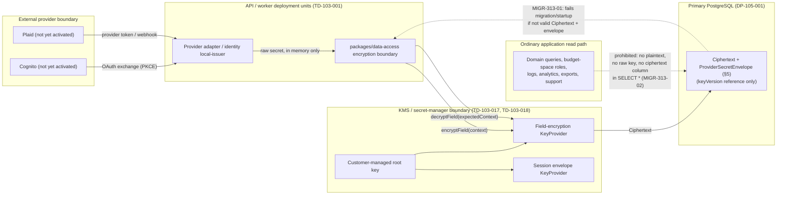

# CBD-313 — Provider Secret Custody Specification

| Field | Value |
| --- | --- |
| Status | **Proposed** — specification for independent review; not yet approved. |
| Document version | 0.1 |
| Owner | Security specialist, dispatched under task packet `CBD-313-SECRET-INVENTORY` (r1) |
| Jira | [CBD-313](https://cobudget.atlassian.net/browse/CBD-313) |
| Governing requirements | CBD-94 `SR-94-039`–`SR-94-043` (`docs/cbd-94-risk-mitigation-requirement-register.md`); CBD-95 `FU-95-008` (`docs/cbd-95-architecture-roadmap-follow-up-register.md`) |
| Governing topology | `docs/cbd-103-runtime-topology-specification.md` (`TD-103-017`, `TD-103-018` — KMS boundary, customer-managed keys); `docs/cbd-105-data-protection-and-recovery-specification.md` (`DP-105-001`, `DP-105-002` — what never appears in an ordinary row, create-time CMK) |
| Consumed data classification | `docs/cbd-91-private-mvp-data-inventory.md` §S4 ("Secret" tier), `DI-91-002`, `DI-91-003`, `DI-91-006`, `DI-91-010`, `DI-91-051`, `DI-91-072` |
| Consumed implementation pattern | `packages/data-access/src/encryption/*` (S4 field encryption, CBD-246-AC04); `packages/sessions/src/envelope-key.ts`, `packages/sessions/src/config.ts`; `packages/budget-application/src/invitations/secrets.ts`; `apps/api/src/budget-creation/composition.ts`; `apps/api/src/identity/config.ts`, `apps/api/src/identity/local-issuer.ts`; `packages/rate-limit/src/counter.ts` |
| Follow-on implementation packet | `CBD-315` builds the executable migration/startup check §6 specifies. This document specifies the rule only — no executable check is added here. |
| Repository baseline | `70106b3` |
| Last updated | September 18, 2026 |

## 1. Purpose and authority

`FU-95-008` requires selecting "managed hosting and key-management controls" and
defining "environment/account separation, workload identity, secret envelope,
rotation, break-glass custody, log redaction, local-development boundary, and
restore/redeploy path," directed by `SR-94-039`–`SR-94-043`. `SR-94-039`
specifically requires an inventory of "every secret/key/token/cursor/signing
value, its owner, purpose, store, readers, writers, rotation, revocation,
backup status, and prohibited destinations." No such inventory exists as a
single document today — the material is scattered across `docs/cbd-91-*`
(what class each secret belongs to), `docs/cbd-105-*` (why the primary
datastore never holds one in the clear), and the `packages/data-access`,
`packages/sessions`, and `apps/api/src/identity` source itself (what is
actually implemented today). This document is that inventory, plus the
envelope schema, the specified migration/startup check rule, the
SR-94/FU-95-008 mapping, the data-flow diagram, and the control map that
`SR-94-039`–`043` and `FU-95-008` ask for together.

This document is **derived**, not inventive: every custody rule in it either
restates an already-approved rule (`DP-105-001`'s exclusion table, `TD-103-017`/
`TD-103-018`'s KMS boundary, `CBD-246-AC04`'s field-encryption pattern) or
extends that pattern to a secret class the approved documents name but do not
yet enumerate one-by-one (Cognito, Plaid, the several already-implemented
signing/HMAC keys).

## 2. What this document does not do

* It does not implement an encryption change, a migration, or a startup check.
  §6's rule is specified for `CBD-315` to build; nothing here is executable.
* It does not activate Cognito or a Plaid connection. Both remain
  `PROVIDERS-LOCAL-001`-refused (Cognito: `apps/api/src/identity/config.ts`
  line 219; Plaid: no client exists in the repository at all — CBD-107/CBD-108
  select a provider separately). Their inventory rows below describe the
  custody path they must use *when* activated, not a live secret.
* It does not select a KMS vendor or set a rotation cadence in days. Those
  values are `DP-105-*`/`TD-103-*` open items this document does not resolve;
  §3's "Rotation" column states the trigger this repository already codes
  (schedule-agnostic key-version rollover), not a calendar value no approved
  source supplies.
* It does not change `packages/data-access/src/encryption/*`,
  `packages/sessions/*`, or any other file outside this new document.

## 3. Secret and signing-value inventory (`SR-94-039`, AC1)

Every provider secret, signing key, or keyed-digest key found in the
repository (grep for `encrypt`, `Hmac`, `sign`, `signing`, `secret`, `cognito`,
`plaid` across `packages/` and `apps/`, September 18, 2026), plus the two
provider credential classes the packet names that are not yet implemented
(Cognito client credentials, Plaid credentials). "Store" and "Backup &
retention" state the custody rule this table holds every row to — `DP-105-001`'s
exclusion table and `CBD-246-AC04`'s pattern — not a per-row exception.

| Secret | Owner | Purpose | Source | Store | Readers | Writers | Encryption | Rotation | Revocation | Backup & retention | Prohibited destinations |
| --- | --- | --- | --- | --- | --- | --- | --- | --- | --- | --- | --- |
| S4 field-encryption key material (`COBUDGET_FIELD_ENCRYPTION_LOCAL_KEY` / KMS) | Security (custody); Infrastructure (KMS binding, `CBD-120`) | Encrypts every S4 field column at rest (AES-256-GCM, `packages/data-access/src/encryption/cipher.ts`) | Local: developer-supplied env value, dev/test only. Hosted: `TD-103-017`/`TD-103-018` KMS boundary via `createKmsKeyProvider` (`kms-provider.ts`) — no client exists yet (`KmsProviderNotConfiguredError`) | Local provider refused outside `NODE_ENV=development\|test` (`LocalProviderNotAllowedError`); hosted key never leaves the KMS boundary — the application holds only a `keyVersion` reference | `resolveFieldEncryptionProvider` caller inside `packages/data-access` only; no other package imports the raw key | `apps/api/src/config.ts`, `apps/worker/src/config.ts`, `packages/migrations/src/local-config.ts` (the three registered call sites; `scripts/check-environment.mjs` enforces the list) | Is the encryption key; not itself "encrypted," but non-exportable under KMS and never persisted in the primary datastore (`DP-105-001`) | Key-version rollover: `resolveFieldEncryptionProvider`/`KeyProvider.keyByVersion` already support multiple live versions; cadence is a `DP-105-*` open item | Retiring a `keyVersion` from the KMS boundary makes every ciphertext at that version undecryptable; §6 specifies the startup proof that no row still needs a retired version before retirement completes | DI-91-072 governs recovery copies: separate encrypted/non-exportable recovery boundary, quorum/break-glass, no ordinary backup operator access | Ordinary domain rows, logs, queues, audit, diagnostics, support, analytics, exports, client bundles, source control (`SR-94-040`; `DP-105-001`) |
| Session verifier/CSRF pepper (`COBUDGET_SESSION_PEPPER`) | Security | Peppers the session verifier digest (`SC-191-001`) and is the HKDF root every derived session-scope key below comes from | `packages/sessions/src/config.ts`; required, ≥32 bytes, no silent default | Process environment only; never written to a row | `packages/sessions` verifier-comparison and key-derivation code paths only | Same three registered config call sites as field encryption | Not itself encrypted; the digests it produces are one-way (HMAC) and never reversed | Rotation invalidates every live session and every value derived from it in the same act (binding key, envelope key are separately versioned so they are not forced to rotate in lockstep) | Immediate: replacing the pepper makes every existing verifier digest and derived key un-reproducible | Not persisted; nothing to back up. Recovery = re-issue and force re-authentication | Ordinary domain rows, logs, queues, audit, diagnostics, support, analytics, exports, client bundles, source control |
| Session delivery-envelope key (`COBUDGET_SESSION_ENVELOPE_KEY` / KMS) | Security | Seals the session hand-off delivery envelope (`packages/sessions/src/envelope-key.ts`, `CBD191-SECURITY-002` finding 3) | Local provider, dev/test only; hosted path is `KmsEnvelopeKeyProviderNotConfiguredError` until `CBD-120`/Cognito activation | Same local-only admission rule as field encryption; deliberately **not** derived from the session pepper (compromise of one has no effect on the other) | Only `issuance.ts`'s isolated issuance/replay component receives an `EnvelopeKeyProvider`; `resolve.ts`/`fact-source.ts`/`cookie.ts` never do | Same three registered config call sites | AES-GCM sealing, versioned (`currentVersion`/`keyFor(version)`) | Key-version rollover, same mechanism as field encryption | Retiring a version makes envelopes sealed under it unopenable; the hand-off is short-lived by design (`CBD-190` §6), so this is a low-blast-radius rotation | DI-91-072 recovery boundary; not held in the primary-datastore backup path | Ordinary domain rows, logs, queues, audit, diagnostics, support, analytics, exports, client bundles, source control |
| Invitation purpose-derived digest keys (destination-token, code-verifier, ceremony-secret, channel-challenge, abuse-fingerprint) | Security | Keyed HMAC digests so a small-entropy plaintext (a 6-digit code, an address) is not enumerable from a stored column (`SEC-PK2-F07`) | Derived per call, per purpose, from the field-encryption provider's current key via HKDF (`packages/budget-application/src/invitations/secrets.ts`); never cached, never itself a stored secret | Exists only as an in-memory derived value for the duration of one digest computation | `packages/budget-application/src/invitations` command handlers only | Same handlers | HKDF-derived, purpose-separated; a compromise of one purpose's key reveals nothing about another's or about the root field-encryption key | Rotates automatically whenever the underlying field-encryption key rotates (no independent rotation surface) | Same as field-encryption key revocation | Not persisted independently of the field-encryption key it derives from | Raw `bearer`, `challenge`, or ceremony secret values are never stored or logged by this module; only the resulting digest is |
| Budget-creation-proposal binding HMAC key | Security | Signs/verifies the CBD-232 §7.1 confirmation-binding envelope so a proposal cannot be replayed or tampered with between preview and confirm | HKDF-derived once per process from the session pepper (`apps/api/src/budget-creation/composition.ts` `deriveBindingKeyring`); the pepper itself is never used directly as the HMAC key | In-process derived value, `keyId` `k1`; not persisted | `packages/budget-application/src/creation-proposals` binding sign/verify calls only | `composition.ts` at process startup | HKDF derivation, versioned binding format (`bindingVersion.keyId.mac`) | Rotates whenever the session pepper rotates (derived, not independent); a future independent rotation surface is an open item this document does not resolve | Same as session pepper revocation | Not persisted independently | Ordinary domain rows, logs, queues, exports, client bundles |
| Rate-limit bucket-key pseudonymization secret | Security | HMACs the rate-limit counting key so raw actor/network identifiers are never used directly as a bucket key (`packages/rate-limit/src/counter.ts`, `CountingKeyDeriver`) | Randomly generated per process (`randomBytes(32)`) unless a caller supplies one; not a provider credential | In-process only; the prototype counter store is explicitly "NEVER a fallback" for continued/hosted use | `packages/rate-limit` consume/derive path only | Process startup (`CountingKeyDeriver` constructor) | HMAC-SHA256; supports an overlapping previous/current secret pair for rotation without dropping in-flight buckets | Caller-triggered `rotate()`; overlap window configurable (`overlapMs`) | Rotation with a short overlap is the revocation mechanism — no separate revoke path | Not persisted; ephemeral per process (a hosted/continued rate-limit store is a separate, not-yet-made decision) | Ordinary domain rows, logs, exports, client bundles |
| Local identity-issuer RS256 signing key pair | Security | Signs the Cognito-shaped local OIDC issuer's ID tokens (`apps/api/src/identity/local-issuer.ts`, `PROVIDERS-LOCAL-001`) | Generated in-process (`generateKeyPairSync("rsa", 2048)`), dev/test only | Held only by the local issuer instance; public half published through its own JWKS endpoint | `local-issuer.ts` sign path only | Process startup and `rotateSigningKey()` | RSA private key never serialized to disk; public key is intentionally public (JWKS) | `rotateSigningKey()` supported; retired keys stay published until `retireOldKeys()` so in-flight tokens still verify | `retireOldKeys()` is the revocation path — a token signed by a retired, dropped key fails closed | Not persisted; regenerated per process, never a real secret outside a local environment | Private key material to any store, log, export, or client bundle |
| Cognito client credentials (not yet provisioned) | Security (custody); Infrastructure (provider account, `CBD-120`) | Would authenticate CoBudget's OAuth client to the hosted Cognito user pool once `PROVIDERS-LOCAL-001` is superseded | Provider console at activation time; `apps/api/src/identity/config.ts` already reserves the `"cognito"` `IdentityProviderKind` and fails closed on it today (`identityConfigFailures` line 219) | Would follow the same KMS/secret-manager boundary as field encryption (`TD-103-017`), never an application config file or the primary datastore. `COBUDGET_IDENTITY_CLIENT_ID` is explicitly documented as public/PKCE, not the secret in question | Would be scoped to the identity adapter's token-exchange call only | Would be one of the three registered config call sites, extended for the `cognito` branch when it is built | Would be S4 per `DI-91-002`'s IdP-only credential boundary | Provider-defined rotation; owed to the activation packet | Provider-defined revocation; owed to the activation packet | DI-91-072 recovery boundary once provisioned | Ordinary domain rows, logs, queues, audit, diagnostics, support, analytics, exports, client bundles, source control, `.env.local` committed to version control |
| Plaid client secret, access tokens, and webhook verification key (not yet provisioned) | Security (custody); Infrastructure (provider account, CBD-107/CBD-108) | Would authorize the financial-provider connection and verify webhook authenticity (`docs/cbd-107-connection-and-provenance-boundary-specification.md`) | Provider console at activation time; no client exists in this repository as of this document's baseline | Would be `DI-91-010` "financial-connection secret material": field-encrypted, separated from ordinary data, no product role or support access, service identity only under least privilege | Would be scoped to the provider adapter (a not-yet-built package) only | Would be added to the registered config call-site list when the adapter is built | Would use the same `EncryptionContext`-bound AES-256-GCM pattern `cipher.ts` already implements (tenant/table/row/column AAD), not a new construction | Revoke/rotate on disconnect or provider evidence, per `DI-91-010` | Revoke/delete on disconnect or provider termination subject to provider evidence (`DI-91-010`) | DI-91-072 recovery boundary; excluded from ordinary application backups (`DP-105-001`, `DI-91-044`) | Ordinary domain rows, logs, queues, audit, diagnostics, support, analytics, exports, client bundles, source control |
| Customer-managed KMS root key (the key that protects every key above) | Security (custody); Infrastructure (provisioning) | Envelope-protects the field-encryption and session-envelope keys once the KMS provider (`createKmsKeyProvider`) is bound to a real client | Cloud KMS/HSM boundary selected by `TD-103-017`, created at instance-creation time per `DP-105-002` (retrofit is not possible on any evaluated candidate) | Never leaves the KMS/HSM boundary; the application never sees raw key bytes, only `keyVersion` references and ciphertext | No application code; only the KMS client binding CBD-120 has not yet delivered | Infrastructure/security operators through the provider's IAM boundary, least-privilege (`SR-94-041`) | Provider-native (HSM-backed); this key is the encryption root, not itself wrapped by another application key | Provider-native rotation; must not silently re-encrypt existing ciphertext (key-version references make old ciphertext remain decryptable across root rotation) | Disabling key access is the documented emergency stop (`DP-105-002`): it suspends or makes the instance/keys inaccessible | DI-91-072: separate recovery custodian holds key-recovery custody with **no** path to customer content (`HG-102-006`, `SR-94-069`) | Any application store, config file, log, export, or backup outside the KMS/HSM boundary itself |

## 4. Token custody rule (`SR-94-040`, AC2)

**Rule `TC-313-01`.** Every value in §3 above is `S4`-classified per
`docs/cbd-91-private-mvp-data-inventory.md` §"S4 — Secret." Consistent with
that classification and with `DP-105-001`'s exclusion table, no provider
token, signing key, or derived secret-purpose digest is ever stored, logged,
queued, or exported as plaintext. Where a value must be persisted at all (the
inventory rows above that have a "Store" column entry other than "not
persisted" or "never leaves the KMS boundary"), it is stored as **authenticated
ciphertext plus a key reference**, never plaintext, in an ordinary domain row —
exactly the shape `packages/data-access/src/encryption/cipher.ts` already
implements for every other S4 field:

```ts
export interface Ciphertext {
  readonly keyVersion: string; // which KeyProvider version encrypted this
  readonly iv: string;         // base64, unique per encryption
  readonly authTag: string;    // base64, AES-256-GCM authentication tag
  readonly ciphertext: string; // base64
}
```

A future provider-token column (Cognito refresh material, a Plaid access
token) uses this same shape and the same `EncryptionContext`-bound AAD
(tenant/table/row/column) `cipher.ts` requires today — not a competing
construction. This is a **specification constraint on the future column's
shape**, not a new type: `CBD-315` (or whichever packet adds the first live
provider-token column) reuses `encryptField`/`decryptField` and this
document's §5 envelope metadata rather than inventing a second encryption
path.

**`TC-313-02`.** The authentication tag makes a tampered or misplaced
ciphertext fail to decrypt rather than silently return altered or
cross-tenant plaintext (`cipher.ts` lines 11–23) — the same reasoning
`CBD246-SECURITY-001` finding 4 already establishes for S4 fields generally,
extended here explicitly to provider tokens.

## 5. Envelope metadata schema (`SR-94-039`/`SR-94-040`, AC3)

The **envelope** is the record that selects which key and which purpose a
ciphertext belongs to, without itself exposing the secret or any financial
data. Its fields are metadata-safe by construction: none of them, alone or
combined, reveal the plaintext, and all of them are exactly what `cipher.ts`'s
`Ciphertext` and `EncryptionContext` types already carry today, made explicit
as the one schema every provider-secret column uses.

```ts
/** Provider-secret envelope metadata (CBD-313). Every field here is safe to
 *  log, index, or return to an operator; none of them is the secret. */
export interface ProviderSecretEnvelope {
  /** Schema version of this envelope shape, so a future revision is visible rather than silent. */
  readonly envelopeVersion: "cbd313-envelope-v1";
  /** Which KeyProvider produced the key ("local" | "kms"; see packages/data-access/src/encryption/config.ts). */
  readonly keyProviderName: "local" | "kms";
  /** The specific key version this ciphertext was encrypted under (Ciphertext.keyVersion). */
  readonly keyVersion: string;
  /** Closed, non-financial purpose label -- never a provider account number, token value, or amount. */
  readonly purpose: ProviderSecretPurpose;
  /** The EncryptionContext this ciphertext is bound to as AAD: tenant, table, row, column. */
  readonly boundTo: {
    readonly tenantId: string;
    readonly table: string;
    readonly rowId: string;
    readonly column: string;
  };
  /** When this envelope's ciphertext was written. Not the secret's provider-side issuance time. */
  readonly createdAt: string; // ISO 8601, UTC
  /** Set only during a rotation window: the key version this value is being migrated from. */
  readonly rotatedFrom?: string;
}

/** Closed vocabulary. Extend by adding a value here, never by writing a free-text purpose. */
export type ProviderSecretPurpose =
  | "identity-provider-client-credential"
  | "financial-provider-access-token"
  | "financial-provider-webhook-verification-key"
  | "session-delivery-envelope"
  | "invitation-digest-purpose-key";
```

**`ES-313-01`.** `purpose` is a closed enum, matching the pattern
`identityConfigSchema`'s `values: [...]` and `fieldEncryptionConfigSchema`'s
`values: ["local", "kms"]` already use — a free-text purpose field would let a
future column smuggle descriptive (and potentially identifying) content into
metadata that this schema promises stays safe to log.

**`ES-313-02`.** The envelope never carries the secret, the ciphertext, the IV,
or the authentication tag — those remain `Ciphertext`'s fields, stored beside
but structurally separate from the envelope, exactly as `cipher.ts` already
separates `EncryptionContext` (never persisted, passed fresh by the caller)
from `Ciphertext` (persisted, self-describing only as to key version).

**`ES-313-03`.** `boundTo` is the same four fields `encodeAad` already
requires (`assertNonBlank` on each), restated here as the schema's own
requirement rather than an implementation detail of one function, so a second
implementation of provider-token storage cannot drop the tenant/row binding
that makes a copied ciphertext fail to decrypt in the wrong place
(`CBD246-SECURITY-001` finding 4).

## 6. Migration/startup check rule — specified, not implemented (`SR-94-040`, AC4)

**This section specifies a rule. `CBD-315` implements it.** No executable
check is added by this document or this packet; adding one here would be
scope creep into `CBD-315`'s own ticket, per this packet's explicit
exclusion.

**Rule `MIGR-313-01` — a legacy or plaintext provider-secret row must fail
migration and startup.** At database-migration apply time and at every
process startup (`apps/api`, `apps/worker`, and any future provider-adapter
process), for every column this document's §3 inventory or §5 schema
designates as provider-secret-classified, the implementing check:

1. Reads the column's stored value and rejects it unless it parses as exactly
   the `Ciphertext` shape (`keyVersion`, `iv`, `authTag`, `ciphertext`, all
   present, all base64-shaped for the latter three) **and** an accompanying
   `ProviderSecretEnvelope` (§5) is present and structurally valid.
2. Resolves `keyVersion` against the currently configured `KeyProvider`
   (`resolveFieldEncryptionProvider` or the equivalent for the column's key
   family). An unresolvable version is a fail-closed error naming the column
   and row, never a silent skip or a fall-back to treating the value as
   plaintext.
3. Treats any row that is not exactly one of the above two things as a legacy
   or plaintext row and **fails the migration or startup outright**, naming
   the table, column, and count of offending rows — the same "fail loudly,
   name what is missing" posture `MissingFieldEncryptionConfigError` and
   `LocalProviderNotAllowedError` already establish for configuration. There
   is no code path that migrates a discovered plaintext value automatically;
   an automatic rewrite would itself require handling the plaintext in
   memory and logs during the fix, which is exactly the exposure this rule
   exists to prevent. Remediation is a manually-authorized, out-of-band
   re-encryption exercise, tracked as its own change.
4. Runs before any other application effect — consistent with
   `fieldEncryptionConfigFailures` and `identityConfigFailures` already
   running immediately after config load and before any adapter, listener,
   or effect exists.

**Rule `MIGR-313-02` — ordinary identities cannot read such a row even if one
existed.** Independent of `MIGR-313-01` catching it at migration/startup time,
an ordinary application identity (any budget-space role, any API/worker
request-handling code path outside `packages/data-access`'s encryption
boundary, any support or analytics identity) must be structurally unable to
read a plaintext or malformed provider-secret value even between the moment
it is written and the moment `MIGR-313-01` next runs:

* Provider-secret columns are never included in an ordinary domain query's
  projection (`SELECT *` is prohibited for any table carrying one; the
  application's read layer names columns explicitly, so an added
  provider-secret column requires a deliberate opt-in to expose it, never an
  accidental one).
* The database roles `DP-105-003` already establishes (api, worker,
  least-privilege) are the only roles with any DML access to a
  provider-secret column, and even those roles receive ciphertext, never a
  decrypted value — decryption happens only inside
  `packages/data-access`'s encryption boundary, in application memory, for
  the one call that needs it.
* No support tool, admin console, or diagnostic surface (`TD-103-021`'s
  separate diagnostic boundary) is granted a query path that returns a
  provider-secret column's raw stored value, decrypted or not.
* This property holds **regardless of `MIGR-313-01`'s outcome** — it is not
  contingent on the migration/startup check having run recently or at all. A
  row that is somehow legacy or plaintext is still unreadable by an ordinary
  identity through the ordinary read path; `MIGR-313-01` exists to stop the
  system from starting on top of such a row, not to be the only thing
  standing between it and disclosure.

`CBD-315`'s scope, per this specification: implement `MIGR-313-01` as an
executable migration-time and startup-time check (a new
`scripts/check-*` script or a `packages/migrations` hook, consistent with the
existing `fieldEncryptionConfigFailures`/`identityConfigFailures` pattern),
and add the negative tests (`MIGR-313-01` rejects a hand-crafted plaintext or
malformed row; `MIGR-313-02` is proved by a query-surface test showing no
ordinary-role query returns a provider-secret column's raw value) that
`SR-94-043` requires as build/runtime scanning and negative-test evidence.

## 7. `SR-94-039`–`043` and `FU-95-008` mapping (AC5)

| Requirement | Text (abbreviated) | Addressed in | Implementation owner | Evidence owner |
| --- | --- | --- | --- | --- |
| `SR-94-039` | Inventory every secret/key/token/cursor/signing value: owner, purpose, store, readers, writers, rotation, revocation, backup, prohibited destinations | §3 (this document) | Security (this document); kept current by whichever packet adds or retires a secret | Security — re-verified whenever §3 changes |
| `SR-94-040` | Provider tokens and high-impact application secrets use separated KMS custody; never in ordinary domain rows, queues, logs, audit, diagnostics, support, analytics, exports, or clients | §4 (token custody rule), §5 (envelope schema), §3 "Prohibited destinations" column | `CBD-315` (executable enforcement of §6); `CBD-120` (KMS client binding) | Security, at `CBD-315` review |
| `SR-94-041` | Workload/operator access to secrets is least-privilege, strongly authenticated, purpose-bound, time-bounded where human, independently auditable | §3 "Readers"/"Writers" columns (three registered config call sites; `DP-105-003` database roles); KMS/IAM policy is a `TD-103-017` open item | Infrastructure (KMS/IAM policy); Security (application-side least privilege, already implemented in the three call sites) | Security + Infrastructure, joint KMS/IAM policy review (`FU-95-008` evidence list) |
| `SR-94-042` | Rotation/revocation invalidates every dependent session, callback, connection, package, queue, replica, and backup recovery path without reactivating prior authority | §3 "Rotation"/"Revocation" columns per secret; §6 `MIGR-313-01` step 2 (unresolvable key version is a hard failure, never a reactivation) | Owning package for each secret (sessions, data-access, rate-limit, identity); `CBD-315` for the migration/startup enforcement | Security, at a rotation/revocation exercise (`FU-95-008` evidence list) |
| `SR-94-043` | Build/runtime scanning and negative tests prove prohibited secret fields do not enter logs, errors, traces, queues, audit, support, analytics, exports, or client bundles | Existing secret scanner (`scripts/secret_scanner.py`, run every packet); `CBD-315`'s negative tests for §6 | Guard (scanner maintenance); `CBD-315` (new negative tests) | Security + Guard, joint review at `CBD-315` |
| `FU-95-008` | Select managed hosting/KMS; define environment separation, workload identity, secret envelope, rotation, break-glass custody, log redaction, local-dev boundary, restore/redeploy path | §5 (secret envelope, satisfies "secret envelope"); §3 (local-dev boundary already implemented per secret via `LocalProviderNotAllowedError`/`EnvelopeKeyProviderNotAllowedError`/`PROVIDERS-LOCAL-001`); KMS vendor selection, break-glass custody, and restore/redeploy path remain `TD-103-*`/`DP-105-*` open items this document does not resolve | Infrastructure (`CBD-120`, KMS vendor selection); Security (envelope schema, this document) | Product Owner, at `CBD-120`/Cognito/Plaid activation approval |

## 8. Data-flow diagram



## 9. Control map

| Control | SR-94/FU-95-008 lineage | Mechanism | Evidence |
| --- | --- | --- | --- |
| Closed inventory of every secret/signing value | `SR-94-039` | §3 table, re-verified whenever a secret is added or retired | This document; `check-doc-vocabulary.py` catches a drifted enumeration if §3's rows are restated elsewhere |
| Provider tokens never in an ordinary row, queue, log, or export | `SR-94-040` | `Ciphertext` + `ProviderSecretEnvelope`, `SELECT *` prohibition, database role separation (`DP-105-003`) | `packages/data-access/src/encryption/*` (existing); `scripts/secret_scanner.py` per-packet run |
| Local-development boundary fails closed outside dev/test | `SR-94-040`, `FU-95-008` | `LocalProviderNotAllowedError`, `EnvelopeKeyProviderNotAllowedError`, `PROVIDERS-LOCAL-001` refusal of `cognito` | `packages/data-access/src/encryption/config.ts`; `packages/sessions/src/envelope-key.ts`; `apps/api/src/identity/config.ts` (all existing, unit-tested) |
| Least-privilege, auditable access to key material | `SR-94-041` | Three registered config call sites (`scripts/check-environment.mjs`); `DP-105-003` database roles; KMS/IAM policy (open item) | `check-environment.mjs` (existing); KMS/IAM policy review owed to `CBD-120` |
| Rotation/revocation without reactivating prior authority | `SR-94-042` | Per-secret key-version rollover (`KeyProvider.keyByVersion`); `MIGR-313-01` step 2 hard-fails an unresolvable version rather than falling back | §3 per-row "Rotation"/"Revocation"; `CBD-315` implements the fail-closed check |
| Build/runtime scanning and negative tests | `SR-94-043` | `scripts/secret_scanner.py` (existing, run every packet); `CBD-315`'s negative tests for `MIGR-313-01`/`MIGR-313-02` | Secret scanner output per packet; `CBD-315` review record |
| Migration/startup fails on a legacy or plaintext row | `SR-94-040`, `FU-95-008` | `MIGR-313-01` (specified here, built by `CBD-315`) | `CBD-315` implementation + test evidence |
| Ordinary identity cannot read a provider-secret column regardless of migration state | `SR-94-040` | `MIGR-313-02` — explicit column-projection and role-privilege design constraint | `CBD-315` query-surface negative test |
| Emergency stop via key-access disablement | `SR-94-042`, `FU-95-008` (break-glass custody) | `DP-105-002`'s CMK create-time decision; disabling key access suspends the instance on every evaluated candidate | `docs/cbd-105-data-protection-and-recovery-specification.md` §4 (existing, Approved) |
| Recovery custodian has no path to customer content | `SR-94-041`, `FU-95-008` | `DI-91-072`; `HG-102-006`/`SR-94-069` separation | `docs/cbd-91-private-mvp-data-inventory.md`, `docs/cbd-105-data-protection-and-recovery-specification.md` §4 (existing, Approved) |

## 10. Open items

* **`OI-313-01`.** KMS vendor selection, exact rotation cadence, and
  break-glass custodian identity remain `TD-103-*`/`DP-105-*` open items this
  document does not resolve. §3's "Rotation" column states the mechanism this
  repository already codes (key-version rollover), not a calendar value.
* **`OI-313-02`.** Cognito and Plaid rows in §3 describe the custody path
  those credentials must use at activation, not a live secret; both remain
  `PROVIDERS-LOCAL-001`-refused as of this document's baseline. Activation is
  a separate Executive decision per `apps/api/src/identity/config.ts`'s own
  comment.
* **`OI-313-03`.** The budget-creation-proposal binding key and the invitation
  digest keys are both derived from an existing root (the session pepper and
  the field-encryption key, respectively) rather than independently rotatable.
  Whether either warrants its own independent rotation surface is a design
  question for whichever packet next revisits `CBD-232`/`CBD-73`'s custody, not
  resolved here.
* **`OI-313-04`.** `CBD-315`'s exact implementation surface (a new
  `scripts/check-*.py`/`.mjs`, a `packages/migrations` hook, or both) is left
  to that packet's own design; this document specifies the rule's required
  behavior (§6), not its file layout.

## 11. Revision history

| Version | Date | Author | Change | Disposition |
| --- | --- | --- | --- | --- |
| 0.1 | September 18, 2026 | Security specialist, dispatched under task packet `CBD-313-SECRET-INVENTORY` (r1) | Initial provider-secret custody specification: inventory (§3), token custody rule (§4), envelope metadata schema (§5), specified (not implemented) migration/startup check rule (§6), `SR-94-039`–`043`/`FU-95-008` mapping (§7), data-flow diagram (§8), control map (§9), open items (§10). | Proposed; independent and Security review required before Approved. |
