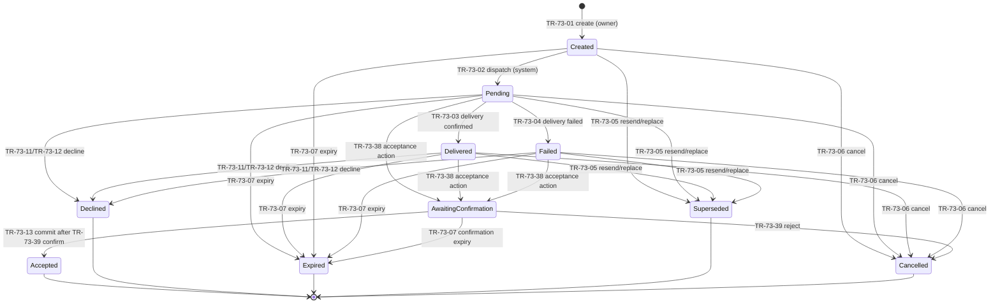

# CBD-73 — Invitation, Consent, and Revocation Lifecycle Specification

| Field | Value |
| --- | --- |
| Status | **Approved v1.0.6 — Product Owner approved this exact specification on August 18, 2026 at v1.0.3 and approved the §13.1 v1.0.4 amendment on September 15, 2026 (`PO-CONTRACT-APPROVALS-003`); v1.0.5 is the consequential §13.2 record of the `DR-73-09` membership-end reason-class vocabulary under `EXEC-FOLLOWUPS-003` item 5(a); v1.0.6 is the consequential §4.5 record of the `awaiting_confirmation` inviter projection under `EXEC-PK8-RULINGS-001` item (a) (`PO-CONTRACT-APPROVALS-001`), and the v1.0.4 approval otherwise stands. The §15 open issues remain binding; approval is of the specification, not of any implementation or evidence** |
| Document version | 1.0.6 |
| Owner | Alexander Wohlford |
| Jira | [CBD-73](https://cobudget.atlassian.net/browse/CBD-73) |
| Parent | [CBD-12](https://cobudget.atlassian.net/browse/CBD-12) |
| Epic | [CBD-1](https://cobudget.atlassian.net/browse/CBD-1) |
| Governing permission model | CBD-72 Collaboration Permission Model **v0.1.53**, approved August 18, 2026 (`docs/cbd-72-collaboration-permission-model.md`) |
| Governing schedule decisions | CBD-71 **MVP Schedule Decisions v1.1**, approved August 15, 2026 |
| Governing security/privacy requirements | CBD-94 Risk, Mitigation, and Security/Privacy Requirement Register **v1.0**, approved August 16, 2026 (`docs/cbd-94-risk-mitigation-requirement-register.md`), especially `SR-94-007`–`SR-94-011` |
| Governing product decisions | `RI-93-001`–`RI-93-019` dispositions recorded August 16, 2026 in `docs/cbd-95-architecture-roadmap-follow-up-register.md` §6 |
| Message inventory | `docs/cbd-73-customer-message-inventory.md` |
| Test inventory | `docs/cbd-73-negative-recovery-test-inventory.md` |
| Traceability and review | `docs/cbd-73-acceptance-criteria-traceability.md` |
| Last updated | August 18, 2026 |

> **Authority and blocking boundary:** The approved CBD-72 permission model, CBD-94 security/privacy requirements, CBD-91 data boundaries, the CBD-11/CBD-71 inherited rules, and the August 16, 2026 `RI-93-*` Product Owner decisions are controlling inputs. This specification defines the invitation, informed-consent, membership-change, revocation, and removal lifecycle that consumes them. It cannot weaken or broaden an approved outcome without explicit change control. The conspicuous register in §15 is normative: no behavior named there as blocked may ship, be treated as approved, or be silently resolved by implementation. Execution mechanisms may refine mechanics but not outcomes.

## 1. Purpose

This specification defines the complete lifecycle contract for budget-space collaboration membership: how an invitation is created and delivered, how the recipient proves control of the invited channel, what the recipient sees before consenting, what acceptance records, how roles and resource scopes change after acceptance, and how participation ends through revocation or removal. It is written to be complete enough for interface design, server-side policy design, data modeling, message drafting, threat review, and deterministic negative testing.

It defines requirements and outcomes. Exact code format, expiry durations, limiter values, template strings, and cache/job/session mechanisms remain gated execution-level decisions (`OI-73-004`, `OI-73-008`–`OI-73-012`; §15).

## 2. Scope and vocabulary

| Term | Meaning |
| --- | --- |
| Invitation | A server-side record offering one person one proposed role in one budget space, delivered to one intended email address or mobile phone number. A Viewer invitation never carries an initial profile or visibility grant; every new Viewer starts with no profile under CBD-72 §5.1. |
| Reconciliation code | The opaque, single-use secret embedded in the invitation link. It resolves the authoritative server-side invitation record and confers nothing by itself. |
| Synthetic suppressed invitation | A non-delivering, code-less security record created when an otherwise authorized create/resend is suppressed by an inviter block, pair limit, or other resolvable private recipient/account state such as already-active or ineligible membership. Its customer projection follows the ordinary created/pending/no-longer-active lifecycle and never reveals the suppression cause or account existence. |
| Customer projection | The allowlisted inviter/customer chronology and controls for an invitation request. It is deliberately separate from authoritative invitation state and restricted provider/security state; a private internal terminal cause may invalidate authority immediately while this projection remains `sent/pending` until its fixed `projection_inactive_at`. |
| Same-space sibling set | After candidate-account binding, the other invitations in the same budget space bound to the same account. Acceptance and membership-end rules use this set to prevent duplicate same-space authority. |
| Cross-space block-match set | Every enumerable active invitation from the blocked inviter, across all budget spaces, whose bound recipient account or OI-73-010-approved privacy token matches the authenticated blocking account. This set is distinct from same-space siblings and never includes or changes an existing membership. |
| Invited channel | The exact email address or mobile phone number the invitation targets. |
| Channel verification | Proof, performed during the acceptance ceremony, that the acting person controls the invited channel. Verification is not consent and is not account authentication. |
| Intended-recipient binding | A Product Owner- and Security/Privacy-approved, versioned rule that links the inviter's intended human to the candidate account by evidence stronger than invited-channel control or equality with the account's current verified primary contact. No such rule is currently approved; OI-73-001 therefore blocks every acceptance commit. |
| Ceremony binding | A server-generated, expiring, one-time correlation binding one invitation version, code verifier, invited-channel proof, authenticated candidate account, intended-recipient-rule result, disclosure version, optional destination proof, and final action. It is neither a session credential nor reusable authority. |
| Acceptance ceremony | The bounded server-mediated flow from opening the link through exact invited-channel verification and then either an explicit invitation-scoped decline, or deliberate authenticated account attachment, current protected disclosure, and an explicit final choice. |
| Consent evidence | The durable record proving versioned, informed agreement: person, budget space, role, resource scope, timestamp, consent-copy version, and source. |
| Historical consent evidence | Immutable evidence explaining a past grant. It is never an authorization input; membership and authorization versions are authoritative. A reduction, revocation, removal, transfer, or superseding consent links to the evidence it ended or replaced. |
| Notification-only destination | An optional, separately verified destination nominated during acceptance under `RI-93-011`. It receives supported notifications and nothing else. |
| Mandatory lifecycle notice | A membership-independent, account-subject notice about that subject's own lifecycle event. It always creates an authenticated in-app instance and may additionally route only to the subject's verified private safety channel under `RI-93-012`; it is not an alert instance and does not restore ended membership authority. |
| Inviter block | The recipient-controlled, account-level suppression of future invitations from one inviter under `RI-93-010A`. |
| Revocation | A member ending their own participation in one budget space. |
| Removal | An authorized owner ending another member's participation in one budget space. |
| Roles | Primary Owner, Co-owner, Collaborator, Viewer, and Accountability Partner, exactly as defined by CBD-72 §2.2. |

## 3. Governing invariants

| ID | Invariant | Source |
| --- | --- | --- |
| IC-73-001 | Only the Accepted state confers anything. An invitation in every other state confers no role, access, action, visibility, derived data, export, search result, alert eligibility, or notification-destination activation. | CBD-72 §2.1; CBD-73 scope |
| IC-73-002 | Link possession is never authority. The link exposes only an opaque, single-use reconciliation code; role, scope, recipient, consent, and invitation state are loaded from and validated against the authoritative server-side invitation record at every use. | CBD-73-AC16; CBD-12-AC35 |
| IC-73-003 | The recipient must verify control of the exact invited channel before acceptance. A forwarded link alone is insufficient, and verification proves neither consent nor that the controller is the human the inviter intended. | CBD-73-AC15; CBD-12-AC34; approved consent policy |
| IC-73-004 | Acceptance requires an explicit affirmative action, separate from opening the link and channel verification, taken by an authenticated account after complete current-version disclosure; it then requires the approved intended-recipient confirmation in §5.1 to pass before any membership, authority, or protected access exists. Both the acceptor's consent and the inviter's confirmation produce durable evidence. | CBD-73-AC04; CBD-12-AC14; `OI-73-001` closed by Product Owner decision, August 18, 2026 |
| IC-73-005 | Channel control is not sole control. Verification, possession, and even equality between the invited channel and an account's verified primary contact confer no intended-human, identity, login, recovery, primary-contact, or account authority; recorded consent is not proof of voluntariness. | RI-93-016; FU-95-007 boundary |
| IC-73-006 | Superseded, consumed, cancelled, expired, and declined invitation codes permanently confer nothing. A restricted provider-failure observation does not invalidate an otherwise current code. Prior invalidated codes can never restore access; restoration after membership end or any terminal invitation outcome requires a new invitation issued after that outcome. | CBD-73-AC05/CBD-73-AC10; CBD-12-AC15/CBD-12-AC35 |
| IC-73-007 | A role or resource-scope expansion requires explicit disclosure and new consent before expanded access begins. A valid, independently submitted pure reduction takes effect immediately with notification and never requires the affected member's consent. | CBD-73-AC06/CBD-73-AC07; CBD-12-AC16 |
| IC-73-008 | Revocation and removal stop budget-space authorization and alert delivery immediately, suppress queued notifications, and invalidate the affected access in existing sessions without signing the person out globally. The effect is scoped to one membership: sign-in, other budget-space memberships, and other roles are untouched. | CBD-73-AC09/CBD-73-AC10; CBD-12-AC17 |
| IC-73-009 | Previously contributed shared work remains in the budget space and stays attributed to the former member. Attribution changes only through the separately approved terminal account-deletion disposition (`RI-93-018`), which is out of CBD-73 scope. | CBD-12-AC17; CBD-92 PA-92-006 |
| IC-73-010 | Inviter/owner/admin/API observations use uniform, non-enumerating outcomes. No response, header, body shape, observable timing, status label, count, customer audit/export row, or error available to those observers distinguishes a blocked inviter, rate-limited pair, provider outcome, synthetic request, nonexistent/ineligible/already-member account, or another person's private state. This equivalence does not claim identical observation by the invited channel or delivery provider: a real request may deliver `MSG-73-002`, while a synthetic never contacts the channel; that inherent channel-side fact must never reflect back into inviter/admin/API surfaces. | `RI-93-010`; CBD-92 `RL-92-003`–`RL-92-005`; `SR-94-007`; `FU-95-019` |
| IC-73-011 | Authorization is default-deny, evaluated server-side at protected-detail open time and mutation time; permission loss invalidates open work; a denied mutation changes no state and is audited; concurrent changes never silently overwrite confirmed state. | CBD-72 `PM-72-001`–`PM-72-005` |
| IC-73-012 | Consent and membership authority are budget-space-specific. No consent, block, or preference recorded here creates account-global authority or changes an existing membership in another space. The only cross-space effect is the recipient's account-global inviter block suppressing/cancelling matched invitations under §8.2; it grants no authority and touches no membership. | CBD-73 planning notes; CBD-72 PM-72-010; `RI-93-010A` |
| IC-73-013 | Every customer-facing message in this lifecycle follows the approved `RI-93-016` semantic standard, and each external delivery stays within the approved CBD-92 channel ceilings. Exact strings, locales, and accessibility evidence remain gated under `FU-95-017`. | RI-93-016; FU-95-001 decision; FU-95-017 |
| IC-73-014 | The one bounded exception to unilateral self-revocation is a sole active Primary Owner, whose supported exits are Primary ownership transfer and budget-space archival; the interface always offers both. No other member's exit requires anyone's approval. | CBD-12-AC17; CBD-72 §6.3 |
| IC-73-015 | `SR-94-007`–`SR-94-011` are inherited without weakening: locators are high-entropy, purpose-specific, one-time, recipient/ceremony/version bound, expiring one-way verifiers; acceptance rechecks inviter authority, channel proof, the approved §5.1 intended-recipient confirmation, disclosure/invitation/membership/space/rate/resource versions; membership, invitation invalidation, consent, audit, and notice enqueue share one atomic or recoverably idempotent transition; concrete anti-lockout rate/resource controls are release gates. | CBD-94 `SR-94-007`–`SR-94-011` |
| IC-73-016 | Expiry is authoritative by timestamp, not by worker-materialized state. Code resolution, provider callback acceptance, and every ceremony commit require server time strictly before the stored expiry; a delayed expiry worker can never extend validity. | `SR-94-008`/`SR-94-009`; CBD-73-AC05 |
| IC-73-017 | An invitation issued at or before the attached account's most recent membership end in that budget space can never restore access or protected disclosure. Account attachment and acceptance each compare invitation issue time with prior membership-end time and terminalize a stale invitation; persisted candidate-account bindings are invalidated at membership end as defense in depth. | CBD-73-AC10; CBD-12-AC17 |
| IC-73-018 | Consent evidence is immutable history, never authority. Every ending, reduction, replacement, and transfer records the ended/superseded consent-evidence reference and the new authorization version or terminal no-change event; replaying historical evidence grants nothing. | CBD-91 `DI-91-005`/`DI-91-007`; CBD-73-AC04/CBD-73-AC10 |
| IC-73-019 | Every subject lifecycle notice is membership-independent: mandatory authenticated in-app plus, if configured and currently valid, only the subject's verified private safety channel. Missing, stale, quarantined, or failed safety delivery leaves the in-app notice available and never falls back to another external destination. | `RI-93-012`; `FU-95-020`; CBD-72 §6.3 |
| IC-73-020 | Every new Viewer membership starts with no profile and no financial, schedule, search, report, derived, export, or alert visibility. A profile is a separate post-acceptance expansion under §10. | CBD-72 permission 25 and §5.1 item 1 |
| IC-73-021 | A request that combines any reduction with any expansion is invalid and changes no state; the service never transforms or automatically splits it. CBD-73-AC07 applies only to a separately submitted valid pure reduction, which commits immediately as its own atomic action. Recovery from a rejected mixed request requires a new explicit pure-reduction request and, only after that commit, a separate versioned expansion proposal requiring consent. | CBD-73-AC06/CBD-73-AC07; CBD-72 permission 25 |

## 4. Invitation lifecycle state model

### 4.1 States

An invitation record moves through the following states. The reconciliation code is a separate object whose validity is derived from the invitation state (§4.3): the code is usable only while its invitation is active and becomes permanently unusable the moment the invitation leaves the active set.

| State | Class | Meaning |
| --- | --- | --- |
| Created | Active | Invitation metadata and authoritative expiry exist; delivery has not been requested and no reconciliation bearer or verifier exists yet. TR-73-02 generates them exactly once at the durable dispatch boundary. No recipient-facing artifact exists. |
| Pending | Active | Delivery was requested; no delivery confirmation has been observed. On channels without delivery confirmation, Pending is the ordinary pre-acceptance state. |
| Delivered | Active, restricted | The provider positively confirmed delivery before expiry. This changes only restricted provider evidence; the customer projection remains `sent/pending` because exposing Delivered would distinguish a real request from a synthetic one. It grants the recipient nothing. |
| AwaitingConfirmation | Active | The acceptor completed verification, authentication, disclosure, and the explicit acceptance action, and the invitation now waits on the inviter's intended-recipient confirmation under §5.1. It confers nothing: no role, access, alert eligibility, or destination activation exists in this state (`IC-73-001`). Its own authoritative expiry applies. |
| Accepted | Terminal | The verified, authenticated recipient completed the explicit affirmative acceptance; membership activated atomically; the code is Consumed. The only state that confers anything (IC-73-001). |
| Declined | Terminal | The verified recipient explicitly declined during the acceptance ceremony (`RI-93-010B`), with or without invoking the inviter block. |
| Expired | Terminal | The expiry time passed without a terminal outcome. |
| Superseded | Terminal | A resend or replacement created a successor invitation; this record and its code are permanently invalidated (CBD-73-AC05). |
| Cancelled | Terminal | An authorized owner withdrew the invitation before acceptance, or the system terminalized it under an exact invalidation rule in §4.4 additional rules 4–6. |
| Failed | Active, restricted | **Decided August 18, 2026 (`OI-73-008` Failed semantics).** Authenticated provider evidence conclusively failed. This is delivery metadata, not an authority outcome: the record and code remain active and can resolve, verify, decline, accept, be replaced/cancelled, or expire exactly like Pending/Delivered. The customer projection stays `sent/pending`; no holder or customer can learn the failure observation. |

> **Settled source semantics:** CBD-73 Jira AC01/AC05 can be read as requiring a terminal Failed invitation. The Product Owner decided on August 18, 2026 that Failed remains **active restricted delivery metadata**: a provider bounce never invalidates the code, never terminalizes authority, and never appears in a customer surface. A visible failure would tell the inviter they were not blocked, which `RI-93-010A` forbids, and a false bounce would otherwise destroy a legitimate invitation. The typo-recovery need that a visible failure would have served is met instead by the cause-neutral `MSG-73-053` prompt in §4.5, which every still-unaccepted request receives on the same normalized schedule. CBD-73-AC01 and AC05 must be corrected in Jira to state this model; that authorized Jira change is recorded in the traceability register and is not made by this document.

**Consumed** is the terminal disposition of the reconciliation code, reached exactly once, through acceptance. A consumed code is permanently unusable and any later presentation is denied and audited (IC-73-006). AC01's consumed outcome is therefore modeled on the code object, where single-use is enforced.

**AwaitingConfirmation** likewise extends the AC01 minimum list. It is required by the `OI-73-001` decision of August 18, 2026, which places the inviter's confirmation between the acceptance action and any grant; it is an active waiting state, not an outcome.

**Declined** extends the AC01 minimum state list. It is required by the approved `RI-93-010B` decision (an explicit decline-once / decline-and-block choice) and by the rejected-invitation language in the CBD-73 scope; the traceability record notes this addition.

### 4.2 State diagram

The ceremony steps between opening the link and the terminal outcome (code resolution, channel verification, account attachment, disclosure) are recorded events, not invitation states; the invitation remains in its active state until a terminal transition commits (§4.4 items 8–10).

The diagram shows authoritative real-invitation state, not the separate customer projection. Created has no bearer/verifier and is deliberately not ceremony-capable: its only exits are dispatch, replacement, cancellation, or expiry. Ceremony resolution, verification, decline, and acceptance require the dispatched active set Pending/Delivered/Failed. Failed is restricted delivery metadata, so every such transition available from Pending/Delivered is also available from Failed.

### 4.3 Code validity

1. A Created real invitation has no reconciliation bearer or verifier. TR-73-02 generates exactly one high-entropy raw bearer and its purpose/recipient/invitation/version-bound, expiring one-way verifier (`SR-94-008`) at first durable dispatch. Synthetic suppressed invitations never have either.
2. TR-73-02 atomically stores only the one-way verifier in the code record and writes the raw bearer solely as an envelope-encrypted, purpose-limited dispatch-outbox payload authenticated to the invitation ID/version, canonical destination, template purpose, and custody deadline. Only the narrow delivery worker may decrypt it just in time for `MSG-73-002`; application reads, code resolution, logs, audit, analytics, exports, support tools, and general backup/snapshot paths cannot access it.
3. A bounded dispatch retry reuses the identical encrypted payload and provider idempotency key; it never generates a second bearer for that invitation/version. The ciphertext and every queue replica are cryptographically erased/tombstoned immediately after provider admission is durably known, after a terminal no-retry disposition, on invitation replacement/cancellation/expiry, or at the fixed custody deadline—whichever comes first. It is excluded from backups. Ambiguous admission may retry only while custody remains; after erasure the same invitation never regenerates a bearer, and recovery is a TR-73-05 successor. Operational queue replication necessary for retry inherits the same access boundary, deadline, and deletion tombstone.
4. The code encodes no role, scope, recipient identity, budget-space identity, expiry, or authority; all of those live only in server-side records (IC-73-002). Outside the bounded encrypted dispatch custody above, the raw value exists only in the recipient delivery and an acceptance request and is never stored, logged, exported, backed up, or shown again.
5. Code usability requires a stored verifier, a dispatched active invitation state (Pending, Delivered, or restricted Failed), and authoritative server time strictly before expiry (IC-73-016). Created is not code- or ceremony-capable. Acceptance consumes the code; every terminal transition invalidates it. The permanent invalidation set is superseded, consumed, cancelled, expired, and declined (IC-73-006).
6. Valid-code resolution, including a code whose invitation has restricted Failed delivery metadata, emits exactly one `AE-73-08`. Any inactive, expired-by-time, malformed, unknown, or terminal-code presentation routes instead through TR-73-14 and emits exactly one `AE-73-14`; the same request never emits both. If an otherwise-active real record is expired by timestamp, TR-73-14 first executes TR-73-07 exactly once and the same correlation therefore also contains one `AE-73-07`. Repeated invalid presentations feed `FU-95-015` abuse controls through a non-reversible safe fingerprint, never the raw code.
7. Exact entropy, verifier construction, envelope/key separation, custody deadline, deletion proof, fingerprint construction, and durations remain OI-73-008 evidence gates; no implementation may persist readable bearer material or relax these bindings.

### 4.4 Transition table

Each row states the authorized actor, preconditions, resulting state, customer message, notification fan-out, audit event, and failure/recovery behavior (CBD-73-AC12). Message IDs resolve in `docs/cbd-73-customer-message-inventory.md`; audit IDs in §14.

| ID | Transition | Authorized actor | Preconditions | Resulting state | Customer message | Notifications | Audit | Failure and recovery |
| --- | --- | --- | --- | --- | --- | --- | --- | --- |
| TR-73-01 | Create real invitation | Primary Owner or Co-owner under permission 24 for Collaborator, Viewer, or Accountability Partner; Primary Owner only under permission 26 for Co-owner | Live space; current active acting membership; exact required permission, role, membership version, and authorization version captured; one canonical invited channel; valid proposed role; Viewer scope fixed to none; caller-known validation passes; block/limit/private-recipient-state evaluation does not require suppression | Created, with expiry and dispatch intent but no reconciliation bearer, verifier, or dispatch-custody payload | Initial create uses `MSG-73-001`; when invoked as TR-73-05's successor, return only TR-73-05's single `MSG-73-004` response | None beyond the inviter surface | Success: exactly one AE-73-01 customer-administrative event for the new record. Denial/no-op: exactly one AE-73-31 for each previously unseen request | Unauthorized, stale, archived-space, malformed, or unsupported-role attempts deny with no invitation and AE-73-31; an exact retry returns that correlation with no new event. Suppression solely from private recipient/account state—including a resolvable already-member/ineligible target—is not a denial and routes only to TR-73-15. A nonexistent no-account destination may receive an ordinary real invitation; no response reveals account existence. |
| TR-73-02 | Generate code and dispatch real invitation | System under narrow code-generation/outbox/delivery authority | Real invitation Created; no bearer/verifier/outbox payload exists; server time before expiry; provider operation admitted by current rate/resource controls | One atomic commit generates one raw bearer, stores its one-way verifier, writes the envelope-encrypted purpose-limited outbox payload/custody deadline/provider idempotency key, records AE-73-02, and moves invitation to Pending. Delivery worker then decrypts only for provider handoff | None; customer projection remains safe sent/pending | External `MSG-73-002` to the invited channel within channel ceilings | Exactly one AE-73-02 plus purpose-separated custody/delivery-attempt evidence; neither contains bearer/ciphertext | If the atomic commit fails, invitation remains Created with no bearer/verifier/outbox. After commit, bounded retries reuse the identical ciphertext and provider key. Provider admission, terminal no-retry, invitation invalidation, or custody deadline erases/tombstones every encrypted copy as §4.3 requires. After erasure the invitation/version never regenerates a bearer; owner recovery is TR-73-05. Conclusive provider failure follows TR-73-04; callbacks after non-Pending follow TR-73-19. |
| TR-73-03 | Internal delivery confirmation | System on authenticated provider evidence | Real invitation Pending; callback idempotency key new; authoritative server time strictly before `expires_at` | Internal Delivered; customer projection remains `sent/pending` | None; no delivery-confirmation/status/timing signal | None | Exactly one restricted AE-73-03; no customer audit/export projection | Duplicate, reordered, or at/after-expiry evidence follows TR-73-19. Absence of evidence leaves internal Pending. Expiry always wins over a new callback. |
| TR-73-04 | Record restricted delivery failure | System on authenticated provider evidence | Real invitation Pending; callback idempotency key new; conclusive bounce/rejection; authoritative server time strictly before `expires_at` | Active restricted Failed; code, ceremony eligibility, authoritative expiry, customer projection, and `projection_inactive_at` are unchanged | None; no failure/status/timing signal | None | Exactly one restricted security AE-73-04; no customer audit/export projection | Failed remains an active invitation. Resolution, verification, decline, acceptance, cancel, replacement, and expiry use the same rules as Pending/Delivered. Provider detail and failure time never change recipient behavior or enter a holder/customer surface; duplicate, reordered, or at/after-expiry evidence follows TR-73-19. |
| TR-73-05 | Resend / replace / create successor | Same current exact permission as TR-73-01 | Current actor still holds the required permission; predecessor customer projection is still active, whether the predecessor is active real (Created/Pending/Delivered/Failed), active synthetic, or privately terminal real/synthetic; current versions and rate/resource state rechecked | Active real predecessor becomes Superseded and its code invalid; active synthetic becomes SyntheticInactive; privately terminal predecessor keeps its authoritative/internal terminal state. The predecessor projection retires immediately as owner-known replacement, and exactly one separately linked real or synthetic successor is created through TR-73-01 or TR-73-15 | `MSG-73-004` | Successor delivery only if real | Success: exactly one AE-73-05 linking/retiring the predecessor, the successor row's exact events, and—if a prospective destination/ceremony existed—TR-73-37's one AE-73-16 retirement child. Denial/no-op: exactly one AE-73-31 for each previously unseen request | An unauthorized, stale, or already-inactive-projection request changes nothing and emits AE-73-31; exact retry returns the prior correlation. No predecessor, code, private terminal cause, suppression cause, or provider observation is revived or exposed. |
| TR-73-06 | Cancel invitation authority or retire a still-active projection | Current actor holding the exact permission required by TR-73-01; system only under an exact invalidation rule in this specification | Actor path: any still-active real or synthetic customer projection, including one whose internal state is already privately terminal, with permission/membership/authorization/invitation versions current. System path: an active real or synthetic invitation selected by an exact private invalidation rule | Actor path: active real becomes Cancelled/code invalid, privately terminal real keeps its state, or synthetic delegates to TR-73-18; projection retires immediately as owner-known cancellation. System path: active real becomes Cancelled/code invalid, or active synthetic becomes SyntheticInactive, immediately; its projection remains `sent/pending` until TR-73-07. Every real path invalidates ceremony/candidate bindings | Actor-initiated cancellation uses `MSG-73-005`; a private/system cancellation uses uniform `MSG-73-003` without changing the inviter projection before TR-73-07 | None; later code presentation follows TR-73-14 | Success: exactly one AE-73-06 for this cancellation edge (owned by TR-73-18 when delegated) and—if a prospective destination/ceremony existed—TR-73-37's one AE-73-16 retirement child. Denial/no-op: exactly one AE-73-31 for each previously unseen request | Unauthorized, stale, or already-inactive-projection actor attempts change nothing and emit AE-73-31; exact retries reuse the prior correlation. A later owner cancellation of a privately terminal invitation may retire its still-active projection as a distinct owner edge; it cannot rewrite or expose the private cause. |
| TR-73-07 | Materialize authoritative expiry or normalized projection inactivity | System clock/lifecycle service, or TR-73-14/TR-73-19 routing | Customer projection remains active and server time is at/after its immutable `projection_inactive_at`; for every real invitation this time equals its authoritative `expires_at`, and a synthetic uses the approved equivalent deadline | Active real (including Failed) becomes Expired and code invalid; privately terminal real keeps its state/code disposition. Active synthetic becomes SyntheticInactive; privately terminal synthetic stays SyntheticInactive. In every case the customer projection becomes the same non-attributing `no longer active` state | None at transition; terminal-code recovery uses uniform `MSG-73-003` | Customer-safe no-longer-active status; no external cause notice | Exactly one AE-73-07 for first materialization and—if a prospective destination/ceremony existed—TR-73-37's one AE-73-16 retirement child | Idempotent if projection is already inactive. Private causes cannot move the fixed deadline earlier; resolution, callbacks, and commits enforce authoritative expiry independently, so delayed materialization cannot extend authority. |
| TR-73-08 | Resolve valid code / replace current ceremony binding | Link holder | One-way verifier matches one dispatched active invitation/version (Pending/Delivered/Failed); server time before expiry; current rate/resource checks admit the attempt | Invitation unchanged. Atomically invalidate any prior current ceremony, invoke TR-73-37 once per prior prospective destination, then create exactly one new current expiring one-time ceremony binding. At most one ceremony per invitation/version is current | `MSG-73-010` | None | Success: exactly one AE-73-08 plus exactly one AE-73-16 per prior prospective destination retired through TR-73-37. Valid-code rate/resource denial: exactly one AE-73-31 and no AE-73-08/AE-73-16 | Inactive/unknown/malformed/expired-by-time code routes exclusively to TR-73-14. A valid-code rate/resource rejection changes no ceremony/invitation state, returns the same safe `MSG-73-010` retry envelope without cause detail, and is owned by TR-73-08/AE-73-31; a later new attempt may retry after the approved recovery condition. Exact idempotent retry returns its prior correlation. Resolution grants no authority or protected detail. |
| TR-73-09 | Verify invited channel | Person acting in the ceremony | Current ceremony binding; active invitation; server time before expiry; exact invited-channel proof succeeds within bounded attempts | Invitation unchanged; channel proof bound to ceremony/invitation/version | `MSG-73-011` | None | Exactly one AE-73-09 per attempt/outcome | Failure, cooldown, or abandonment grants nothing and leaves the invitation active until a terminal outcome. Proof cannot be moved to another ceremony or account. |
| TR-73-10 | Authenticate and attach candidate account | Verified channel controller | Current channel proof/current ceremony; the person deliberately authenticates an existing account or completes the gated new-account flow | When membership-eligible and not block-matched, invitation unchanged and a durable candidate-account binding is added. It records primary-contact match/nonmatch only as restricted evidence and, if one exists, the approved intended-recipient rule ID/version/result. Neither channel control nor primary-contact equality satisfies acceptance | Successful eligible attachment uses `MSG-73-012`; private terminalization uses TR-73-06's uniform `MSG-73-003` | None | Exactly one AE-73-10 per attachment attempt/outcome. Active-member, stale-pre-removal, or current inviter-block/account-token match adds exactly one AE-73-06; retired prospective destinations add one TR-73-37/AE-73-16 each | Before disclosure, compare membership history and recheck block/account-token match. Active membership, stale issue time, or block match closes the ceremony and routes TR-73-06 privately. Account switch retires every prospective through TR-73-37. Any account may attach under CBD-73-AC17, but a typo can equal a stranger's verified primary contact; therefore match is never intended-recipient proof. With no OI-73-001-approved binding rule today, TR-73-13 blocks every acceptance. |
| TR-73-11 | Decline once | Verified controller of the exact invited channel; account attachment is optional | Current active invitation and ceremony binding; current exact-channel proof; server time before expiry; explicit invitation-scoped decline-only action | Declined; code and ceremony invalid immediately; no membership, consent, destination, or block; customer projection remains `sent/pending` until TR-73-07 at fixed `projection_inactive_at` | `MSG-73-013` to the declining controller; no decline result is projected to the inviter | No attributable decline notice | Success: exactly one restricted AE-73-11 and—if a prospective destination exists—TR-73-37's one AE-73-16 retirement child. Denial/no-op: exactly one AE-73-31 for each previously unseen request | Available immediately after verification and on the authenticated disclosure surface. Unauthorized/stale/expired/reused attempts change nothing and emit AE-73-31; timestamp expiry additionally routes TR-73-07 in the same correlation. Exact retry adds no event. Interruption, timeout, ambiguity, or abandonment is not decline/block; abandonment invokes TR-73-37 only when a prospective destination exists. |
| TR-73-12 | Decline and block inviter | Verified, authenticated, deliberately attached recipient account | Current active invitation/ceremony/channel proof/account attachment; complete current disclosure shown; server time before expiry; explicit decline-and-block action | Current invitation becomes Declined and its code invalid immediately; account-level inviter block is created atomically. Every other invitation in the cross-space block-match set is internally cancelled through TR-73-06, one record at a time. All affected customer projections remain `sent/pending` until their fixed TR-73-07 time; existing memberships are untouched | `MSG-73-014` to the blocking recipient; nothing attributable to an inviter | None to inviter | Success: exactly one correlated AE-73-12 group, exactly one AE-73-06 child per additional cross-space block-match invitation, and one TR-73-37/AE-73-16 retirement child per affected prospective destination. Denial/no-op: exactly one AE-73-31 for each previously unseen request | If any required decline/block/enumerable-match cancellation cannot commit, none commits. Unauthorized/stale/no-account/reused attempts change nothing and emit AE-73-31; timestamp expiry additionally routes TR-73-07. Exact retries add no event. Alternate-channel/unenumerable records recheck at TR-73-10/TR-73-13. OI-73-010 gates matching/enumeration; OI-73-002 keeps no-account block unavailable while TR-73-11 remains available. |
| TR-73-13 | Commit acceptance after intended-recipient confirmation | System under narrow lifecycle authority, on a current TR-73-39 confirmation | Invitation `AwaitingConfirmation`; current TR-73-39 confirmation record whose binding-rule ID/version, acceptor account, invitation, and ceremony all match; server time before both the invitation expiry and the confirmation expiry; current channel proof and `MSG-73-016` disclosure; live/current creating authority and all versions; block/account-token recheck does not match; no active/stale membership; valid role/Viewer-none/one-Primary/rate-resource state | Accepted; code Consumed; projection retires as accepted; membership/consent/authorization activate atomically; exactly the eligible destination bound to the winning current ceremony may activate; every nonwinning prospective record retires through TR-73-37; every enumerable same-space sibling is internally cancelled | Success `MSG-73-015`; ordinary denial `MSG-73-021`; private block/active/stale terminalization `MSG-73-003`; ambiguous reconciliation `MSG-73-023` | Accepting subject's mandatory membership-independent in-app notice is `MSG-73-015` (optional copy only to verified private safety channel); inviting owner/eligible existing members receive `MSG-73-019` | Success: exactly one AE-73-13, one AE-73-30 subject enqueue, one AE-73-06 per sibling, one AE-73-16 only for the winning destination if activated, and one TR-73-37/AE-73-16 per nonwinner. Denial: exactly one AE-73-15; each privately terminalized/permission-loss invitation adds AE-73-06 and every prospective adds TR-73-37/AE-73-16 | Missing, stale, rejected, expired, or mismatched confirmation denies mutation-free with `MSG-73-021`, closes the ceremony, and retires its prospectives; channel or primary-contact equality can never substitute for the confirmation. Block or active/stale membership instead routes TR-73-06/`MSG-73-003`; creating-permission loss cancels every affected invitation. Ambiguous transport/infrastructure emits `MSG-73-023` and reconciles the same key to exactly `MSG-73-015`, `MSG-73-021`, private-terminal `MSG-73-003`, or still-pending—never partial/second acceptance. |
| TR-73-14 | Present invalid/unknown/inactive code | Whoever possesses the value | Value is malformed/unknown or resolves to superseded, consumed, cancelled, expired-by-state, expired-by-time, or declined invitation | Unknown/already-terminal values change no invitation state. An active real invitation, including Failed, that is expired by authoritative timestamp first routes TR-73-07, then returns the same denial | Uniform terminal recovery `MSG-73-003` | None | Exactly one AE-73-14 per presentation and never AE-73-08; when this request first routes an active expired record through TR-73-07, the same correlation also contains exactly one AE-73-07 and any applicable TR-73-37/AE-73-16 child | Unknown values use a global nullable-space event with a non-reversible fingerprint. Known values use a safe restricted state class. A current Failed code instead routes TR-73-08. Response, timing, and recovery never identify existence, terminal cause, or provider failure. |
| TR-73-15 | Create/resend synthetic private-suppressed invitation | System after an otherwise authorized initial create or a TR-73-05 successor operation | Caller-known validation passed; block, pair limiter, or resolvable private recipient/account state requires non-delivery; `PR-94-002`/`PR-94-003`/`PR-94-004` release gates apply; successor mode carries the authoritative TR-73-05 predecessor/correlation | SyntheticCreated; no code, no delivery, no recipient-facing artifact; successor mode links the already-retired predecessor | Initial create uses `MSG-73-001`; successor shares TR-73-05's single `MSG-73-004` response and emits no second message | None | Initial mode: exactly one customer-safe AE-73-01 plus one restricted AE-73-27. Successor mode: exactly one customer-safe AE-73-01 for the new record plus the one AE-73-05 owned by TR-73-05, and exactly one restricted AE-73-27; no second AE-73-05 | This is the only private-state suppression outcome, including resolvable already-member/ineligible state. It never returns a cause-specific message or account-existence signal. Caller-known authorization/malformed/archived-space failures instead remain mutation-free under TR-73-01/AE-73-31. Failure to create the synthetic record returns the same generic retry envelope as an admitted infrastructure failure. |
| TR-73-16 | Project synthetic dispatch | System | SyntheticCreated; approved equivalence schedule reached | SyntheticPending | `MSG-73-006` safe sent/pending status | None | One customer-safe AE-73-02 projection; restricted correlation only | No provider call occurs. Idempotent repeat has no second event. |
| TR-73-17 | End synthetic lifecycle | System clock/lifecycle service | SyntheticCreated/SyntheticPending, or privately terminal SyntheticInactive with a still-active projection; approved equivalent deadline reached | SyntheticInactive; projection becomes uniformly no longer active under TR-73-07 rules | `MSG-73-003` terminal recovery and `MSG-73-006` status projection as applicable | None | Exactly one customer-safe AE-73-07 projection plus restricted correlation; this is the synthetic materialization of TR-73-07 and never emits a second AE-73-07 | Cause remains unavailable to customer audit/export. Synthetic state can never become Delivered, Failed, Accepted, or recipient-visible. |
| TR-73-18 | Cancel synthetic invitation projection | Actor currently holding the same required permission as creation; reached through TR-73-06 for a synthetic predecessor | Current synthetic/version match; customer projection is still active; internal state may be SyntheticCreated, SyntheticPending, or privately terminal SyntheticInactive | Internal state becomes/remains SyntheticInactive; projection retires immediately as the actor's owner-known cancellation. A prior private system cancellation/cause remains restricted and is not rewritten or exposed | `MSG-73-005`, identical for active and privately terminal internal state | None | Exactly one AE-73-06 for this distinct actor projection-cancellation edge, owned jointly by the TR-73-06/TR-73-18 correlation. A prior private system AE-73-06 remains separate; exact retry emits neither again. Denial/no-op emits exactly one AE-73-31 per previously unseen request | Unauthorized/stale actor or already-inactive projection changes nothing and emits AE-73-31; exact retry returns the prior correlation. A resend must route TR-73-05. Internal state, timing, response, and controls never disclose whether private terminalization preceded the actor cancel. |
| TR-73-19 | Ignore late, reordered, or duplicate delivery callback | System on authenticated provider evidence | Callback duplicates an idempotency key, targets any state other than Pending, or is a new callback for Pending at/after `expires_at` | Ordinarily no state change. For a new Pending callback at/after expiry, first route TR-73-07 to Expired, then ignore the callback | None | None | Exactly one AE-73-28 per previously unseen ignored callback. The Pending-at/after-expiry path also has exactly one AE-73-07 in the same correlation; exact callback retries return the prior correlation with no new event | Expiry wins over both delivery confirmation and failure. The callback never rewrites terminal state, emits a delivery/failure status, retries recipient delivery, or changes code validity after TR-73-07. |
| TR-73-38 | Record acceptance action and open intended-recipient confirmation | Verified, authenticated, attached recipient account | Current one-time ceremony; dispatched active invitation/code (Pending/Delivered/Failed); server time before expiry; current `MSG-73-016` disclosure and explicit `MSG-73-017` acceptance action; current channel proof; block/account-token recheck does not match; no active/stale membership | `AwaitingConfirmation`; acceptor consent evidence recorded as pending and non-authorizing; confirmation request created with its own authoritative expiry; no membership, authority, access, alert eligibility, or destination activation exists | `MSG-73-051` waiting state, which states that the inviter will see the acceptor's display identity and must confirm before anything is shared | Inviting owner receives `MSG-73-050`; no existing-member notice occurs at this step | Exactly one AE-73-32 `confirmation_requested`, plus one AE-73-30 inviter enqueue | A second acceptance action on the same ceremony returns the existing authoritative request without creating a second one. Block, active/stale membership, or expiry instead routes TR-73-06/`MSG-73-003` or TR-73-14. Because nothing is granted here, an abandoned confirmation simply expires through TR-73-07. |
| TR-73-39 | Confirm or reject the accepting account | Any actor currently holding the exact permission that TR-73-01 required for this invitation | Invitation `AwaitingConfirmation`; current confirmation request; server time before the confirmation expiry; actor's permission, membership, and authorization versions current; explicit confirm-or-reject action against the displayed acceptor identity | Confirm: binding record written with rule ID/version and acceptor account, enabling exactly one TR-73-13 commit. Reject: invitation Cancelled, code invalidated, ceremony closed through TR-73-37, and the acceptor's pending consent evidence closed as non-authorizing history | Inviter sees the confirm/reject outcome; a rejected or expired acceptor receives the uniform `MSG-73-052` | Rejected or expired acceptor receives their mandatory `MSG-73-052` notice under `IC-73-019`; confirmation does not itself notify existing members, which happens at TR-73-13 | Exactly one AE-73-32 `confirmation_confirmed` or `confirmation_rejected`; a reject adds exactly one AE-73-06 and one AE-73-30 acceptor enqueue | Loss of the exact permission, a stale version, or confirmation expiry denies mutation-free with exactly one AE-73-31 and leaves the request to expire through TR-73-07; expiry grants nothing. Rejection is never presented to the acceptor as a judgement about them, and no surface tells the acceptor who rejected or why. Exact retry creates no new audit event. |

Additional transition rules:

1. Creation, resend, cancellation, every ceremony step, and acceptance recheck current state, authoritative time, rate/resource admission where applicable, and the exact relevant versions. A stale actor, proof, proposal, or record denies without access-conferring partial state.
2. Delivery uses only the minimum destination and purpose-specific allowlisted content. External templates, providers, and evidence remain gated in §15.
3. Customer status, controls, counts, audit, and export use only the safe projection. Restricted suppression, Failed delivery metadata, private terminal state, ceremony, security, provider, block, and limiter state never enters those surfaces. A private terminal cause invalidates authority/code immediately but cannot move `projection_inactive_at`; TR-73-07 later materializes the uniform result. Owner-known replacement/cancellation and accepted membership may retire the projection immediately.
4. Before account binding, “same recipient” means the same channel type plus canonical privacy-preserving normalized-destination token; a second active invitation in the same space uses TR-73-05. After candidate-account binding, the **same-space sibling set** contains only other invitations in that space bound to that account. Acceptance and membership end system-cancel every enumerable active same-space sibling through TR-73-06 in the causing atomic group, exactly one AE-73-06 each. Acceptance may retire those projections immediately as an owner-known accepted-membership outcome; a private membership-end cause stays normalized. Unopened alternate-channel records are caught by attachment/acceptance membership and prior-end checks.
5. The **cross-space block-match set** is separate: TR-73-12 cancels every other enumerable active invitation across all spaces from that inviter whose bound account or OI-73-010-approved privacy token matches the blocking account, exactly one TR-73-06/AE-73-06 each. Its private projections remain pending until TR-73-07. Existing memberships are never members of this set and are untouched. Pre-existing unenumerable/alternate-channel invitations recheck at TR-73-10/TR-73-13 and cannot bypass the block.
6. An invitation to an already-active member never creates a second membership or protected-disclosure path. A resolvable private state at create/resend uses TR-73-15. If later attachment reveals active membership, or issue time at/before latest membership end, the system executes TR-73-06 once, invalidates the ceremony/candidate binding, and keeps the inviter projection pending until TR-73-07. Acceptance repeats both checks to close races. Both recipient-side branches are exercised by `INV-73-18` and `VER-73-11`.
7. **Creating-permission loss.** The invitation records the exact permission, creating membership/role version, and authorization version required at creation. Losing that exact permission makes the system execute TR-73-06 exactly once for each active invitation, with exactly one AE-73-06 each, including one created by a former Primary who retains owner status but loses permission 26 after transfer. Each private projection normalizes through TR-73-07; restoring authority never revives it.
8. Nothing in any pre-acceptance or synthetic state creates role, visibility, alert eligibility, notification-destination activation, search/export inclusion, or derived presence.
9. Provider callbacks are authenticated, idempotency-keyed, state/version checked, and compared with authoritative `expires_at` before their payload is applied. TR-73-03 and TR-73-04 are strictly pre-expiry; TR-73-19 makes expiry win over any new at/after-expiry confirmation or failure. Failed remains active and its code/ceremony behavior is identical to Pending/Delivered.
10. Account attachment records primary-contact match/nonmatch only as restricted evidence; neither outcome distinguishes intended human from stranger. TR-73-13 requires a separate OI-73-001-approved intended-recipient rule/version/result. Until one exists, **all** acceptance commits deny; CBD-73-AC17 attachment and decline/block choices remain available.
11. TR-73-10 and TR-73-13 recheck the attached account's current inviter block and approved account/privacy-token match. A match privately invokes TR-73-06 with one AE-73-06, closes the ceremony through TR-73-37 when applicable, leaves the customer projection pending until TR-73-07, and cannot expose or bypass the block. Matching/enumeration implementation is gated by OI-73-010.

### 4.5 Customer-safe projection and synthetic suppression lifecycle

Every invitation request has a distinct allowlisted inviter/owner/admin/API projection. For ordinary real, Delivered/Failed real, privately terminal real, and synthetic records, that projection governs status, controls, counts, audit, and export and never asserts delivery, failure, decline, block, account state, or private cause. This equivalence is not a fiction about the invited channel: only a real request may send `MSG-73-002`; synthetic non-delivery is never reflected back to the administrative observers. Real `projection_inactive_at` equals `expires_at`; synthetic uses the approved equivalent deadline, and no callback/private cause moves it earlier.

The synthetic lifecycle is mandatory for inviter-block, pair-limit, and otherwise-authorized private recipient/account-state suppression and is never an implementation option. Its internal states are `SyntheticCreated`, `SyntheticPending`, and `SyntheticInactive`; it has no reconciliation code, provider delivery, recipient surface, acceptance path, or budget-space-visible cause. A Failed real invitation remains fully active and follows the same `sent/pending` projection as Pending. Declined, block-matched, already-member, stale-prior-membership, creating-permission-loss, and other private/system terminal outcomes invalidate authority/code immediately but keep the same controls and projection until owner replacement/cancellation or TR-73-07 at the fixed deadline.

1. Status/API body shape, headers, response timing distribution, pagination/count behavior, audit rows, exports, and view/cancel/resend availability use the same allowlisted projection under `PR-94-003`/`PR-94-004`.
2. Customer audit/export records only AE-73-01, AE-73-02, owner-known AE-73-05/AE-73-06, accepted membership, and AE-73-07 when the normalized projection actually retires. AE-73-03/AE-73-04 and private-cause AE-73-06/AE-73-11/AE-73-12 remain restricted until the safe projected edge; they cannot reveal cause or timing. AE-73-27 may name `block_suppressed`, `pair_limit_suppressed`, or a coarse `private_state_suppressed` class only in restricted security scope.
3. Status polling, view, cancellation, and resend operate equivalently on active real (including Failed), privately terminal real with a still-active projection, and active synthetic records. Resend always routes TR-73-05, retires/links one predecessor, and independently creates one real or synthetic successor from current private-state/block/limit evaluation. Actor cancellation always gives the owner-known safe outcome; neither operation discloses any prior cause.
4. Block-suppressed attempts and pair-limit accounting remain purpose-separated. Exact counters, recovery, and anti-lockout rules are blocked by `PR-94-002`/`SR-94-011`; no counter exhaustion may prevent recipient actions, block removal, existing memberships, or unrelated inviter/recipient pairs.
5. **Cause-neutral resend prompt (`MSG-73-053`).** Every still-unaccepted request — ordinary Pending, internally
   Delivered, restricted Failed, privately terminal, and synthetic alike — receives the same prompt on the same
   normalized schedule, inviting the inviter to check the destination or resend. It is driven only by elapsed time and
   non-acceptance, never by delivery outcome, so it restores typo recovery without distinguishing a bounce from a
   block. No variant of this prompt may be conditioned on provider evidence.
6. **Awaiting-confirmation projection (`EXEC-PK8-RULINGS-001` item (a), September 15, 2026).** A real request whose acceptance TR-73-38 has recorded and which is awaiting the owner's §5.1 confirmation projects `awaiting_confirmation` to the inviter, distinct from `pending` and from `accepted`. A synthetic record never reaches it, exactly as it never reaches `accepted`: the synthetic lifecycle of this section has no acceptance path. The projection carries no cause — it tells the inviter only that a decision is waiting, never why, and adds nothing beyond what §5.1 already allows the inviter to see.
7. Customer-equivalence evidence, not prose alone, is required before release. The relevant fully namespaced scenarios are `DCL-73-02`, `DCL-73-06`, `DCL-73-08`, `DCL-73-10`–`DCL-73-12`, and the CBD-94 `VT-94-009`–`VT-94-017` suite.

## 5. Invited-channel verification and account attachment

The canonical ceremony is a fixed partial order with one safe early-exit branch; a client may not reorder or bypass it:

1. **Resolve.** TR-73-08 validates a current one-way verifier for Pending/Delivered/Failed. A new non-idempotent resolution becomes the sole current ceremony, invalidates the prior ceremony, and retires each prior prospective destination through TR-73-37/AE-73-16. Valid-code rate/resource rejection is mutation-free TR-73-08/AE-73-31. No protected detail is shown.
2. **Verify invited channel.** TR-73-09 proves control of the exact invited channel and binds the proof, invitation/version, time window, and bounded-attempt state to the ceremony. A forwarded, shared, or leaked link is insufficient.
3. **Permit plain decline or continue.** Immediately after exact-channel verification, the controller may explicitly end only this invitation through TR-73-11. `MSG-73-022` explains that protected/account-bound paths require authentication while `MSG-73-013` keeps invitation-scoped decline available. That early decline reveals no protected detail, needs no account, and cannot create a block, consent, destination, or membership. Continuing does none of those things implicitly.
4. **Authenticate and attach account for every protected path.** TR-73-10 deliberately authenticates one candidate account, checks membership/block state, and binds its subject/session-assurance reference to the current ceremony. Account switching invalidates the binding and retires every prospective destination. Primary-contact equality is recorded evidence but never proves intended-recipient identity. Acceptance, destination nomination, and account-level decline-and-block are unavailable before attachment.
5. **Disclose and choose.** Only after both channel proof and eligible account attachment does the service show complete versioned `MSG-73-016` disclosure and the `MSG-73-017` explicit unselected accept/decline/decline-and-block choice. A recipient may still choose invitation-scoped decline here; acceptance, block, and destination verification bind to the same ceremony/version.
6. **Commit once.** Acceptance additionally requires an OI-73-001-approved intended-recipient rule to pass; none exists today, so acceptance is blocked pending that decision. A successful future commit consumes the current ceremony and may activate only its winning destination; every nonwinner retires through TR-73-37. Retry returns the prior safe result; superseded/concurrent ceremony, expired proof, or mismatched account denies and retires its prospectives.

Verification and account attachment confer no intended-human proof: a typo may be the stranger's verified primary contact, so equality cannot be a safe acceptance predicate. TR-73-10 records match/nonmatch only as restricted evidence. TR-73-13 requires a separate OI-73-001-approved intended-recipient rule/version/result; because none is approved, all acceptance commits are currently blocked without classifying the controller as legitimate alternate contact or stranger. The invited channel is never promoted to account authority or a destination.

A person without an account may explicitly decline only this invitation after exact-channel verification. To accept or create an account-level block, they must use the separately gated identity/account-creation flow and return with a deliberately attached authenticated account. Whether any durable no-account decline-and-block composition exists remains unresolved under OI-73-002; interruption is never treated as decline or block. Exact identity/provider mechanics are OI-73-012.

Verification attempts are bounded, rate/resource checked, cooled down, and uniformly answered under `FU-95-015`, `PR-94-002`, and `SR-94-007`/`SR-94-011`. Evidence records the bindings in DR-73-03 and never stores a raw verification secret.

### 5.1 Intended-recipient confirmation (`OI-73-001`, decided August 18, 2026)

Channel control proves that someone holds the invited address or number. It does
not prove that the holder is the person the inviter meant, because a mistyped
destination can be a stranger's verified primary contact. The Product Owner
decided on August 18, 2026 that the inviter confirms the specific accepting
account before any grant exists.

1. The acceptor's affirmative action does not commit membership. It opens a
   confirmation request through TR-73-38 and leaves the invitation
   `AwaitingConfirmation`, which confers nothing (`IC-73-001`).
2. The confirming actor is whoever currently holds the exact permission
   TR-73-01 required — not necessarily the original inviter, so an owner who
   leaves cannot strand a pending acceptance.
3. The inviter sees the minimum needed to decide: the acceptor's safe display
   identity (`DI-91-065`), the invited channel as already masked in their own
   surfaces, the proposed role, and the consequence of confirming. They never
   see the acceptor's private contact profile, other memberships, or any
   account detail beyond the shared display identity.
4. The acceptor is told before they act that the inviter will see their display
   identity and must confirm. This is the same two-way disclosure `RI-93-009`
   already requires, stated at `MSG-73-016` and repeated at `MSG-73-051`.
5. Confirmation is a versioned binding record naming the rule ID/version and
   the exact acceptor account (`DR-73-13`). TR-73-13 commits only against a
   current one. Primary-contact equality between the invited channel and the
   account never substitutes for it (`IC-73-005`).
6. Rejection cancels the invitation and grants nothing. The acceptor receives
   the uniform `MSG-73-052`, which never characterizes them, names who
   rejected, or states a reason. Expiry of the confirmation request has the
   same customer-visible outcome as rejection, so an unattended request cannot
   be distinguished from a deliberate refusal.
7. **Accepted disclosure trade-off.** A confirmation prompt tells the inviter
   that a real invitation reached someone who accepted, which a block-suppressed
   synthetic request never produces. That inference already existed at
   membership activation; this decision moves it earlier, before any financial
   data is shared, and does not create a new class of disclosure. It is
   recorded here rather than designed away, because the alternative is granting
   access to an unconfirmed human.
8. This rule governs the product decision only. Security/privacy review and the
   `VT-94-009`–`VT-94-017` verification fixtures remain implementation gates
   under `OI-73-012` and CBD-94; approval of this specification is not evidence
   that the control works.

## 6. Consent policy

1. Opening the link is not consent. Verifying the invited channel is not consent. Only the explicit affirmative acceptance action, taken after the complete current-version disclosure, is consent (approved consent policy; IC-73-004).
2. Consent evidence records person, budget space, role, resource scope, timestamp, consent-copy version, and source (CBD-73-AC04; §13 DR-73-04). The source names the acceptance surface and the invitation record and version it resolved.
3. Consent is versioned. A material change to the disclosure content, proposed role, or permitted scope after dispatch requires replacement (TR-73-05) so the recipient always consents to the current version; an acceptance against a stale disclosure version is denied at commit (TR-73-13).
4. Consent is membership- and budget-space-specific (IC-73-012). Acceptance in one space consents to nothing in any other space and to no account-global behavior.
5. Recorded consent is evidence of the ceremony, not proof of voluntariness (`RI-93-016`). Consent, decline, and revocation copy must remain voluntary, accessible, and nonjudgmental and must always include a safe path to decline or leave (CBD-73-AC13; message inventory §3).
6. Consent evidence never authorizes. Current membership status, role/profile/scope, authorization version, space lifecycle, and policy version authorize. Every later reduction, revocation, removal, replacement, or transfer links the consent evidence it ends/supersedes and leaves that evidence immutable for historical explanation (IC-73-018).

## 7. Pre-acceptance disclosure

### 7.1 Surface boundary

1. The external delivery message (email or SMS) carries the minimum needed to act: the link with its opaque code and generic CoBudget framing within the approved channel ceilings. Protected detail belongs to the authenticated, verified ceremony surfaces, not to the external message (FU-95-001 decision; IC-73-013). The exact external template is gated by OI-73-004.
2. Before channel verification, the ceremony surface discloses only the approved ceremony-entry minimum — that this is a MoneyPact invitation requiring verification — and no budget-space identity, inviter identity, member list, or financial data (IC-73-010).
3. The full disclosure below and its accept/decline/decline-and-block choices are presented only after channel verification **and** authenticated account attachment in the same ceremony (§5).
4. The pre-authentication surface may additionally offer only the explicit invitation-scoped TR-73-11 decline after exact-channel verification. It discloses no protected detail and cannot create an account-level block or any other persistent account state.

### 7.2 Required disclosure content

Before the acceptance action, the recipient sees, in the current consent-copy version (CBD-73-AC03; CBD-12-AC13; `RI-93-009`):

1. The budget-space identity and the inviting member's display identity.
2. The proposed role, in approved role terminology, and what that role can and cannot do — the permitted actions and restrictions inherited from CBD-72.
3. The shared resources the role would see: every new Viewer starts with **no profile and no visibility**, and any later profile is a separate §10 expansion; an Accountability Partner has the fixed comprehensive financially read-only boundary of CBD-72 §5.3; a Collaborator or Co-owner has the approved full shared financial scope. The disclosure never includes actual pre-consent financial data, hidden resources, private member details, or an unauthorized member list (`RI-93-009`).
4. The two-way view: what existing members will see about the acceptor after acceptance — display identity, role, and attributed activity per CBD-72 permission 1 and `DI-91-065` — and what remains private to the acceptor (personal notification settings, personal alert state, other-space memberships).
5. The authorized alert behavior of the role: whether and how the member can receive alerts about budget-space activity, and for an Accountability Partner the informational-alert eligibility, stated within the CBD-71/CBD-72 alert invariants.
6. The revocation/removal method, stated for the proposed role: every non-Primary member may leave unilaterally; Primary Owner and Co-owner may remove a Collaborator, Viewer, or Accountability Partner; only the Primary Owner may remove a Co-owner through the protected flow; nobody may remove/demote the Primary through an ordinary membership action. A sole Primary always has both supported unilateral exits—transfer and archival—and the disclosure explains what removal does and does not affect.
7. The consequence boundary of acceptance: acceptance activates the role immediately; no payment, financial, legal, or bank-account authority is created (CBD-72 §1).
8. The `RI-93-010B` unselected choice — accept, decline once, or decline and block this inviter — presented without a default.
9. The optional `RI-93-011` notification-only destination nomination (§9), including that the invited channel does not automatically become a notification destination.

A Viewer invitation cannot carry or activate an initial profile. Acceptance creates a Viewer membership with no profile and no visibility; an owner may then propose one profile as a separate §10 expansion, and nothing becomes visible until the Viewer consents and that proposal commits.

### 7.3 Two-way member notice at acceptance

At acceptance, `MSG-73-015` is both the accepting recipient's authoritative result and their mandatory membership-independent authenticated in-app lifecycle notice; only their configured/current verified private safety channel may receive the optional external copy. Existing affected members receive `MSG-73-019` per entitlements/preferences/channel ceilings: the new member's safe display identity and role, never ceremony, channel, destination, or safety detail. The AE-73-30 child belongs to the `MSG-73-015` subject notice; `MSG-73-019` is existing-members-only.

## 8. Decline, inviter block, and invitation limiting

### 8.1 Decline

1. Plain invitation-scoped decline appears as an explicit unselected action immediately after exact invited-channel verification and remains available on the later authenticated disclosure surface (`RI-93-010B`). It needs no account, reveals no protected detail, and creates no block. Decline-and-block is hidden and server-denied until an authenticated account is deliberately attached; OI-73-002 governs any proposed no-account block composition.
2. Decline once (TR-73-11) ends this invitation's authority/code immediately and creates no persistent account state; its inviter/customer projection remains `sent/pending` until the fixed TR-73-07 edge. A future invitation from the same inviter is permitted, subject to §8.3.
3. Decline and block (TR-73-12) ends this invitation's authority/code immediately, creates the §8.2 block, and cancels the distinct cross-space block-match set in the same atomic commit; every affected projection follows the same private-cause normalization.
4. Interruption, ambiguity, timeout, or abandonment neither declines nor blocks (`RI-93-010B`).

### 8.2 Inviter block (`RI-93-010A`)

1. The block is recipient-controlled, account-level state binding one blocked inviter (an authenticated account) for the authenticated blocking recipient, across all budget spaces, until the recipient removes it. No block record exists for a no-account person; OI-73-002 keeps no-account decline-and-block unavailable.
2. While active, invitation creation and resend targeting the blocking recipient by the blocked inviter use only the §4.5 synthetic lifecycle. No limit-specific or block-specific customer response exists.
3. The block changes no existing membership in any space and has no effect on any other inviter (`RI-93-010A`).
4. The recipient manages their blocks in their personal account settings; the list, its existence, and its changes are invisible to every other person, and block records never appear in budget-space-scoped audit surfaces (§14 item 4).
5. The required outcome is that an account-bound block still matches approved destination/alias tokens without exposing account existence, while an unrelated destination never matches. Canonical alias equivalence, privacy-token derivation/versioning/rotation, storage, and recovery are unresolved under OI-73-010; account-block matching cannot release until that gate closes.
6. At block commit, every other enumerable active invitation in the cross-space block-match set—across all spaces from that inviter to the blocking account or its OI-73-010-approved privacy tokens—is system-cancelled through TR-73-06 inside the TR-73-12 atomic group, with one AE-73-06 per invitation. This is not the same-space sibling set. Every private projection stays pending until TR-73-07; unenumerable/alternate-channel records recheck at TR-73-10/TR-73-13 and cannot bypass the block. Existing memberships remain untouched.

Block removal is itself a defined personal-account transition:

| ID | Transition | Actor and preconditions | Result | Customer message | Notifications | Audit cardinality | Failure/recovery |
| --- | --- | --- | --- | --- | --- | --- | --- |
| TR-73-29 | Remove inviter block | Authenticated blocking recipient; current personal block/version; explicit removal | Block becomes inactive; future invitations are evaluated only against current controls; already-terminal invitations remain terminal | Recipient-only `MSG-73-024` | None to inviter or budget-space members | Success: exactly one AE-73-26 on first commit. Denial/no-op: exactly one AE-73-31 for each previously unseen request | Unauthorized, stale, or already-removed requests change nothing and emit AE-73-31; exact retry returns the prior correlation. Removal never recreates, delivers, or reveals a prior suppressed invitation. |

### 8.3 Pair-scoped invitation limit (`RI-93-010C`)

1. A cross-space limit is keyed to the authenticated inviter plus a privacy-preserving recipient key. It counts inviter-originated create and resend attempts, never recipient actions.
2. There is no recipient-wide quota: limiting one inviter–recipient pair never affects the recipient's ability to receive invitations from anyone else, and legitimate unrelated inviters are never throttled by another inviter's behavior (`FU-95-019`).
3. Exhaustion produces only the §4.5 synthetic lifecycle with equivalent responses, customer status, audit/export, and timing evidence (CBD-92 `RL-92-003`–`RL-92-005`; IC-73-010).
4. No raw recipient identifier is stored or logged in limiter state; exact alias equivalence, values, token/key derivation and versioning, storage, rotation, and recovery evidence are gated by OI-73-010 and `PR-94-002`.
5. The limit composes with the volume ceiling on the invitation surface (`RL-92-001`) and the `FU-95-015` abuse controls; the strictest applicable control governs.

## 9. Notification-only destination (`RI-93-011`)

1. During the authenticated acceptance ceremony, the recipient may optionally nominate one notification-only destination different from the invited channel, because invited-channel control is not sole control.
2. The destination record is bound to the candidate account, budget space, prospective membership, invitation/version, ceremony binding, destination type/value, proof version, and expiry. Its separate verification is one-time and ceremony-bound. Failed, stale, mismatched, replayed, or abandoned proof activates nothing and does not block ordinary acceptance.
3. The destination activates only in the atomic acceptance commit (TR-73-13), only for the resulting membership in that budget space, and only when verification remains current. Nothing activates on decline, expiry, supersede, cancellation, failed acceptance, another ceremony, or another space.
4. The destination is invisible to the inviter and to every other budget-space member (CBD-72 §5.4 personal-settings boundary).
5. The destination is notification-only: it grants no identity, login, recovery, primary-contact, account, invitation-proof, acceptance, or cross-space authority, and it follows channel ceilings and the recipient's preferences for this membership.
6. The invited channel is never automatically promoted. This destination is not automatically the `RI-93-012` private safety channel; safety designation is separately subject-controlled and verified. Later changes use the subject's personal notification/safety settings under their applicable gated workflow.
7. Revocation or removal atomically retires only the destination association bound to the ended membership and budget space. The same destination value's independently verified association with another membership or space remains untouched. TR-73-30, TR-73-31, and TR-73-32 each name the conditional AE-73-16 retirement child.

| ID | Transition | Actor and preconditions | Result | Customer message | Notifications | Audit cardinality | Failure/recovery |
| --- | --- | --- | --- | --- | --- | --- | --- |
| TR-73-36 | Nominate and verify optional notification-only destination | Verified/authenticated candidate in the sole current ceremony; supported destination differs from invited channel; one-time proof within limits | Successful proof atomically retires any prior prospective for this ceremony through TR-73-37, then leaves exactly one verified prospective bound to invitation/version/current ceremony; failure activates/creates nothing | `MSG-73-018` | None | Exactly one AE-73-16 per proof attempt/outcome, plus exactly one TR-73-37/AE-73-16 if a prior prospective is replaced; TR-73-13 owns later activation | Failed proof creates no prospective. Exact retry reuses its correlation. New proof, ceremony replacement, cancellation, expiry, decline, account switch, denial/nonselection, or abandonment retires each affected prospective exactly once and never blocks ordinary decline. |
| TR-73-37 | Retire prospective destination and close its ceremony binding | System or causing transition; a nonactivated prospective destination exists and its ceremony is replaced or otherwise closes, or its invitation is replaced/cancelled/expires/declines, its account switches, or acceptance denies/completes without selecting it | Prospective destination `Retired`; proof and ceremony binding permanently unusable; invitation state/projection otherwise follow the causing transition | None beyond the causing transition | None | Exactly one AE-73-16 retirement child per prospective record correlated to the cause | Invoked atomically by a new TR-73-08 for every prior-ceremony prospective, TR-73-05/TR-73-06/TR-73-07/TR-73-11/TR-73-12, applicable TR-73-10 account switch, and TR-73-13 for every nonwinning prospective or on denial/abandonment/closure. If no prospective exists it is not invoked; retry returns the prior correlation with no second event. |

## 10. Role and resource-scope changes after acceptance

Owner authority is exactly CBD-72's: permission 25 for non-owner role transitions, permission 22 for Viewer profile/groups, permission 26 for Co-owner appointment, and §6.2/permission 29 for Primary transfer. A material expansion proposal has one of these states: `Proposed` (active), `Declined`, `Withdrawn`, `Expired`, `Invalidated`, or `Committed` (terminal). Consent and commit are one atomic transition; there is no access-conferring `Consented` intermediate state.

Classification is evaluated against the member's current effective authority/visibility at commit:

- **Expansion:** adds any authority or visibility, including first Viewer profile, profile widening, added groups, broader role, or Co-owner appointment.
- **Reduction:** removes authority/visibility and adds nothing. It commits immediately without affected-member consent.
- **Mixed:** adds and removes in one request. Mixed requests are rejected without proposal, reduction, expansion, or other state change (IC-73-021). The service does not reinterpret Collaborator→Viewer-with-profile as two operations. Recovery requires the owner to submit a new explicit Collaborator→Viewer-with-no-profile pure reduction; only after that independently commits may the owner submit a separate Viewer-profile expansion proposal.

### 10.1 Change transition table

| ID | Transition | Actor and preconditions | Result | Customer message | Notifications | Audit cardinality | Failure/recovery |
| --- | --- | --- | --- | --- | --- | --- | --- |
| TR-73-20 | Propose expansion | Current owner holding exact permission 22, 25, or 26; live space; active affected membership; before/after versions current; proposal adds authority/visibility and removes nothing | Proposal `Proposed`; current membership unchanged | `MSG-73-030` complete before/after voluntary disclosure | Mandatory membership-independent in-app proposal for affected member; optional external copy only through IC-73-019 routing/ceilings | Exactly one AE-73-17 plus exactly one AE-73-30 enqueue child for the affected member | A mixed request routes TR-73-27; unauthorized, stale, duplicate, or invariant-invalid requests route TR-73-28. Neither creates a proposal. |
| TR-73-21 | Accept and commit expansion | Affected authenticated member; current Proposed record/disclosure; explicit consent; proposal/member/owner-permission/space/policy/rate-resource versions current | Success: proposal `Committed`; role/profile/scope, authorization version, consent, and superseded-evidence link commit atomically. A conclusive TR-73-21 failure itself is mutation-free | Success `MSG-73-031`; mutation-free denial `MSG-73-029` | Success: mandatory subject notice and owner safe result. Mutation-free denial: none | Success: exactly AE-73-18 + AE-73-19 + one AE-73-30. Conclusive mutation-free denial: exactly one AE-73-20 and no AE-73-18, AE-73-19, or AE-73-30 | Any dependency version/authority/space/policy invalidation routes TR-73-25 instead, which owns the Invalidated mutation and AE-73-20 plus AE-73-30. Infrastructure/rate failure before commit leaves proposal/membership unchanged; ambiguous result reconciles one idempotency key. No partial access. |
| TR-73-22 | Decline expansion | Affected authenticated member; current Proposed record; explicit decline | Proposal `Declined`; membership unchanged | `MSG-73-037`; current access unchanged | Proposer receives non-attributing safe outcome; exact copy remains gated by OI-73-004 | Exactly one AE-73-18 | Interruption is not decline. Retry returns prior result. Decline never reduces current access. |
| TR-73-23 | Withdraw expansion | Proposer or another actor currently holding the same exact permission; current Proposed record | Proposal `Withdrawn`; membership unchanged | `MSG-73-038`; current access unchanged | Mandatory affected-member lifecycle outcome under IC-73-019; proposer gets current safe result | Exactly one AE-73-18 plus one AE-73-30 enqueue child | Exact retry of the committed withdrawal returns its prior correlation with no event. A previously unseen stale/terminal/caller-unauthorized withdrawal routes mutation-free TR-73-28/AE-73-20; a dependency version/authority invalidation routes TR-73-25/AE-73-20+AE-73-30. |
| TR-73-24 | Expire expansion | System clock; authoritative expiry timestamp reached on Proposed record | Proposal `Expired`; membership unchanged | `MSG-73-039`; current access unchanged | Mandatory affected-member lifecycle outcome under IC-73-019; proposer gets current safe result | Exactly one AE-73-18 plus exactly one AE-73-30 enqueue child for the affected member | Timestamp is enforced at action/commit even if worker is delayed; idempotent materialization. |
| TR-73-25 | Invalidate stale expansion | System or commit path; affected membership/role/profile, proposal disclosure, proposer permission, space lifecycle, or policy version changed | Proposal `Invalidated`; membership otherwise follows the separately authorized change that caused invalidation | `MSG-73-029`; fresh proposal required | Mandatory affected-member lifecycle outcome under IC-73-019; proposer gets current safe result | Exactly one AE-73-20 plus exactly one AE-73-30 enqueue child for the affected member, correlated to the causing transition | No reversal of the causing action. Recovery is a new current-version proposal. |
| TR-73-26 | Commit immediate pure reduction | Current owner holding permission 22 or permission 25; live space; affected active non-owner membership; independently submitted request removes authority/visibility and adds nothing; current versions rechecked | Membership role/profile/scope reduced atomically; authorization version advances; deterministic invalidation-set/idempotency references recorded; stale artifacts/jobs/alerts cease authorizing; ended consent evidence linked | `MSG-73-032` before/after class, effective time, remaining access, supported next step | Mandatory subject lifecycle notice under IC-73-019; relevant owners get entitled safe result | Exactly one AE-73-19 correlated group plus one AE-73-30 enqueue child; the group contains the invalidation-set reference | Consent is neither requested nor accepted. Notification or physical-cleanup failure never delays the authorization reduction; current-version checks fail closed and OI-73-009 gates completion/reconciliation evidence. Restoration requires a later, separately submitted TR-73-20/TR-73-21 expansion. |
| TR-73-27 | Reject mixed change | Any caller presents one command that both adds and removes authority/visibility | No proposal, reduction, expansion, or membership state change | `MSG-73-029`: rejected command did nothing; submit a new explicit pure reduction and, only after it commits, a separate consented expansion | None beyond caller | Exactly one AE-73-20 | The service never transforms, splits, queues, or partially applies the mixed command. CBD-73-AC07 immediate effect applies only to the later valid pure-reduction request. |
| TR-73-28 | Deny unauthorized/stale/direct change | Caller-specific permission failure, previously unseen stale/terminal request, or direct mutation path while the proposal dependencies themselves remain current | No state change | `MSG-73-029` safe denial/current-status outcome | None | Exactly one AE-73-20 | Default deny; exact retry returns prior correlation. A dependency version/authority/space/policy invalidation is not this row and must route TR-73-25. |

Co-owner appointment uses TR-73-20/TR-73-21 with permission 26 and its additional CBD-72 safeguards. Primary transfer uses the dedicated §12 table. Every change preserves historical consent as evidence only (IC-73-018).

## 11. Revocation and removal

### 11.1 Authority

| Action | Authority | Source |
| --- | --- | --- |
| Revoke own participation | Any member, unilaterally, without another party's approval — except a sole active Primary Owner, whose supported exits are transfer and archival, both always offered (IC-73-014) | CBD-12-AC17; CBD-72 §6.3 |
| Remove a Collaborator, Viewer, or Accountability Partner | Primary Owner or any Co-owner, through a prominent confirmation flow naming the member and the consequences | CBD-72 permission 24 |
| Remove a Co-owner | Primary Owner only, as a protected action under the CBD-72 §6.1 contract (fresh reauthentication, explicit named confirmation, commit-time recheck) | CBD-72 permission 27 |
| Remove or demote the Primary Owner | Nobody; atomic transfer (§12) is the only replacement path | CBD-72 permission 28 |
| Cancel a pending invitation | §4.4 TR-73-06 | CBD-72 permission 24 |

Self-revocation requires an explicit confirmation naming the budget space and the consequences; it is deliberately low-friction and never requires approval, a reason, a waiting period, or another party's action (CBD-73-AC13 safe-leave requirement).

### 11.2 Revocation and removal transition table

An active membership ends in exactly one terminal state: `Revoked` for self-departure or `Removed` for another actor's authorized removal. Duplicate/concurrent end attempts do not create a second terminal transition.

| ID | Transition | Actor and preconditions | Result | Customer message | Notifications | Audit cardinality | Failure/recovery |
| --- | --- | --- | --- | --- | --- | --- | --- |
| TR-73-30 | Self-revoke | Authenticated active member other than sole active Primary; explicit current confirmation names space/consequences | Membership `Revoked`; authorization version advances; RC-73 checklist starts; ended consent references linked; any notification-only destination bound to this membership/space retires atomically, with other-space associations untouched; RC-73-08 invitation authority is cancelled | `MSG-73-033` before confirmation and after commit | Mandatory subject lifecycle notice under IC-73-019; relevant owners receive `MSG-73-035` | Exactly one AE-73-21 commit, one AE-73-30 subject-notice enqueue child, zero or one AE-73-16 destination-retirement child, exactly one AE-73-06 per invitation cancelled by RC-73-08/creating-permission loss, and one AE-73-23 per asynchronous checklist effect through TR-73-35 | Commit, invitation cancellation set, conditional destination retirement, and required in-app notice enqueue share IC-73-015 atomic/idempotent protocol. Private invitation projections normalize through TR-73-07. Later effect/notice failures never restore authority. |
| TR-73-31 | Remove Collaborator/Viewer/Accountability Partner | Current Primary or Co-owner under permission 24; active target; current actor/target versions; explicit precommit confirmation through `MSG-73-047` names the target, role, and consequences | Membership `Removed`; authorization version advances; RC-73 checklist starts; ended consent references linked; any destination bound to this membership/space retires atomically, with other-space associations untouched; RC-73-08 invitation authority is cancelled | Before commit `MSG-73-047`; after commit target `MSG-73-034` and entitled owners `MSG-73-035` | Mandatory target lifecycle notice under IC-73-019; relevant owners safe result | Exactly one AE-73-22 commit, one AE-73-30 target-notice enqueue child, zero or one AE-73-16 destination-retirement child, exactly one AE-73-06 per invitation cancelled by RC-73-08/creating-permission loss, and one AE-73-23 per asynchronous effect through TR-73-35 | Stale/concurrent/unauthorized request routes TR-73-34; no partial effect. Private invitation projections normalize through TR-73-07. Notice failure never delays cutoff. |
| TR-73-32 | Remove Co-owner | Current Primary under permission 27; fresh action-bound reauthentication; current actor/target/ownership versions; explicit precommit `MSG-73-049` names the Co-owner and consequences | Membership `Removed`; authorization version advances; RC-73 checklist starts; other owners and connection authority unchanged; any destination bound to this membership/space retires atomically, with other-space associations untouched; every active invitation created under the Co-owner's lost permission and every RC-73-08-bound invitation is cancelled | Before commit `MSG-73-049`; after commit target `MSG-73-034` and Primary/relevant owners `MSG-73-035` | Same mandatory target routing as TR-73-31 | Exactly one AE-73-22 with assurance reference, one AE-73-30 target-notice enqueue child, zero or one AE-73-16 destination-retirement child, exactly one AE-73-06 per invitation cancelled by RC-73-08/creating-permission loss, and one AE-73-23 per asynchronous effect through TR-73-35 | Any stale assurance/version denies through TR-73-34. No other role may invoke this path. Private invitation projections normalize through TR-73-07. |
| TR-73-33 | Deny sole-Primary departure/removal | Sole active Primary attempts self-revocation/deactivation/membership deletion, or any actor attempts ordinary Primary removal/demotion | No membership change; both unilateral exits offered | `MSG-73-036`, accurately presenting transfer **and** archival | Mandatory authenticated in-app denial/outcome for the Primary; only their current verified private safety channel may additionally receive an approved safe copy; missing/failure has no other external fallback | Exactly one AE-73-24 plus the AE-73-30 enqueue/delivery cardinality | Never a dead end and never a support-transfer suggestion. Transfer follows §12; archival follows CBD-72 §6.5. |
| TR-73-34 | Deny stale/unauthorized/duplicate end attempt | Missing permission/assurance, target mismatch, stale version, or target already ended | No state change | `MSG-73-026` safe current-status/no-op outcome | None except an entitled existing outcome | Exactly one AE-73-29 for a previously unseen attempt; exact idempotent retry returns prior result | Concurrent attempts deterministically yield one TR-73-30/TR-73-31/TR-73-32 commit and one no-op denial, never double effects. |
| TR-73-35 | Complete/retry asynchronous cutoff effect | Lifecycle service under narrow service authority; committed Revoked/Removed membership; named RC item incomplete | Membership remains terminal; one checklist effect marked complete | None unless the effect changes a previously communicated safe state | No new customer notice unless required by an approved retry/failure semantic | Exactly one AE-73-23 per RC item completion; retries reuse the same item/idempotency key | Exhausted retry enters the gated operational recovery path in OI-73-009; it never reopens authorization. |

### 11.3 Revocation and removal execution checklist

Every revocation and removal executes all of the following, atomically where marked, and the checklist is the deliverable contract for CBD-73-AC09/CBD-73-AC10. Items marked *(execution-level)* state the required outcome; the mechanism is an architecture decision (§15).

| ID | Requirement | Timing |
| --- | --- | --- |
| RC-73-01 | End the membership's authorization: every subsequent read, mutation, search, report, export, and derived-data evaluation for that membership denies (`PM-72-001`/`PM-72-002`). | Atomic with commit |
| RC-73-02 | End ordinary alert eligibility: the former member's eligible alert instances close and no new alert instance is created. The mandatory membership-independent lifecycle notice is not an alert and is not suppressed. | Atomic with commit |
| RC-73-03 | Atomically retire the notification-only destination association bound to the ended membership and space, emitting exactly one AE-73-16 retirement child when such an active association exists; leave any independently verified association for another membership/space untouched. Suppress queued, unsent **ordinary** attempts for the ended membership. The subject-lifecycle notice outbox is purpose-separated and remains deliverable under IC-73-019. Already-delivered external copies are outside recall (`RI-93-016`). | Destination retirement atomic with commit; queue suppression immediate |
| RC-73-04 | Invalidate the affected budget-space access in existing sessions without signing the person out of CoBudget globally: the session survives; its authority in this space ends *(execution-level: session/cache versioning per `FU-95-007`)*. | Immediate |
| RC-73-05 | Invalidate caches, derived artifacts, open work, report caches, pending downloads, and undownloaded packages that depend on the ended membership's authorization *(execution-level: authorization-version keying per `FU-95-010`)*. | Immediate |
| RC-73-06 | Stop queued and scheduled jobs from acting under the ended authority: jobs reauthorize against current state before effect, so queued work for this membership denies at execution *(execution-level: `FU-95-009` envelope)*. | Before any later effect |
| RC-73-07 | Deny in-flight requests at their commit-time recheck (`PM-72-002`/`PM-72-003`); a mutation that began under valid authority and commits after revocation fails without partial state. | At commit |
| RC-73-08 | System-cancel through TR-73-06 every active invitation/code durably bound to the account in this space, every enumerable same-space sibling, and every active invitation created under the exact permission/version lost with this membership, with exactly one AE-73-06 per invitation in the membership-end atomic group. Retire any associated prospective destination through TR-73-37/AE-73-16. Private projections remain pending until fixed TR-73-07. Independently, TR-73-10/TR-73-13 reject and terminalize an invitation issued at/before this membership-end time, closing unopened/alternate-channel gaps. Restoration requires a later-issued invitation (IC-73-006/IC-73-017). | Atomic with commit plus attachment/commit-time defense |
| RC-73-09 | Preserve previously contributed shared work in the budget space, attributed to the former member via the safe display identity (`DI-91-065`); the former member loses the ability to read, edit, or remove it through the ended membership (CBD-72 §5.6 item 7). | Permanent |
| RC-73-10 | Leave every other budget-space membership, role, block record, personal notification setting, independently verified other-membership/other-space destination association, and the person's CoBudget sign-in untouched (IC-73-008). | Always |
| RC-73-11 | For a connection authorizer: stop that connection's synchronization, preserve imported records and provenance, make private configuration inaccessible, and transfer authority to nobody (CBD-72 §6.3; PM-72-011). | Immediate |
| RC-73-12 | Create the affected person's mandatory authenticated in-app lifecycle notice independent of membership authority; optionally send only to their current verified private safety channel. Missing/failed/quarantined safety delivery has no external fallback. Notify relevant owners with safe, nonjudgmental, non-attributing copy under their own entitlements (`RI-93-012`/`RI-93-015`; `MSG-73-033`–`MSG-73-035`). | In-app enqueue atomic with commit; delivery after commit |
| RC-73-13 | Record the complete audit group: request, confirmation/reauthentication evidence where required, commit, ended/superseded consent references, conditional membership-destination and prospective-destination AE-73-16 retirement, exactly one AE-73-06 per RC-73-08/permission-loss invitation, each checklist effect completion, required-notice enqueue/delivery outcome, and any denial (§14). | With each step |
| RC-73-14 | For non-owner removal present `MSG-73-047`; for Co-owner removal present `MSG-73-049` and additionally enforce the CBD-72 §6.1 protected-action contract. Each precommit message names the specific member, role, and concrete consequences. | Before commit |

### 11.4 What revocation and removal never do

1. Never sign the person out of CoBudget or touch another budget space (IC-73-008).
2. Never delete, reattribute, or orphan contributed shared work (IC-73-009).
3. Never expose why the person left or was removed, to anyone, in any notice, status, or export; copy never characterizes another person's circumstances (`RI-93-016`).
4. Never leave a budget space without an active Primary Owner (CBD-72 PM-72-008, §6.3): flows that would violate the invariant are denied and the transfer/archival exits are offered instead (IC-73-014).
5. Never grant the remover any new authority — no connection adoption (CBD-72 §6.3), no content moderation (CBD-72 §5.6 item 4), no personal-settings access (CBD-72 §5.4).

## 12. Primary ownership transfer consent ceremony

CBD-72 §6.2 and permission 29 control eligibility, resulting roles, and connection boundaries. The workflow states are `Proposed`, `RecipientAccepted`, `PrimaryConfirmed`, `Ready` (both current records present), `Declined`, `Withdrawn`, `Expired`, `Invalidated`, and `Committed`. Consent/confirmation may arrive in either order; no role changes before Committed.

| ID | Transition | Actor and preconditions | Result | Customer message | Notifications | Audit cardinality | Failure/recovery |
| --- | --- | --- | --- | --- | --- | --- | --- |
| TR-73-40 | Propose Primary transfer | Current Primary under permission 29; fresh current ownership/membership versions; selected recipient is another active member | Workflow `Proposed`; no role change | Recipient `MSG-73-040`, including full powers, prior-role closure, unchanged connection authority, and both later sole-Primary exits—transfer or archival | Mandatory recipient lifecycle proposal under IC-73-019; any external copy is safe and routes only to the recipient's verified private safety channel | Exactly one AE-73-25 subtype `transfer_proposed` plus one AE-73-30 recipient-notice enqueue child | Pending invitee, inactive/ended member, self, or stale target routes TR-73-47. |
| TR-73-41 | Recipient accept | Authenticated eligible recipient; current workflow/disclosure; explicit acceptance; action-bound assurance where required | If no current Primary confirmation exists: `RecipientAccepted`. If a valid Primary-first confirmation already exists: `Ready`. Recipient consent evidence remains pending/non-authorizing in either state | Conditional `MSG-73-025`: `RecipientAccepted` says Primary confirmation is still required; Primary-first `Ready` says both prerequisites are recorded but atomic TR-73-43/rechecks remain pending. Neither claims authority | Current Primary receives safe ready/not-ready outcome | Exactly one AE-73-25 subtype `recipient_accepted`, recording resulting state | Stale dependency routes TR-73-46 and closes evidence; no role change. Exact retry returns prior conditional result. |
| TR-73-42 | Primary confirm | Current Primary; fresh action-bound reauthentication; explicit named consequences; current workflow/recipient/ownership versions | `PrimaryConfirmed` or `Ready`; Primary confirmation evidence recorded as pending historical evidence and grants no authority | `MSG-73-041` | Recipient receives safe ready/not-ready outcome | Exactly one AE-73-25 subtype `primary_confirmed` | A stale workflow/version routes TR-73-46. A mutation-free missing-assurance or unauthorized attempt routes TR-73-47; fresh confirmation requires a new action-bound record. |
| TR-73-43 | Commit transfer | System under narrow lifecycle authority; workflow Ready; both records/disclosure/assurance current; recipient and Primary active; exactly-one-Primary invariant and rate/resource state rechecked | `Committed`; recipient becomes sole Primary; former Primary becomes Co-owner and explicitly loses permission 26; prior recipient role/profile state closes; authorization versions advance; ended/superseded consent linked; connection authority unchanged; recipient-consent and Primary-confirmation evidence close as consumed-by-commit and link to the resulting authorization versions/terminal event; every active invitation created under the former Primary's lost permission 26 is internally cancelled through TR-73-06 | `MSG-73-042` | Mandatory subject lifecycle notices for both parties under IC-73-019; relevant owners receive entitled safe outcome | Exactly one AE-73-25 subtype `transfer_committed`, exactly two AE-73-30 enqueue children, and exactly one AE-73-06 per permission-26 invitation cancelled, in the correlated commit group; AE-73-25 links both closed evidence records | Atomic/recoverably idempotent under IC-73-015. Each cancelled invitation's private projection normalizes through TR-73-07; restoring a permission never revives it. A version-invalidating failure routes TR-73-46; unauthorized/ineligible mutation-free denial routes TR-73-47. No evidence replay or partial role/connection/invitation state is allowed. |
| TR-73-44 | Recipient decline | Eligible recipient; current nonterminal workflow; explicit decline | `Declined`; no role change; every extant recipient-consent/Primary-confirmation record closes and links to the terminal decline event as non-authorizing history | `MSG-73-043`; current roles unchanged | Current Primary receives a mandatory non-attributing lifecycle closure under IC-73-019 | Exactly one AE-73-25 subtype `transfer_declined` plus one AE-73-30 Primary-notice enqueue child; AE-73-25 links all closed evidence | Interruption is not decline. A later transfer requires a new proposal and new evidence; no prior confirmation is reusable. |
| TR-73-45 | Primary withdraw | Current Primary; current nonterminal workflow | `Withdrawn`; no role change; every extant recipient-consent/Primary-confirmation record closes and links to the terminal withdrawal event as non-authorizing history | `MSG-73-044`; current roles unchanged | Recipient mandatory lifecycle outcome under IC-73-019 | Exactly one AE-73-25 subtype `transfer_withdrawn` plus one AE-73-30 recipient-notice enqueue child; AE-73-25 links all closed evidence | Repeat is idempotent. A later transfer requires new evidence. |
| TR-73-46 | Expire or invalidate transfer | System clock or version-invalidating transition; nonterminal workflow | Mutates workflow to `Expired` or `Invalidated`; no role change; every extant consent/confirmation record closes and links to this terminal event | Expiry `MSG-73-045`; invalidation-only `MSG-73-027`, explicitly stating the workflow/evidence closed and a new proposal is required | Mandatory lifecycle outcome to each transfer party | Exactly one AE-73-25 `transfer_expired`/`transfer_invalidated` plus exactly two AE-73-30 enqueue children; links all closed evidence | Timestamp/version enforced at every step. This mutating closure never uses denial/no-op `MSG-73-046`; later transfer requires a new workflow/evidence. |
| TR-73-47 | Deny ineligible/stale/support transfer without workflow mutation | Unauthorized caller, ineligible/self target, missing assurance, unsupported recovery, or support request; actual workflow version invalidation routes TR-73-46 | No role or workflow change. Request-scoped evidence closes only to the denial event; evidence owned by a still-current workflow remains unchanged | `MSG-73-046` bounded denial/no-op/current-status under `RI-93-017` | None beyond involved subject's safe outcome | Exactly one AE-73-25 subtype `transfer_denied`, linking only request-scoped evidence closed by this attempt | Never invalidates workflow and never emits `MSG-73-027`. Support cannot mutate ownership; unavailable-Primary outcome is archival, never takeover. |

Personal preferences remain personal-account state. A prior Viewer profile or Accountability Partner role state closes at commit. Every recipient-consent and Primary-confirmation record is pending and non-authorizing while the workflow is active, then closes with an explicit terminal-event link under TR-73-43 through TR-73-47; replay never authorizes. Exact copy/accessibility evidence remains OI-73-004; the transition outcomes above are normative semantics.

## 13. Invitation and consent data requirements

CBD-91 rules govern existing classes, but several v0.2 records have materially different audience, lifecycle, or storage boundaries and therefore cannot be forced into an existing class. Mappings marked **provisional** are not source approval. OI-73-003 blocks implementation until CBD-72/CBD-91 are aligned for `RI-93-012` and CBD-91 approves the necessary new/split classes for block, limiter, synthetic suppression, ceremony binding, scoped notification destination, and mandatory lifecycle notice. Field lists below are normative semantic minima; physical schemas may narrow but not broaden them.

| ID | Record | Required content | Data class |
| --- | --- | --- | --- |
| DR-73-01 | Invitation record | Budget space; creating membership; exact required permission; creating role/membership/authorization versions; channel type and protected canonical destination/token; proposed role; Viewer marker fixed to no-profile/no-scope; issue/expiry time; immutable `projection_inactive_at` equal to real `expires_at`; invitation/disclosure/policy versions; authoritative state/history; separately restricted delivery metadata/history including confirmation/failure time/class; separately allowlisted customer projection/history; predecessor/successor links; same-space-sibling and cross-space-block-match correlations where enumerable; candidate-account bindings; private-terminal cause and correlation inaccessible to customer projection; correlation IDs. Failed delivery metadata and AE-73-04 never invalidate the code or enter customer projection. | Existing `DI-91-054`, with candidate-binding/projection/source fields subject to OI-73-003 alignment |
| DR-73-02 | Reconciliation code and dispatch custody | Created-state marker with no bearer/verifier; at TR-73-02, one high-entropy raw bearer and purpose/recipient/invitation/version-bound one-way verifier; issue/expiry; single active verifier; consumed/invalidated cause/time; non-reversible abuse fingerprint; no encoded authority/detail. Raw bearer is never stored in this record. Its only durable pre-handoff custody is a separately envelope-encrypted, purpose-limited outbox payload authenticated to invitation/version/destination/template/custody deadline and readable only by the delivery worker. Retry reuses one provider key/payload; ciphertext is excluded from backup/log/export/support/application reads and every replica shares immediate admission/terminal/invalidation/deadline deletion tombstones. No regeneration after deletion. | `DI-91-006`; encryption/key/custody/deletion design gated by OI-73-008 |
| DR-73-03 | Ceremony/channel/account proof | One-time ceremony ID/nonce; invitation/code/disclosure versions; single-current/superseded pointer; invited-channel proof class; account/session-assurance reference; candidate account; restricted primary-match/nonmatch evidence; OI-73-001-approved intended-recipient rule ID/version/result or explicit `no_approved_rule`; issued/expiry/consumed/invalidated times; bounded attempts; account-switch and TR-73-37 correlations. Never a login credential or raw proof; primary equality is never intended-human proof. | **Provisional split** of `DI-91-052`/`DI-91-054`; OI-73-003 |
| DR-73-04 | Consent evidence | Person/account; budget space; membership; role/profile/resource scope; timestamp; copy/disclosure/policy version; invitation/change/transfer source and version; ceremony correlation; assurance reference where required; `supersedes_consent_id`; `ended_by_event_id/time/reason_class`; historical/non-authorizing marker. | `DI-91-007` with explicit link to `DI-91-005` authorization versions |
| DR-73-05 | Inviter block | Blocking recipient account; blocked inviter account; approved privacy-preserving destination/alias tokens needed for future match; token/key version; created/removed time; status/version; recipient-only management audit. Invisible to inviter and all budget-space surfaces. No block exists without an authenticated blocking account. | **Provisional new personal-safety class**, not `DI-91-001`; OI-73-003 and OI-73-010 |
| DR-73-06 | Pair limiter | Authenticated inviter plus approved privacy-preserving recipient/alias token; token/key version; purpose-separated create/resend counts; window/version/recovery state; no raw recipient identifier; strict retention minimum; security-only decision correlation. | **Provisional new abuse/security class**, not inviter-visible `DI-91-054`; OI-73-003 and OI-73-010 |
| DR-73-07 | Membership-scoped notification-only destination | Recipient account; budget space; prospective/resulting membership; invitation/version; exact ceremony; destination/type; one-time proof/version/expiry; prospective/active/retired state; winning/nonwinning marker; activation/retirement time/cause and AE-73-16/TR-73-37 correlation. A new ceremony retires prior prospectives; acceptance activates at most its current winner and retires every nonwinner. No record is orphaned/replayed; other membership/space associations remain untouched. | **Provisional split/extension** of `DI-91-029`; OI-73-003 |
| DR-73-08 | Membership-change proposal | Proposing/affected memberships; exact permission and all relevant versions; before/after role/profile/scope; expansion-only classification; disclosure/expiry; Proposed/Declined/Withdrawn/Expired/Invalidated/Committed state; consent/commit/denial correlations; superseded consent links. Pure reductions have a direct transition record, not a pending proposal. | `DI-91-005`/`DI-91-007`; workflow split subject to OI-73-003 if required |
| DR-73-09 | Revocation/removal record | Acting party; affected membership and prior authorization version; confirmation and assurance references; commit/end time; terminal membership state; ended consent references; RC-73-01–RC-73-14 item status/idempotency keys; exact cancelled-invitation set and one AE-73-06 correlation per member; conditional destination-retirement/AE-73-16 correlation; mandatory-notice correlation; failures/retries. | `DI-91-005`/`DI-91-007`/`DI-91-009`; source alignment under OI-73-003 |
| DR-73-10 | Synthetic suppression record | Customer-safe synthetic ID; inviter/space/action and masked destination projection; proposed role; created/pending/inactive timestamps including immutable equivalent `projection_inactive_at`; predecessor/successor across synthetic/real records; customer audit correlations; separately protected block/limit/private-recipient-state suppression class and security correlation. No code, recipient delivery, candidate account, recipient surface, or customer-visible account-existence signal. | **Provisional new split customer/security class**; OI-73-003 |
| DR-73-11 | Mandatory lifecycle notice | Subject account; lifecycle event/correlation; safe event/before-after class; effective time; remaining state/access; next step/deadline; mandatory in-app instance; optional verified private safety-channel reference; enqueue/delivery/suppression/failure/no-fallback outcomes. Independent of ended membership authority. | **Provisional split/extension** of `DI-91-029`/`DI-91-049`/`DI-91-059`; `RI-93-012`; OI-73-003 source alignment |
| DR-73-12 | Ownership-transfer workflow | Space; current Primary/recipient memberships and versions; disclosure/version/expiry; recipient-consent and Primary-confirmation/assurance references; each evidence record's pending/consumed/closed disposition and terminal-event link; Proposed/RecipientAccepted/PrimaryConfirmed/Ready/Declined/Withdrawn/Expired/Invalidated/Committed state; resulting authorization and ended-consent links; notice/audit correlation. | `DI-91-007`/`DI-91-009`/`DI-91-052`; any split subject to OI-73-003 |
| DR-73-13 | Intended-recipient confirmation and binding | Invitation and version; ceremony; acceptor account; confirming membership, exact permission, and authorization version; binding-rule ID/version; requested/confirmed/rejected/expired state with its authoritative expiry; displayed-identity version shown to the confirmer; correlation to the acceptor's pending consent evidence and to the TR-73-13 commit or terminal event. Retained as authority evidence under `IC-73-018`; replay grants nothing. | `DI-91-007` / `DI-91-009`; class assignment remains `OI-73-003` |

### 13.1 `DR-73-04` physical mapping

**Amendment v1.0.4, approved by the Product Owner on September 15, 2026 under
`PO-CONTRACT-APPROVALS-003`.** This subsection records the physical record that
now implements `DR-73-04` for the Primary Owner's creation-time consent. It is
the amendment `CBD236-CONSENT-SEMANTICS-001` item 6 deferred to this package. It
adds no requirement, changes no `DR-73-04` semantic minimum, closes no open
issue, and is not CBD-91 class approval: `OI-73-003` remains open and the
`DI-91-007` mapping above remains the governing statement.

**The record.** `DR-73-04` consent evidence is physically the `budget_space_consent`
table, budget-space scoped, created by
`packages/migrations/migrations/20260914T170000Z__create_budget_space_consent.sql`
in the shape specified by `docs/cbd-236-consent-facts-proposal.md` §4. One row
per consent event. It is the single store for every consent source: the Primary
Owner's creation-time row is the first row of a space's consent history, and
invitation acceptance (`TR-73-13`), membership change (`DR-73-08`) and Primary
transfer (`DR-73-12`) add rows of the same shape rather than a second store. The
row is historical evidence and never an authorization input (§2, §6 rule 6):
`budget_space_membership` and its authorization version authorize. Consent
evidence can only deny — by its absence, or by a state other than `current`.

| `DR-73-04` required content | Column | Note |
| --- | --- | --- |
| Person/account | `account_subject_id` | Constrained by trigger to equal the referenced membership's subject |
| Budget space; membership | `budget_space_id`, `membership_id` | Tenant-scoped composite foreign key to `budget_space_membership`, so a membership from another space is rejected |
| Role/profile/resource scope | `role`, `resource_scope` | Closed by CHECK to `primary_owner` and `full` for the prototype; see the forward rule below |
| Timestamp | `recorded_at`, `recorded_by_subject_id` | The acting subject; equal to `account_subject_id` for this source, and legitimately different for a future system-committed transfer |
| Copy/disclosure version | `disclosure_kind`, `disclosure_version`, `disclosure_digest` | From the approved registry only; see the disclosure version source below |
| Policy version | `policy_version`, `policy_digest` | The tuple of the decision that authorized the write, linking `DI-91-005` authorization versions as `DR-73-04` requires |
| Invitation/change/transfer source and version | `source`, `source_record_id`, `source_record_version` | For this source, the CBD-233 proposal and its confirmed lifecycle revision |
| Ceremony correlation | `source_record_id` for this source | Where the `DR-73-03` ceremony binding for the invitation source lives is `OQ-CF-005`, unresolved here |
| Assurance reference where required | `assurance_ref` | Null for `self_disclosure`, which is not a protected action |
| `supersedes_consent_id` | `supersedes_consent_id` | Set only at insert; a superseding row is inserted and the prior row transitions to `superseded` in one transaction (§6 rule 6; `TR-73-21`, `TR-73-43`) |
| `ended_by_event_id/time/reason_class` | `ended_by_event_id`, `ended_at`, `ended_reason_class` | Set exactly when `state` leaves `current` |
| Historical/non-authorizing marker | the table comment and `state` | `state` is one of `current`, `superseded`, `ended`; the latter two are terminal |

**Write-once.** A `BEFORE UPDATE` trigger admits only `current → superseded` and
`current → ended` and rejects a change to any other column; `DELETE` is revoked
from the application roles. Evidence is immutable for historical explanation
(`IC-73-018`). A partial unique index enforces one `current` consent per
membership.

**The `self_disclosure` source value.** The Primary Owner's creation-time row
carries `source = 'self_disclosure'`. Under `CBD236-CONSENT-SEMANTICS-001`
item 1, a Primary Owner's explicit CBD-233 confirmation, taken after the
complete current-version Primary Owner self-disclosure, is consent under §6
rule 1; without that disclosure it is not consent. The row is written inside the
CBD-233 transaction immediately after the creator membership, from server-side
facts only, and a stale, foreign or absent acknowledgement denies the whole
confirmation with nothing written — the commit-time denial `TR-73-13` already
requires for an acceptance against a stale disclosure version.

**The disclosure version source.** `disclosure_version` is the version of an
approved disclosure text in the append-only, digest-pinned registry
`config/consent-disclosure-registry.json`, read server-side. It is never an
authorization version, never a policy version and never a request value. Each
entry pins the SHA-256 digest of its content file — for the prototype,
`docs/consent-disclosures/primary-owner-self.v1.json` — and both a build-time
guard and an API startup guard refuse a registry whose digests do not reproduce
or whose approved entries were changed, reordered or removed. Versions are dense
from 1 per kind, so the current version of a kind is its highest version. A
material change to the content is a new version (§6 rule 3; `TR-73-05` for
invitations); a new version changes nothing retroactively, and whether a later
self-disclosure version obliges an existing Primary Owner to re-consent is
`OQ-CF-002`, which this amendment leaves open. The `primary_owner_self`
version 1 content is approved for the prototype phase only; exact copy,
accessibility and comprehension evidence remain `OI-73-004`.

**Forward rule (`SEC-F02`), binding on every later membership path.** A deferred
constraint trigger on `budget_space_membership` refuses at commit any *inserted*
membership that does not have exactly one `current` consent row for its
`(budget_space_id, membership_id)`. Existing memberships are never inspected, so
no space is stranded, and insert ordering within the transaction is free.
Therefore:

1. Every future membership insert — invitation acceptance (`TR-73-13`),
   membership change, and Primary ownership transfer (§12) — **must write its
   consent row in the same transaction as the membership**, or it fails closed
   at commit.
2. It **must first widen the closed CHECK constraints by migration**: the
   consent `role`, `resource_scope`, `source` and `disclosure_kind` constraints
   are closed to `primary_owner`, `full`, `self_disclosure` and
   `primary_owner_self`, and `budget_space_membership.role`/`status` are closed
   in the same way. A widening migration is part of the implementing packet, in
   the same way this specification's other physical constraints are deferred.
3. Superseding an existing consent **must update the prior row to `superseded`
   before inserting the new `current` row**, because the one-current-per-
   membership index is immediate, not deferred.

**Deliberately left open by this amendment.** `OQ-CF-002` (re-consent on a new
disclosure version) and `OQ-CF-003` (whether §14 allocates a dedicated
consent-recorded event class, or the creation audit's reference to the consent
evidence suffices) are unresolved and remain with their named owners in
`docs/cbd-236-consent-facts-proposal.md` §13, as does `OQ-CF-005`. No `AE-73-*`
code is added or changed here. `OI-73-003` and `OI-73-004` remain binding gates.

### 13.2 `DR-73-09` membership-end reason classes

**Amendment v1.0.5, recorded under `EXEC-FOLLOWUPS-003` item 5(a) on
September 15, 2026.** This subsection records the closed vocabulary of the
`DR-73-09` "terminal membership state" reason class as the physical
`budget_space_membership.ended_reason_class` column carries it. `DR-73-09`
names the record's contents in prose and stopped short of enumerating the
classes; the widening migration
`packages/migrations/migrations/20260915T100000Z__widen_membership_and_consent_for_invitations.sql`
closed the column by CHECK to the set derived from the membership-end paths
this specification draws (`PK2FIX-F01`), and that derived set is now the
vocabulary. It adds no requirement, changes no transition, closes no open
issue, and is not CBD-91 class approval: `OI-73-003` and `OI-73-009` remain
binding.

`budget_space_membership.ended_reason_class` is exactly one of
`self_revocation`, `removed_by_owner`, `account_closed`, `space_archived`:

| Class | Membership-end path |
| --- | --- |
| `self_revocation` | `TR-73-30`: the member ends their own membership |
| `removed_by_owner` | `TR-73-31` and `TR-73-32`: an entitled owner removes the member |
| `account_closed` | The whole account ends, and with it every membership, without anybody removing the member |
| `space_archived` | The whole budget space ends, and with it every membership, without anybody removing the member |

The class is never free text and never another member's personal state. It is
NULL exactly while `status = 'active'` and set exactly when the membership
ends (`ended_at`, `ended_reason_class`, `ended_by_event_id` together, write-once
under the M1 trigger). No route writes any of the four classes in the current
increment, because revocation and removal are deferred to their own packet
(`CBD-277`); the packet that needs a fifth class widens the CHECK in one
migration and this subsection in the same change.

`budget_space_consent.ended_reason_class` (`DR-73-04`, §13.1) is a different
column with a different vocabulary: it additionally admits `primary_transfer`,
written by `TR-73-43` when the transfer supersedes both parties' consent rows
(`PK7A-F04`). A transfer ends no membership, so `primary_transfer` is not a
membership-end class and does not appear above.

## 14. Audit-event inventory

Every event uses the CBD-72 §9 envelope where the event has a resolved budget-space target: event ID, time, actor/principal, acting membership/role, budget space, action, target type/safe identifier, decision/result, policy/rule version, safe reason class, correlation/idempotency IDs, and safe semantic delta. A malformed/unknown code has no resolved space or target; AE-73-14 then uses an explicitly nullable global security envelope and a non-reversible fingerprint. No event contains a raw code/proof, unmasked destination, block/limit state in customer scope, or data its audience cannot inspect.

Lifecycle polarity and cardinality are normative in the transition prose and negative/recovery tests. Each row names its exact events; idempotent retry returns the prior correlation without duplication. An atomic group has one correlated transition receipt referencing every required child (state, consent, authorization version, audit, notice enqueue). That receipt and its direct-reference tokens are evidence, not an enforcement mechanism: application invariants/transactions and tests enforce allowed direction and exact child count before acknowledgement (`SR-94-010`). Audit storage/integrity/retention remains OI-73-011.

| ID | Event | Notes |
| --- | --- | --- |
| AE-73-01 | Invitation create/request customer event | Exactly one per newly created real or synthetic record: TR-73-01, initial TR-73-15, or successor TR-73-15 inside TR-73-05. Customer payload never distinguishes real/synthetic, block/limit, account existence, eligibility, or internal delivery failure. |
| AE-73-02 | Invitation dispatch/status projection | Exactly one in TR-73-02's atomic code-verifier/outbox/Pending commit or per TR-73-16 synthetic projection. It contains only a privacy-safe destination reference and custody correlation—not the bearer, verifier, ciphertext, provider payload, or delivery/suppression cause. Audit evidence records the commit but does not itself enforce custody deletion or retry cardinality. |
| AE-73-03 | Internal delivery confirmed | TR-73-03 exactly once before expiry. Restricted provider evidence only; invitation remains active Delivered and code validity is unchanged. No customer delivered status, timing, notification, audit, export, or provider payload. |
| AE-73-04 | Internal delivery failure observed | TR-73-04 exactly once before expiry. Restricted security/provider evidence only; invitation remains active Failed and code/ceremony/acceptance validity is unchanged. No holder/customer status, timing, notification, audit, export, provider detail, or recipient-existence signal. |
| AE-73-05 | Invitation successor created / predecessor projection retired | TR-73-05 exactly once per successful predecessor/successor pair. Links real/synthetic records; active real (including Failed) becomes Superseded, active synthetic becomes SyntheticInactive, privately terminal real/synthetic keeps its state, and predecessor projection retires without exposing type/cause. A prospective destination adds TR-73-37's separate AE-73-16 child. |
| AE-73-06 | Invitation authority/projection cancellation edge | Exactly one per distinct successful TR-73-06/TR-73-18 edge. Actor-known cancel retires any still-active projection immediately, including a privately terminal SyntheticInactive projection; that actor edge is distinct from, and does not duplicate or reveal, an earlier private system edge. Private/system cancellation invalidates real authority/code or terminalizes synthetic internal state immediately but stays absent from customer projection until AE-73-07. TR-73-12/TR-73-13/TR-73-30/TR-73-31/TR-73-32/TR-73-43 each add exactly one child per invitation they cancel. Exact retry adds none; application transitions/tests—not this audit token—enforce edge polarity and count. |
| AE-73-07 | Invitation projected no longer active | Exactly once when TR-73-07/TR-73-17 first materializes the fixed customer projection deadline. TR-73-14 and expired-Pending TR-73-19 may invoke TR-73-07 in the same correlation; delayed retries do not add an event. Decline, block match, active/stale membership, permission loss, provider metadata, synthetic suppression, and every private internal cause remain indistinguishable. |
| AE-73-08 | Valid code resolution / current ceremony created | Exactly one per successful TR-73-08. A new resolution replaces the prior current ceremony and adds one TR-73-37/AE-73-16 per prior prospective. Valid-code rate/resource rejection emits AE-73-31 instead; invalid/inactive/unknown emits AE-73-14. These are mutually exclusive. |
| AE-73-09 | Channel verification attempt/outcome | Exactly one per TR-73-09 attempt/outcome and bounded-attempt state change; no secret. |
| AE-73-10 | Account attachment attempt/outcome | Exactly one per TR-73-10 attempt/outcome. Restricted evidence may record primary match/nonmatch and approved intended-recipient rule ID/version/result or `no_approved_rule`, but never treats equality as proof or labels alternate contact versus stranger. Private cancellation adds AE-73-06; each prospective retirement adds AE-73-16. |
| AE-73-11 | Invitation declined | TR-73-11 exactly once whether or not an account was attached. Restricted decline evidence only; it creates no immediate inviter/customer edge. The projection stays `sent/pending` until its fixed AE-73-07, when it becomes the non-attributing class. |
| AE-73-12 | Invitation declined plus inviter block | TR-73-12 exactly one correlated group. Each additional cross-space block-match invitation adds its own AE-73-06 child and each affected prospective destination adds TR-73-37's AE-73-16. Block/decline remain personal/security only; existing memberships and customer projection are untouched until normalized AE-73-07. |
| AE-73-13 | Acceptance committed | TR-73-13 exactly once after an approved intended-recipient rule passes: one correlated transition receipt for membership/authorization/code/consent, one AE-73-30 `MSG-73-015` subject-notice child, one AE-73-06 per sibling, at most one AE-73-16 winning-destination activation, and exactly one TR-73-37/AE-73-16 per nonwinning prospective. Audit tokens evidence but do not enforce these counts. |
| AE-73-14 | Invalid/inactive/unknown code presented | TR-73-14 exactly once and mutually exclusive with AE-73-08. A first presentation of an active timestamp-expired record also has exactly one AE-73-07 in the same correlation. Known state class remains security-only; unknown uses nullable global envelope/fingerprint. |
| AE-73-15 | Acceptance denied at commit | Exactly one per previously unseen TR-73-13 denial, including `no_approved_intended_recipient_rule`; no partial access or human classification. Private cancellation adds AE-73-06; each prospective retirement adds TR-73-37/AE-73-16. |
| AE-73-16 | Membership-scoped destination proof/lifecycle event | TR-73-36 emits one per proof attempt/outcome; TR-73-13 activates at most one winner; TR-73-37 emits exactly one retirement per prospective on TR-73-08 replacement, cancellation/expiry/decline/account switch/denial/nonselection/closure. TR-73-30/TR-73-31/TR-73-32 emit zero/one active-association retirement. Tests/transition invariants—not this event token—enforce count and polarity. |
| AE-73-17 | Change proposed | TR-73-20 exactly once, with one AE-73-30 affected-member enqueue child; expansion-only before/after safe classes and proposal/version. |
| AE-73-18 | Change consent/closure event | Successful TR-73-21 consent child, or exactly one successful TR-73-22/TR-73-23/TR-73-24 closure event; never emitted for a denied/no-op attempt. |
| AE-73-19 | Change committed | TR-73-21 expansion or TR-73-26 pure reduction exactly once; before/after authorization versions, superseded-consent link, invalidation-set reference. |
| AE-73-20 | Change denied/invalidated | Exactly one for mutation-free TR-73-21 denial, TR-73-27/TR-73-28 denial, or TR-73-25 invalidation. Only TR-73-25 may mutate a proposal to Invalidated and it also has one AE-73-30; denied/no-op rows have neither mutation nor notice child. |
| AE-73-21 | Self-revocation committed | TR-73-30 exactly once, with exactly one AE-73-06 per RC-73-08/creating-permission-loss invitation. Sole-Primary denial is AE-73-24, never AE-73-21. |
| AE-73-22 | Member removed | TR-73-31/TR-73-32 exactly once, with permission class and protected Co-owner assurance reference where applicable; the group conditionally includes one AE-73-16 active-destination retirement and exactly one AE-73-06 per RC-73-08/creating-permission-loss invitation. |
| AE-73-23 | Lifecycle effect completion | TR-73-35 exactly once per named RC item/idempotency key; proves asynchronous cutoff without duplicating the membership-end event. |
| AE-73-24 | Sole-Primary self-revocation denied; transfer and archival exits offered | TR-73-33 exactly once per previously unseen attempt, plus one AE-73-30 Primary-notice enqueue child; IC-73-014. |
| AE-73-25 | Ownership-transfer workflow event | Exactly one per previously unseen TR-73-40 through TR-73-47 attempt/outcome, with subtype `transfer_proposed`, `recipient_accepted`, `primary_confirmed`, `transfer_committed`, `transfer_declined`, `transfer_withdrawn`, `transfer_expired`, `transfer_invalidated`, or `transfer_denied`. It links every evidence record consumed/closed by that row; TR-73-43 adds exactly one AE-73-06 per invitation cancelled for former-Primary permission-26 loss; TR-73-47 never mutates an existing workflow and TR-73-46 owns invalidation. |
| AE-73-26 | Inviter block removed by recipient | TR-73-29 exactly once on first commit; personal-account audit only. |
| AE-73-27 | Synthetic/private suppression security event | TR-73-15 exactly once per suppressed request, with restricted synthetic-lifecycle correlation. It may name block, pair-limit, or coarse private-recipient-state class only in security scope; never account existence, customer audit, or export. |
| AE-73-28 | Late/duplicate provider callback ignored | TR-73-19; one event per previously unseen ignored callback idempotency key, exact duplicates collapse. No customer status. |
| AE-73-29 | Revocation/removal denied or duplicate no-op | TR-73-34; safe permission/stale/target-mismatch/already-ended class. |
| AE-73-30 | Mandatory lifecycle notice outcome | Exactly one enqueue child per named subject notice in the triggering atomic group, then exactly one event per in-app or optional safety-channel delivery outcome/idempotency key. Records missing/failure/no-fallback without another destination; personal subject-notice scope. |
| AE-73-31 | Invitation/personal-control mutation denied or no-op | Exactly one per previously unseen rejected TR-73-01/TR-73-05/TR-73-06/TR-73-08-valid-code-rate-resource/TR-73-11/TR-73-12/TR-73-18/TR-73-29 mutation. It changes no invitation, ceremony, projection, block, or personal state; exact retry returns the prior correlation. Private-state suppression is successful TR-73-15, not AE-73-31. |
| AE-73-32 | Intended-recipient confirmation event | Exactly one per previously unseen TR-73-38 `confirmation_requested`, TR-73-39 `confirmation_confirmed`, or TR-73-39 `confirmation_rejected`. A reject adds exactly one AE-73-06 and one AE-73-30; an expiry materializes through TR-73-07 and adds no second confirmation event. The customer projection never exposes the acceptor's identity to anyone but the confirming actor, and the acceptor's surfaces never name the confirming actor or a reason. |

Audit-placement rules:

1. Budget-space customer audit/export receives only allowlisted safe projections: real (including internally Delivered or Failed) and synthetic invitation requests/statuses share the chronology in §4.5; invitation/membership status, role changes, ownership changes, and protected outcomes carry only already-entitled masked fields.
2. Ceremony detail (verification attempts, account attachment, decline choice mechanics) is auditable for security purposes but is not member-visible detail and never appears in another member's surface or export.
3. Denied protected actions appear in customer surfaces only as the CBD-72 §5.7 item 4 safe categories. Provider confirmation/failure never appears there at all: AE-73-03/AE-73-04 are restricted, Failed remains active, and customer surfaces remain sent/pending until accepted, owner-known replacement/cancellation, or normalized no-longer-active.
4. Block and limiter records are personal-account or security state, never budget-space audit: no owner-visible surface, export, or budget-space audit view can reveal a block's existence, a limit's state, or their changes (IC-73-010, `RI-93-010A`).
5. Until OI-73-004 resolves exact presentation/copy, Declined, decline-and-block cancellations, block matches, active/stale membership cancellations, creating-permission loss, and every other private terminal cause remain `sent/pending` until the fixed TR-73-07/AE-73-07 edge, then project to the same non-attributing `no longer active` class as ordinary expiry. Restricted event timing/cause never enters customer audit/export.
6. Mandatory subject-notice state/delivery is personal-account state. The budget-space audit may show only that a required notice was enqueued/completed under a safe outcome class, never the destination, safety designation, delivery behavior, or failure detail.
7. Audit failure cannot be “recovered” by granting access without evidence. IC-73-015 governs atomic/recoverable completion; OI-73-011 gates storage, integrity, retention, and recovery proof.

## 15. BLOCKING OPEN-ISSUE REGISTER — DO NOT IMPLEMENT AROUND THESE GATES

> **Blocking rule:** `OI-73-001` and the `OI-73-008` Failed-state semantics closed by Product Owner decision on August 18, 2026; every other row below remains open, including `OI-73-008`'s custody and rate evidence. The v0.2 normative interim prevents unsafe ambiguity but does not manufacture missing Product Owner, source, architecture, provider, specialist, verification, publication, or evidence approval. A row closes only through its named authoritative route with the resulting source/version/evidence recorded. Silence, code behavior, a test stub, or approval of this draft alone cannot close it.

| OI | Blocking issue and required decision/evidence | Normative interim in this draft | Route and release effect |
| --- | --- | --- | --- |
| OI-73-001 | **Closed August 18, 2026 by Product Owner decision.** Intended-recipient binding is the §5.1 inviter confirmation of the specific accepting account, recorded as a versioned binding (`DR-73-13`). | Normative and in force: TR-73-38 opens the confirmation, TR-73-39 confirms or rejects, and TR-73-13 commits only against a current confirmation. Channel control and primary-contact equality never substitute for it. | Product decision closed. Security/privacy review and `VT-94-009`–`VT-94-017` remain implementation gates; acceptance implementation and release stay blocked on those, not on the decision. |
| OI-73-002 | **No-account decline-and-block composition.** Decide whether and how a durable recipient-controlled account-level block can exist for a person without an authenticated attached account without implicit account creation or an existence oracle. | Plain invitation-scoped decline is allowed immediately after exact-channel verification. Decline-and-block stays hidden and server-denied until deliberate authenticated account attachment. Ambiguity, interruption, timeout, or abandonment creates neither. | Product Owner + Identity/Privacy/Security; only no-account decline-and-block offering/implementation/release is blocked by this issue. |
| OI-73-003 | **CBD-72/CBD-91 source alignment and data classes.** Complete any remaining focused source alignment for `RI-93-012` and approve new/split classes for ceremony binding, block, limiter, synthetic suppression, scoped destination, mandatory lifecycle notice, and related workflow records. | `RI-93-012` routing is normative now: mandatory authenticated in-app plus only the subject's verified private safety channel, no fallback. DR-73 provisional mappings do not claim CBD-91 approval. | Focused CBD-72/CBD-91 source change + data/privacy review; affected persistence/routing implementation blocked. |
| OI-73-004 | **Exact copy, declined-vs-expired presentation, accessibility, comprehension, localization, channel templates/providers, and specialist evidence.** | Semantic rules remain normative. Declined/decline-and-block and every private terminal cause stay `sent/pending` until fixed TR-73-07, then use the non-attributing customer `no longer active` projection indistinguishable from expiry without action; exact strings never ship from this draft. | Product Owner, `FU-95-017`, `EG-91-006`, CBD-106, safety/accessibility review; customer-facing release blocked, not lifecycle-rule review. |
| OI-73-005 | **CBD-95 audit/evidence rebaseline.** Re-run the architecture-roadmap impact and acceptance evidence against this v0.2 source and the approved CBD-72/CBD-94 baselines. | Do not silently replace hashes or cite an older clean CBD-95 run as current; keep intended failures visible until disposition. | CBD-95 owner/repository maintainer; external repository-integrity gate blocks a clean integrated-release claim, not CBD-73 rule review by itself. |
| OI-73-006 | **CBD-72 provenance/metadata conflict.** Resolve the contradictory approval/header metadata without changing the controlling v0.1.53 semantics through this document. | CBD-72 v0.1.53 substantive rules remain controlling; this draft records, but does not repair, source metadata. | Focused CBD-72 correction under separate change control; external cleanup is non-blocking to substantive CBD-73 review/rules. |
| OI-73-007 | **Post-merge Confluence registration/parity.** Register the approved merged pages and verify read-back only after repository merge. | Repository is the working source; Confluence remains read-only during active change. | Repository-first merge, then `scripts/sync-confluence.py` registration and parity verification; publication completion blocked. |
| OI-73-008 | **Failed-state semantics closed August 18, 2026 by Product Owner decision; custody and rate evidence remain open.** Still required: verifier/entropy, envelope/key separation, custody deadline, replica deletion/backup exclusion, provider-idempotent retry, ceremony/proof, bounded-attempt values, and fingerprint/callback controls. | Failed is active restricted delivery metadata and never invalidates a code or reaches a customer surface; `MSG-73-053` supplies cause-neutral typo recovery. §4.3/TR-73-02 custody remains the safe draft interim, and `SR-94-007`–`SR-94-011`, authoritative timestamps, uniformity, and anti-lockout cannot be weakened. | Product decision closed and the CBD-73-AC01/AC05 Jira correction is authorized-and-pending. Identity/Security/Reliability evidence under `FU-95-007`/`FU-95-015` and `VT-94-009`–`VT-94-017` still blocks code/verification/dispatch implementation and release. |
| OI-73-009 | **Session/cache/job/queue/active-request invalidation, reduction cutoff, membership-scoped destination retirement, and lifecycle orchestration evidence.** Prove RC-73-03 through RC-73-07, TR-73-26 cutoff/reconciliation, TR-73-30 through TR-73-37 retries/retirement, exact AE-73-16/AE-73-06 child sets, propagation SLOs, fail-closed behavior, and membership-independent notice delivery. | Authorization reduction/end and active/prospective destination retirement take effect at their causing commit; delayed work reauthorizes; other-space destination associations remain; failures never restore access or orphan a prospective destination; required in-app notice outbox is purpose-separated. | `FU-95-007`/`FU-95-009`/`FU-95-010`, `PR-94-001`/`PR-94-005`, architecture/reliability evidence; reductions, revocation/removal, and destination cutoff implementation/release blocked. |
| OI-73-010 | **Account-block alias/privacy-token matching and pair-limiter engineering.** Approve canonical destination/account/alias equivalence, privacy-token/key versioning and rotation, block-match storage/recovery, pair-limiter key/values/storage/recovery, and non-weaponization controls. | No no-account block exists. Authenticated account blocks and pair limits use only approved privacy-preserving tokens; suppression uses the synthetic projection; no raw recipient ID, recipient-wide quota, unrelated-pair interference, or observable block/limit cause is allowed. | `PR-94-002`, `FU-95-015`/`FU-95-019`, Security/Privacy/Reliability; account-block matching and limiter-protected invitation implementation/release blocked. |
| OI-73-011 | **Audit storage, integrity, retention, audience projections, event-group recovery, and nullable global-event schema.** | Exact transition polarity/cardinality remains normative in lifecycle prose/tests; audit events and direct-reference receipts evidence outcomes but do not enforce them. No access-conferring commit may omit required evidence. | `FU-95-011`, CBD-94 audit/integrity evidence; auditable lifecycle release blocked. |
| OI-73-012 | **Identity provider, account creation, sign-in, session assurance, and return-to-ceremony mechanics.** | Channel proof is not authentication; one authenticated account is ceremony-bound; account switch invalidates the binding; support cannot bypass identity; plain invitation-scoped decline remains available after channel proof. | `FU-95-007`, CBD-21/CBD-41/CBD-104, provider/security evidence; authenticated acceptance/account-level block/transfer surfaces blocked. |

## 16. Revision history

| Version | Date | Author | Change | Approval |
| --- | --- | --- | --- | --- |
| 1.0.6 | September 15, 2026 | Claude implementation specialist, dispatched by Manager (`PROTO-INVITATIONS-AWAITING-CONFIRMATION-001`) | Added §4.5 item 6: a real request whose acceptance TR-73-38 has recorded and which is awaiting the owner's §5.1 confirmation projects `awaiting_confirmation` to the inviter, distinct from `pending` and `accepted`; a synthetic record never reaches it, exactly as it never reaches `accepted`; the projection carries no cause. Renumbered the former item 6 (customer-equivalence evidence) to item 7. No other lifecycle transition, invariant, message row, scenario, data requirement, audit code or open-issue gate changed; no open issue closed. | Consequential amendment under change control, recorded under the Executive decision `EXEC-PK8-RULINGS-001` item (a) (`PO-CONTRACT-APPROVALS-001`), September 15, 2026; the v1.0.4 Product Owner approval otherwise stands. Status line and document version bumped in the same change; the §15 gates stay open |
| 1.0.5 | September 15, 2026 | Claude implementation specialist, dispatched by Manager (`PROTO-SCHEMA-FOLLOWUPS-001`) | Added §13.2, the closed `DR-73-09` membership-end reason-class vocabulary of `budget_space_membership.ended_reason_class` (`self_revocation`, `removed_by_owner`, `account_closed`, `space_archived`) as the M1 migration derived it (`PK2FIX-F01`), with the note that `budget_space_consent.ended_reason_class` additionally admits `primary_transfer` (`PK7A-F04`). Registered as the `membership-end-reason-class` closed vocabulary in `scripts/check-doc-vocabulary.py`. No lifecycle transition, invariant, message row, scenario, data requirement, audit code or open-issue gate changed; no open issue closed. | Consequential amendment under change control, recorded under the Executive decision `EXEC-FOLLOWUPS-003` item 5(a), September 15, 2026; the v1.0.4 Product Owner approval otherwise stands. Status line and document version bumped in the same change; the §15 gates stay open |
| 1.0.4 | September 15, 2026 | Claude specification specialist, dispatched by Manager (`PROTO-CONSENT-AMENDMENTS-001`) | Added §13.1, the physical `DR-73-04` mapping to `budget_space_consent` deferred to this package by `CBD236-CONSENT-SEMANTICS-001` item 6: the column-by-column mapping as merged in PR #337, the `self_disclosure` source value for the Primary Owner's creation-time row, the append-only digest-pinned registry as the disclosure version source, and the `SEC-F02` forward rule binding every later membership insert. No lifecycle transition, invariant, message row, scenario, data requirement, audit code or open-issue gate changed; no open issue closed. | **Approved — Product Owner, September 15, 2026 (`PO-CONTRACT-APPROVALS-003`).** Status line and document version bumped in the same change; the §15 gates stay open |
| 1.0.3 | September 3, 2026 | Claude with Alexander Wohlford as Product Owner | Brand amendment. The ceremony-entry disclosure in the specification's §7 said the surface discloses "that this is a CoBudget invitation requiring verification"; it now says MoneyPact, matching `EM-92-002` as amended at CBD-92 v1.0.1 and the `MSG-73-002`/`MSG-73-010` rows already corrected at v1.0.2. The naming standard is `RT-75-01`. No lifecycle transition, invariant, message row, scenario, or gate changed. | Consequential amendment to an approved document under change control; the v1.0 approval otherwise stands |
| 1.0.2 | September 2, 2026 | Claude with Alexander Wohlford as Product Owner | Brand amendment. The two customer-facing strings that named the product, in `MSG-73-002` and `MSG-73-010`, said "a CoBudget invitation". The September 2, 2026 brand decision recorded in `docs/brand-foundation.md` makes MoneyPact the customer-facing name and keeps CoBudget as the internal codename, so a customer-readable invitation must say MoneyPact. Both now do. No semantic rule changes; the naming standard is `RT-75-*` in the CBD-75 package. | Product Owner authorized September 2, 2026 |
| 1.0.1 | August 18, 2026 | Claude with Alexander Wohlford as Product Owner | Corrected the v1.0 status line, which kept a stale trailing clause and so read as approved and awaiting review at the same time. No rule, decision, or gate changed. | Correction to approved v1.0 |
| 1.0 | August 18, 2026 | Alexander Wohlford — Product Owner, with Claude | Closed `OI-73-001` with the §5.1 intended-recipient confirmation (TR-73-38, TR-73-39, `DR-73-13`, AE-73-32, `MSG-73-050`–`MSG-73-052`, `AwaitingConfirmation` state) so no membership commits until the current permission holder confirms the specific accepting account. Settled the `OI-73-008` Failed-state semantics as active restricted delivery metadata and added the cause-neutral `MSG-73-053` prompt so typo recovery does not leak a block. Approval covers the specification only. | **Approved v1.0** |
| 0.2.1 | August 18, 2026 | Claude with Alexander Wohlford as Product Owner | Independent completeness review (`RV-73-028`, `RV-73-029`). Recorded the scenario evidence for the §4.4 additional rule 6 recipient-side checks in `INV-73-18`/`VER-73-11`. No invariant, transition, message, audit, data, or open-issue rule changed. | Draft; Product Owner review required |
| 0.2 | August 18, 2026 | Codex with Alexander Wohlford as Product Owner | Hardened audit-remediation source including bounded encrypted dispatch custody; dispatched-only/single-current ceremonies; blocking intended-recipient gate; non-oracular active Failed interim with Jira semantic gate; deterministic private projections; exact prospective retirement and cancellation cardinality; unambiguous change/transfer denial versus invalidation; conditional transfer ordering; membership-independent notices; audit-as-evidence boundary; provisional CBD-91 mappings; and canonical `OI-73-001`–`OI-73-012`. | Draft; Product Owner/source/security/privacy/evidence review required; no open issue closed by this draft |
| 0.1 | August 18, 2026 | Claude with Alexander Wohlford as Product Owner | Initial complete draft: state model and transition table, code-validity rules, channel verification and account attachment, consent policy and two-way disclosure, decline/block/limit protections (`RI-93-010A`–`RI-93-010C`), notification-only destination (`RI-93-011`), post-acceptance change classification with expansion re-consent, revocation/removal authority and execution checklist, ownership-transfer consent ceremony, data requirements, audit-event inventory, and the execution-level register. | Draft; Product Owner review required |
